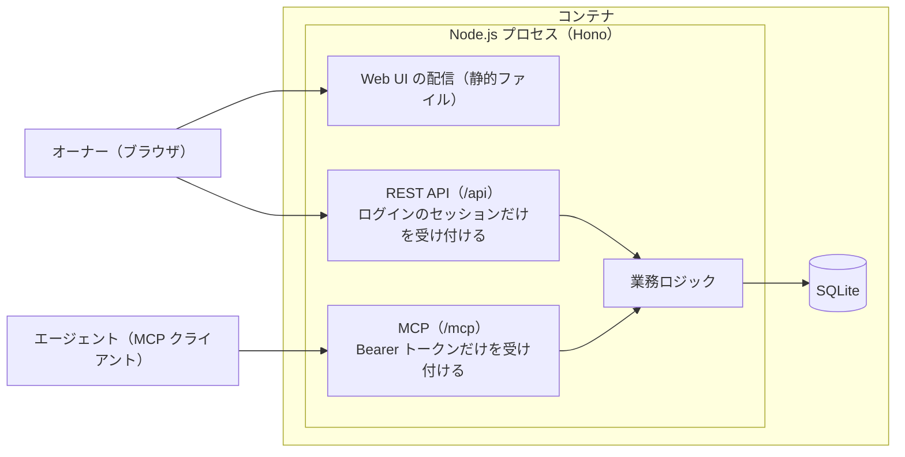
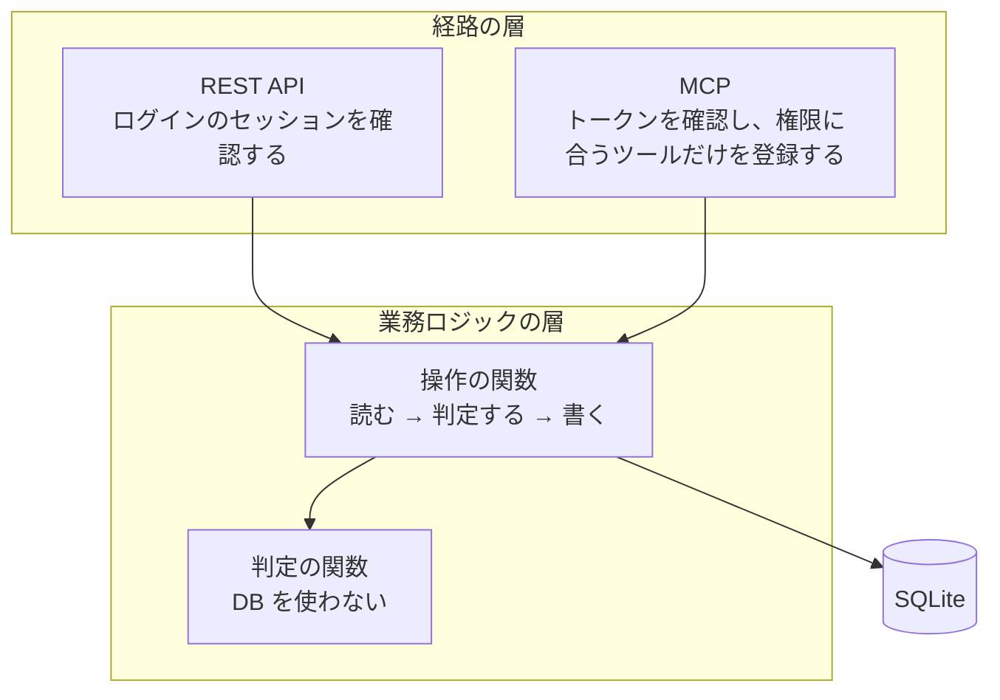

# 設計書

> [要件定義書 v1](Requirements.md) を実現するためのアーキテクチャを書く。要件は要件定義書に書き、この文書には要件をどう実現するかだけを書く。

---

## 1. 全体構成

1つのコンテナの中で、1つの Node.js プロセスが Web UI の配信・REST API・MCP をすべて受け持つ。データは同じプロセスから SQLite のファイルに保存する。



- REST API と MCP は、同じ業務ロジックを通る（要件定義書 設計原則5）。MCP から DB を直接触る経路は作らない
- 経路ごとに受け付ける認証を分ける。REST API はログインのセッションだけ、MCP はエージェントのトークンだけを受け付ける。エージェントのトークンは REST API に使えない
- パスは REST API が `/api`、MCP が `/mcp`。それ以外のパスは Web UI を返す（7.1）

---

## 2. 技術スタック

| 領域 | 採用 |
|---|---|
| 言語 | TypeScript（Node.js） |
| Web フレームワーク | Hono |
| データストア | SQLite |
| SQLite ドライバー | better-sqlite3 |
| テーブルの定義・SQL | Drizzle ORM（drizzle-kit） |
| MCP | 公式 TypeScript SDK v2（`@modelcontextprotocol/server`、`@modelcontextprotocol/hono`） |
| フロントエンド | React の SPA（Vite でビルド） |
| REST API の呼び出し | Hono RPC（`hono/client`） |
| サーバーのデータの取得・更新 | TanStack Query |
| ルーティング（Web UI） | React Router |
| スタイル | Tailwind CSS |
| Markdown の表示 | react-markdown ＋ remark-gfm |

### 2.1 データストア: SQLite

- 要件定義書 10章の「軽量運用を優先」「1コンテナで動かす」「高負荷は想定しない」に合わせる。アプリに組み込むため、DB のプロセスを別に動かさない
- バックアップは DB のファイル単位で行える。テストはインメモリ DB で速く分離できる
- 書き込みは同時に1つに限られるが、人間1人＋エージェント数体の規模では、楽観ロックと短いトランザクションで足りる
- 日本語の部分一致検索は、全文検索を使わず LIKE で実現する（3章）
- SQLite は日時・JSON の型が緩いため、日時の形式（JST（+09:00）の ISO8601）はアプリ側で統一する

### 2.2 バックエンド: TypeScript（Node.js）、Hono、better-sqlite3

- MCP の公式 SDK の中で TypeScript 版が基準の実装で、最も成熟している
- 業務ロジック・REST API・MCP・Web UI を1つの言語で揃え、入力の検証（zod）と型を共有する。状態を変えるときの必須の入力などを「Web UI・MCP で同じルールにする」（要件定義書 6.3）ため
- Hono は軽量で、MCP SDK に公式のアダプタがある
- better-sqlite3 は SQLite を同梱していて、新しい版の SQLite を使える。同期的に動くため、途中に await が入らず、親 Task の連動や子孫のまとめての cancel を1つのトランザクションに収めやすい

### 2.3 MCP: 公式 SDK v2 をステートレスで使う

- `createMcpHandler` を使い、セッションを持たずに、リクエストのたびにサーバーを作る
- ツールは、リクエストのたびに、認証した agent Actor の権限に合うものだけを登録する。これで、権限外のツールを表示しない（F-AUTH-04）。権限を変えると、次のリクエストから反映される
  - 登録するツールが1つもない Actor には、SDK が tools の機能自体を宣言しないため、`tools/list` はエラーになる。表示するツールがないことに変わりはないため、問題にしない
- ツールの説明は MCP の層（`mcp/descriptions.ts`）に、操作の名前ごとに書く。`routes` に `'mcp'` を含む操作に説明がなければ、登録のときにエラーにする
- `create_document`・`update_document` の説明文には、ツールを登録するときに document モジュールの関数で既存のタグの一覧を読んで入れる（要件定義書 F-DOC-02）。エージェントが既存のタグを見てから付けられるようにするため
- SDK はトークンを検証しないため、SDK の手前に置いた自前のミドルウェアで Bearer トークンを検証し、Actor を `authInfo`（`extra.actor`）として SDK に渡す。トークンが無い・無効なら、SDK に渡さずに 401 を返す
- プロトコルは 2026-07-28 版と 2025 年版の両方を受ける（SDK の既定）
  - 2025 年版のクライアントがサーバーからの通知用のストリーム（GET）を開こうとすると 405 を返すが、passdown には通知を送る要件がないため問題にしない
- `createMcpHonoApp` の `allowedHosts`・`allowedOrigins` を必ず設定する。既定の `127.0.0.1` バインドなら Host・Origin を localhost 系で検証するが、コンテナでは `0.0.0.0` にバインドするためこの既定が外れる（2.9）
- MCP を別のプロセス・ポートには分けない

### 2.4 フロントエンド: React の SPA

- Vite でビルドした静的ファイルを、バックエンドの Hono から配信する
- REST API は Web UI 専用で、ログインした人間だけが使う。検索エンジン向けの描画や初回表示の速さは要らないため、SSR は使わない
- REST API は Hono RPC で呼び、サーバーのルートと zod の検証から推論した型をそのまま使う
- サーバーのデータの取得・更新は TanStack Query で揃える（更新後の再取得、読み込み中・エラー・楽観ロックの競合の扱い）
- すべての画面を PC とスマホの幅で使えるようにする（要件定義書 9.2）。スタイルは Tailwind CSS で書く
- Document の Markdown は react-markdown ＋ remark-gfm で表示する。生の HTML は描画しない

### 2.5 テーブルの定義・SQL: Drizzle ORM

- テーブルの定義は Drizzle の TypeScript（`sqliteTable`）で書き、SQL の `CREATE TABLE` は手で書かない。クエリも Drizzle の書き方で書く
- better-sqlite3 と組み、クエリもトランザクションも同期で使う（`db.transaction((tx) => { ... })` に同期の関数を渡す）。途中に await を挟まない
- 検索の `LIKE ... ESCAPE '\'` のように Drizzle の関数で書けない部分だけ、Drizzle の `sql` テンプレートで書く。値は必ずテンプレートの埋め込み（パラメータ）で渡し、文字列の連結で SQL を組み立てない
- テーブル同士の関係から関連をまとめて取る機能（relational queries）は、同じモジュールのテーブルの間でだけ使う（4.5）
- 使う版は 0.45 系（安定版）。v1 系を採らない理由は 2.8

### 2.6 マイグレーション

スキーマの変更は、drizzle-kit が生成した SQL を、プロセスの起動時に適用する。

```
起動 → DB ファイルのコピーを残す → 未適用のマイグレーションを適用 → サーバーを開始
                                     失敗 → ログを出して異常終了（サーバーは開始しない）
```

- 適用はプロセスの起動処理で行い、成功したときだけサーバーを開始する。失敗したまま古いスキーマで動かさないため
- 適用の前に、SQLite のファイルを日時付きでコピーして残す。SQLite では列挙値の変更などがテーブルの作り直しになり（5.1）、失敗や想定外の結果のときに、変更の直前の断面から戻せるようにするため。置き場所と残す数は 2.7 のとおり
  - コピーは日次のバックアップ（2.7）と同じく `VACUUM INTO` で取る。前回のプロセスの `-wal` に残った変更も含めた、一貫した断面になるため
  - コピーを残すのは、未適用のマイグレーションがあり、かつ DB にテーブルがあるときだけ。起動のたびに残すと、世代の上限（5）で変更の直前の断面が押し出されるため。初回の起動（空の DB）は戻す先がないため残さない
- 適用はマイグレーションごとではなく、未適用のものをまとめて1つのトランザクションで行う（Drizzle の既定）。途中で失敗したら、どれも適用されない
- 適用済みかどうかは drizzle-kit の管理テーブルが持つ。適用の記録は Activity に書かない。業務のデータの変更ではないため（要件定義書 6.6）
- プロセスは1つのため（1章）、適用が同時に走ることはない。排他の仕組みは持たない
- 実装の間は、マイグレーションの SQL を作らず `drizzle-kit push` でスキーマを当て、開発用の DB は必要になったら作り直す。マイグレーションの置き場所（`drizzle/`）がなければ、起動処理は適用を飛ばす。v1 を出す時点のスキーマから最初のマイグレーション（`0000`）を1本だけ生成し、以降は変更のたびに生成してリポジトリに入れる
  - 設計が動く間は、途中の差分の SQL を残しても読み返す相手がいない。守るべきデータが入るのは v1 を出した後のため

### 2.7 バックアップと復元

要件定義書 10章の「DB を定期的に自動でバックアップし、復元手順を持つ」を満たす。

- アプリのプロセスの中で1日1回、`VACUUM INTO` で DB を1つのファイルに書き出す。動かしたまま一貫した断面を取れ、`-wal`・`-shm` を一緒にコピーする必要がないため
- 置き場所は `/data/backups`（DB と同じバインドマウントの中。2.9）。ファイル名は `passdown-<日時>.sqlite3`
- マイグレーションの前に残すコピー（2.6）も同じディレクトリに置き、`before-migration-<日時>.sqlite3` の名前にする
- 残す数は、日次を14世代、マイグレーションの前を5世代とする。超えたら古いものから消す
- 復元は、プロセスを止める → 今の DB のファイルと `-wal`・`-shm` を退避する → バックアップのファイルを DB のパスに置く → 起動する（未適用のマイグレーションは自動で当たる）、の順に行う。`/data` はホストのディレクトリのため、この操作はホスト側で行える（2.9）。手順は `docs/Operations.md` に書く
- 別のマシンへの転送・暗号化は持たない。外部への送信の経路を作らない方針（要件定義書 10章）のため、ボリュームごとの保全は運用に任せる
- バックアップの実行は Activity に記録しない。業務のデータの変更ではないため（要件定義書 6.6）

### 2.8 開発環境の道具

| 道具 | 採用 |
|---|---|
| パッケージマネージャー | npm |
| Drizzle の版 | 0.45 系（`drizzle-orm` 0.45.2 / `drizzle-kit` 0.31.10） |
| lint | ESLint ＋ typescript-eslint ＋ eslint-plugin-boundaries |
| 整形 | Biome の formatter |
| テスト | Vitest |
| 開発時のサーバーの起動 | tsx（`npm run dev:server`） |
| TypeScript の版 | 6.0 系 |
| Node の版 | 22 以上（better-sqlite3 13 の `engines` が `node >= 22`。コンテナで使う版は別途決める） |

#### パッケージマネージャー: npm

- サーバーと Web UI は1つのパッケージ（4.8）のため、ワークスペースが要らない。Node に同梱で、コンテナのビルドに手順を足さずに済む
- `bun install`（ランタイムは Node のまま）にすればインストールとスクリプトの起動は速くなる。ただし、パッケージマネージャーの入れ替えは lockfile を作り直すだけで、コードは変わらない。コンテナのビルドの時間が実際に苦になったときに、測って乗り換える
- ランタイムを bun にすることは採らない。`bun:sqlite` を使うことになり、better-sqlite3 を選んだ理由（同期で動くため、親 Task の連動やまとめての cancel を1つのトランザクションに収めやすい。2.2）を検証し直すことになる。得られるのは起動の速さだが、常駐するプロセスは1つ（1章）で起動は1日に数回のため効かない

#### Drizzle の版: 0.45 系

- 2026-09-16 の時点で、`latest` は 0.45.2（2026-03-27 公開）。v1 系は `1.0.0-beta.1` が 2025-11-03、`1.0.0-rc.1` が 2026-04-30、`rc.4` が 2026-06-27 と、約10か月 beta / RC が続いていて GA していない
- drizzle-kit はマイグレーションを生成する道具で、v1 を出した後は守るべきデータが入る（2.6）。生成の道具は枯れている方を採る
- v1 が GA したら移行を検討する。クエリは操作の関数の中にあり（4.5）、テーブルの定義は各モジュールの `schema.ts` に閉じている（D-94）ため、影響の範囲を特定できる

#### lint: ESLint ＋ eslint-plugin-boundaries

lint で守る規則は、次の5つと、4.4「lint で検査すること」のすべて。`eslint-plugin-boundaries` は、パスを「要素の種類」として宣言し、種類どうしの許可・禁止を表で書けるため、これらをそのまま設定に落とせる。

| 守る規則 | 出典 |
|---|---|
| 操作の関数から他のモジュールの `schema.ts` を import しない | 4.5 |
| モジュールの外からは `index.ts` だけを import する | D-102 |
| 経路の層から DB を読み書きしない | 4.1 |
| Web UI にサーバーの実行コードを含めない（`inputs.ts` だけ例外） | 4.8・D-101 |
| `inputs.ts` は zod と他の `inputs.ts` しか import しない | 4.7 |

- 整形は Biome の formatter に任せ、規則の検査（ESLint）と分ける
- Biome だけ・oxlint だけで検査する形は採らない。境界の検査を `noRestrictedImports` と glob の `overrides` の積み上げで書くことになり、モジュールが増えるたびに設定を足すことになる。速さは、この規模のコード量では選定の材料にならない
- 要素の種類（`boundaries/elements`）はフォルダ単位、モジュールの中のファイルの役割（`boundaries/files` の `index`・`inputs`・`schema`・`operations`・`rules`）はファイル単位で宣言し、`boundaries/dependencies` の policy で組み合わせる
- 相対 import を `.ts` のファイルまで解決させるため、`eslint-import-resolver-typescript` を入れる。解決できない import は検査されずに素通りするため、`boundaries/no-unknown-dependencies` を有効にして気づけるようにする
- 要素の種類は `module`（`modules/*`）・`db`・`route`（`http/`・`mcp/`）・`core`・`testing`・`app`（`src/server` 直下のファイル）・`web`。`app` は、ほかのどれにも当たらないものだけが当たるよう、最後に宣言する
- 同じ要素の中の import も検査する（`checkInternals`）。同じモジュールの中の import は許可したうえで、「判定の関数から操作の関数を import しない」「`inputs.ts` は zod と `inputs.ts` だけ」を同じモジュールの中にも効かせるため
- policy は後ろのものが前のものを上書きする。制限を許可より後ろに置く
- テストのファイル（`*.test.ts`）だけは、結果を確かめるために DB（`db/`・Drizzle・他のモジュールの `schema.ts`）を直接読み、アプリ全体（`app`）を組み立ててよい。テストの土台（`testing/`）はテストのファイルと `app` からだけ使える
- try / catch と `withoutPermissionCheck` の検査は、import ではないため、`no-restricted-syntax` で書く。`createTask['withoutPermissionCheck']` の書き方も検出する

#### 開発時のサーバーの起動: tsx

- サーバー側の相対 import は `.js` を付けて書く（`moduleResolution: nodenext`）。Node の型の除去（type stripping）は `.js` を `.ts` に読み替えないため、開発時は tsx で直接起動する
- 本番のビルドの方法は、本番用のコンテナイメージを作るときに決める

#### better-sqlite3 のインストール

- better-sqlite3 13 は主な環境向けのビルド済みバイナリをパッケージに同梱していて、インストール時のスクリプトは要らない
- `package.json` の `allowScripts` で better-sqlite3 のスクリプトを許可しない。許可すると、`binding.gyp` があるため npm が既定で `node-gyp rebuild` を走らせ、Python の無いイメージ（`node:24-bookworm-slim`）では失敗する

#### テスト: Vitest

- Web UI のビルドに Vite を使う（2.4）ため、変換の設定を1つに揃えられる
- DB を使わない判定のテスト・インメモリ SQLite の操作のテスト・将来の React のテストを、1つのランナーで回せる（4.3）

#### TypeScript の版: 6.0 系

- 2026-09-16 の時点で `latest` は 7.0.2 だが、typescript-eslint 8.70 の peer が `typescript >=4.8.4 <6.1.0` で TS 7 に対応していない
- lint による境界の検査が開発の土台の肝（上の5つの規則）のため、typescript-eslint が対応済みの最新を採る
- typescript-eslint が TS 7 に対応したら上げる

### 2.9 コンテナとデプロイ

1つのコンテナで動かす（要件定義書 10章）。

#### ファイルの置き場所

コンテナの中の `/data` に、ホストのディレクトリをバインドマウントする。

```
/data/passdown.sqlite3
/data/backups/passdown-<日時>.sqlite3
/data/backups/before-migration-<日時>.sqlite3
```

- DB とバックアップを同じ場所に置く（2.7）。1つのマウントで両方が守られる
- named volume ではなくバインドマウントにする。復元はファイルの差し替え（2.7）で、ホスト側でそのまま行えるようにするため。バックアップの中身をホストから直接確認・退避できる
- コンテナは非 root で動かす。バインドマウントのため、ホストのユーザーと UID・GID を合わせる

#### 環境変数

接頭辞は `PASSDOWN_`。起動時に1か所で読んで検証し、足りなければサーバーを開始せずに異常終了する（マイグレーションと同じ。2.6）。

| 変数 | 既定 |
|---|---|
| `PASSDOWN_DB_PATH` | `/data/passdown.sqlite3` |
| `PASSDOWN_BACKUP_DIR` | `/data/backups` |
| `PASSDOWN_HOST` | `0.0.0.0` |
| `PASSDOWN_PORT` | `3000` |
| `PASSDOWN_MCP_ALLOWED_HOSTS` | **既定なし（必須）** |
| `PASSDOWN_BACKUP_KEEP_DAILY` | `14` |
| `PASSDOWN_BACKUP_KEEP_MIGRATION` | `5` |
| `PASSDOWN_BACKUP_AT` | `03:00`（JST） |

- バックアップの世代と時刻は設定で変えられるようにする（2.7 の値は既定）。セルフホストで、置ける容量が運用ごとに違うため
- ログインの有効期限（5.3）は設定にしない。決めた値に理由があり、運用で変える場面がないため

#### ポートとリバースプロキシ

- コンテナの中では `0.0.0.0:3000` で待ち受ける
- 本番はホストの LAN に公開する（`3000:3000`）。要件定義書 10章のとおり、内部ネットワークのエージェントが MCP を直接使うため、前段のリバースプロキシの後ろに隠すだけでは足りない
- 外部ネットワークからは、前段の認証付きリバースプロキシを通す。プロキシが同じホストにあるなら `127.0.0.1:3000` に流す
- 開発も本番と同じくホストの LAN に公開する。スマホの幅での確認（要件定義書 9.2）や、他の端末で動かすエージェントから触るため。ホスト側のポートは、同じマシンで動く他のものと衝突しないよう変えられる（`PASSDOWN_DEV_PORT`、既定は 3100）
- `X-Forwarded-*` は信じない。転送されたヘッダを信頼する設定は入れない（D-121 のとおり、接続元のアドレスは数えない）

#### Node の版

- Node 24、イメージは `node:24-bookworm-slim`
  - 24 は現在の Active LTS（2025-10-28 開始、EOL 2028-04-30）。better-sqlite3 13 の `engines`（`node >= 22`）を満たす
  - 26 は Active LTS の開始が 2026-10-28 のため、v1 を出す頃に LTS になっていれば上げる
- alpine は使わない。better-sqlite3 のビルド済みバイナリは glibc 向けで、musl ではソースからのビルドが要るため

#### MCP で許可するホスト名

- `PASSDOWN_MCP_ALLOWED_HOSTS`（カンマ区切り）を必須にし、`createMcpHonoApp` の `allowedHosts` と `allowedOrigins` の両方に同じ値を渡す
- 必須にするのは、コンテナでは `0.0.0.0` にバインドするため SDK の既定の検証（127.0.0.1 バインドのときの Host・Origin の検証）が外れ、既定値を持たせると検証が緩いまま気づかず運用できてしまうため
- 値は運用者が内部で使うホスト名（例: `passdown.local,192.168.1.10`）。ホスト名だけを見てポートは見ない。開発でも、ホストの LAN に公開するため、他の端末のブラウザから触るならその名前・IP を足す
- `Origin` ヘッダの無いリクエストは通るため、ブラウザの外で動く MCP クライアント（エージェント）は影響を受けない。弾けるのはブラウザからの DNS リバインディング

---

## 3. 検索

要件定義書 10章（日本語の部分一致）・F-SRC-01・F-SRC-02 を、SQLite の LIKE で実現する。全文検索のインデックスは持たない。

### 3.1 キーワード

- 入力を空白（半角・全角）で区切り、すべての語を含むもの（AND）に当てる
- 各語は、対象の項目のどれかに部分一致すれば当たる（`LIKE '%語%' ESCAPE '\'`）。語に含まれる `%`・`_`・`\` はエスケープする
- 英字の大文字・小文字は区別しない（LIKE の既定。ASCII の範囲だけ）。全角・半角などの正規化はしない
- 1文字・2文字の語も、ほかの語と同じように当たる

### 3.2 対象の項目

| 対象 | 項目 |
|---|---|
| Task | title・description・result・blocked_reason・コメントの body |
| Document | title・content |

- Task は、Task 自体の項目か、そのコメントのどれかに当たれば結果に含める
- Task の項目とコメントは別々の SELECT で検索し、Task の ID でまとめる。コメントの条件を相関サブクエリ（EXISTS）にして Task の条件と OR でつなぐと、極端に遅くなる（計測では5分以上かかった）

### 3.3 絞り込み

- project / tag / actor / 状態 / 作成日時・更新日時の期間（F-SRC-02）は、キーワードの条件と同じ SQL の WHERE に AND で加える
- ただし、Document の project での絞り込み（その Project が参照している Document）は、Project の参照を持つ project モジュールの関数から Document の id の一覧を受け取り、その id で絞り込む。他のモジュールのテーブルを直接読まないため（4.5）
- read 権限を持たないリソース（Task / Document）は、結果に含めない（F-AUTH-07）

### 3.4 性能

- SQLite 3.45.1・インメモリの DB で、Task 3万件・コメント15万件（本文あわせて約5,000万文字、想定の規模より大幅に多い）を LIKE で全件走査すると、一番遅い場合でも Task が約80ms、コメントが約250msだった
- 検索の入口は、業務ロジックの search モジュールの1つの関数にまとめる。Task・コメントを読む SQL は task モジュール、Document を読む SQL は document モジュールの読み取りの関数に置く（4.5）。遅くなったら、これらの読み取りの関数の中だけで trigram の全文検索を足せる（REST API・MCP・search モジュールの入口は変わらない）

### 3.5 結果の並び順と返す単位

#### 返す単位

- Task と Document は1本のリストに混ぜず、それぞれの配列で返す。2つを貫く並び順の基準と件数の配分を決めずに済み、画面でも分けて見せられるため
- Task は、当たった場所がいくつあっても Task 1件につき結果1件にする。Task 自体のどの項目に当たったかと、当たったコメント（id・本文・投稿日時）を、その1件に添える
- Document も1件につき結果1件とし、title・content のどちらに当たったかを添える
- 当たった箇所の抜粋（スニペット）は返さない。Task の description・result・blocked_reason と Document の content は長くなりうるため、当たった項目の名前だけを返し、本文は `get_task`・`get_document`（画面では詳細の画面）で読む
- コメントだけは本文をそのまま返す。コメントは短く、過去の判断をコメントから確かめる用途（要件定義書 S-06）で、本文が見えないと次に何を開くか決められないため

Task の結果の形（MCP での例。項目名は 7.6 のとおりキャメルケース）:

```
{
  id: "task:24",
  title: "承認フローの設計",
  status: "in_progress",
  updatedAt: "...",
  matchedFields: ["title"],
  matchedComments: [
    { id: "comment:101", body: "...", createdAt: "..." }
  ]
}
```

- この形は、Task の項目とコメントを別々の SELECT で検索して Task の ID でまとめる（3.2）結果をそのまま表す

#### 並び順

- Task・Document とも、更新日時の新しい順（`ORDER BY updated_at DESC, id DESC`）で返す
- `matchedComments` は、Task のコメントと同じく id の順（投稿した順、5.5）に並べる
- 並び順は経路で変えない。REST API・MCP とも同じ順で返す

#### 件数の上限

- 既定で50件まで返し、呼び出し側が指定できる上限は200件とする。打ち切ったときは、当たった総数を添える
- `matchedComments` は Task ごとに最大5件。当たったコメントが多いときは新しい方から5件を選び、並べるときは id の順にする
- 上限を件数で持つ考え方は 6.2 と同じ

---

## 4. ソフトウェアの構成

### 4.1 層

経路の層と業務ロジックの層の2つに分ける。DB へのアクセスは層として分けず、業務ロジックの層に書く。



| 層 | 受け持つこと | 持たないもの |
|---|---|---|
| 経路の層（REST API・MCP） | 認証、入力の取り出しと検証（4.7）、業務ロジックの操作の関数の呼び出し、結果とエラーを経路の形式（HTTP のレスポンス・MCP のツールの結果）に変えること。ログインした人間だけの操作（承認・cancel・Actor とトークンの操作・Activity の閲覧）を REST API にだけ出すこと（4.9） | 業務のルール、DB へのアクセス |
| 業務ロジックの層 | 操作の関数（1つの操作を最初から最後まで行う）と、判定の関数（操作してよいかを決める） | 経路（Web か MCP か）による分岐、Actor の種類による分岐 |

- 経路の層は、同じ操作に対して同じ操作の関数を呼ぶ。Web と MCP でルールを別々に書かない（要件定義書 設計原則5）
- 経路の層から DB を読み書きしない。読むだけの操作（一覧・文脈の取得・検索）も、業務ロジックの層の関数を通す
- 業務ロジックの層は、操作した Actor・経路・現在の日時を `ctx` で受け取る。現在の日時を関数の中で取らない（テストで日時を固定するため）。他のモジュールの関数を呼ぶときも、`ctx` の Actor・経路を差し替えない（4.9）

### 4.2 操作の関数は「読む → 判定する → 書く」で書く

業務ロジックの層の操作の関数は、次の順で書く。

1. **読む**: 判定に必要なデータを、SQL で DB から読む（対象の Task、子孫の Task、所属する Project の状態など）。他のモジュールのデータは、持ち主のモジュールの関数を呼んで読む（4.5）
2. **判定する**: 読んだデータと入力を判定の関数に渡し、操作してよいか、何を変えるかを決める
3. **書く**: 判定が通ったら、SQL で DB を更新し、Activity を記録する

判定のたびに読む量を最小にするため、1〜2を繰り返してもよい（例: Task を読んで判定し、次に子 Task を読んで判定する）。ただし、自分の関数の中では、書き始めた後に判定しない。

書く段階で、他の操作の関数を呼ぶことは許す（例: Project の archive の中で、task の「Project の Task を cancel する」を呼ぶ）。呼ばれた関数は、その中で読む → 判定する → 書く を行う。そこで弾かれれば、例外で起点の操作の変更がすべて戻る（下の「トランザクション」「例外を catch しない」）。

#### 判定の関数

- DB・操作した Actor の認証情報・現在の日時を取りに行かない。必要なものは引数で受け取る
- 同じ引数なら必ず同じ結果を返す
- 対象になるルールの例
  - 状態遷移（今の状態から移れるか）。操作ごとに常に決まる必須の入力（review に出すときの result 等）は、判定の関数ではなく入力のスキーマに置く（4.7）
  - 親 Task が review に出せるか（子 Task がすべて done / cancelled か）
  - 子 Task を追加できるか、親を付ける・付け替える・外せるか（親の状態、循環、同じ Project か）
  - 子 Task が in_progress になったとき、どの祖先の Task を in_progress にするか
  - 親 Task・Project をやめたとき、どの Task を cancelled にするか
  - Project を done にできるか（終わっていない Task がないか）
  - done / cancelled の Task、done / archived の Project、triaged / archived の Inbox Item を変更しようとしていないか
- 自動で起きる変更（親 Task の連動、子孫・Project の Task をまとめて cancel）は、判定の関数が「どれを・どう変えるか」を返し、操作の関数はそのとおりに書く。操作の関数の中で変更の対象を決めない

#### やってはいけないこと

- **ルールを SQL に書かない**。「子 Task がすべて終わっていれば更新する」を UPDATE の WHERE に書く、「親を付けられる Task」を SELECT の WHERE で絞って件数で判定する、といった書き方をしない。ルールがどこにあるか分からなくなり、判定の関数のテストで守れなくなる
  - 例外1: 楽観ロックの版数の確認（`WHERE id = ? AND version = ?`）は UPDATE に書く。更新した行が0件なら競合として扱う。これは同時更新の検知で、業務のルールではない
  - 例外2: 一覧・検索の絞り込み（状態・Project・担当・キーワード等）と、read 権限を持たないリソースを結果から除く条件は、SQL の WHERE に書く。これらは「何を読むか」で、操作してよいかの判定ではない
- **ルールを操作の関数の if 文に直接書かない**。判定の関数を呼び、その結果に従う。操作できないときは、判定の関数が「操作できない」のエラーを投げる（4.6）
- **ルールを経路の層に書かない**。REST API と MCP の片方だけでルールを確認すると、もう片方から迂回できる

#### トランザクション

- 1〜3（読むから書くまで）を1つのトランザクションに収める。読んでから書くまでの間に、ほかの操作で子 Task の状態などが変わると、判定の前提が崩れるため
- **すべての操作の関数は、`ctx.db.transaction((tx) => { ... })` で始める**。起点の操作か、他の操作から呼ばれる関数かで書き分けない（起点の操作は `defineOperation` が張るため、`run` の中で張り直さない。4.9）
  - 他の操作の関数を呼ぶときは、`tx` を入れた `ctx`（`{ ...ctx, db: tx }`）を渡す
  - 他の操作の関数の中から呼ばれると、Drizzle（better-sqlite3）が自動で SAVEPOINT にする。単独で呼ばれたときは、そのままトランザクションになる
- 操作の関数は、引数の `ctx.db` だけを使う。DB の接続を直接 import しない（lint で検査する）。直接 import した接続を使うと、呼んだ側のトランザクションに乗っているかが分からなくなるため
- トランザクションの中で async・await を使わない（better-sqlite3 のトランザクションは async の関数で動かない）
- 判定が通らなかったときは、判定の関数が例外を投げ、何も書かずにトランザクションが終わる（4.6）

#### 例外を catch しない（重要）

- **業務ロジックの層では、例外を catch しない**。例外が一番外側のトランザクションまで届くと、better-sqlite3 がすべてロールバックし、起点の操作でした変更（呼んだ側・呼ばれた側の両方）がすべて戻る
- catch して処理を続けると、SAVEPOINT で呼ばれた側の変更だけが戻り、呼んだ側の変更とその後の変更は書かれる。例: Inbox Item を Task に変換する操作で、「Task を作る」が「操作できない」で弾かれたのを catch して続けると、Task は作られていないのに Item が整理済み（triaged）になる
- 例外を catch するのは、経路の層（REST API・MCP）でエラーを応答に変えるときだけ。これはトランザクションが終わってロールバックした後なので、影響しない
- 例外として、トランザクションの中で SQLite のエラーを catch した場合は、必ず投げ直す（4.6）

### 4.3 テスト

要件定義書 10章（状態遷移・権限・親 Task の連動を必ずテストする）を、2つの粒度でテストする。

| 対象 | テストの仕方 | 主に確かめること |
|---|---|---|
| 判定の関数 | DB を使わず、引数を変えて直接呼ぶ | 状態遷移の全組み合わせ、親の付け替えの条件、連動・まとめての cancel の対象 |
| 操作の関数 | インメモリの SQLite に対して呼ぶ（DB を差し替えるモックは使わない） | 判定どおりに書かれること、Activity が記録されること、判定が通らないとき何も書かれないこと、楽観ロックの競合 |
| 入力のスキーマ | DB を使わず、入力を変えて検証する | 操作ごとの必須の入力（review に出すときの result、blocked にするときの blocked_reason、todo に戻すときのコメント、cancel するときの result）、列挙値、文字数の上限 |

- 経路の層のテストは、認証と、ログインした人間だけの操作が REST API にだけあり MCP にないことを確かめる。業務のルールは経路の層でテストしない
- 権限・read 権限による絞り込み・経路の制限・Activity の記録漏れは、これに加えて起点の操作の一覧から表駆動でテストする（4.9）
- 経路の層のテストでは、エラーの種類ごとに、決まった形のレスポンス・ツールの結果に変わることも確かめる（4.6）

### 4.4 モジュール

業務ロジックの層は、業務の単位でモジュールに分ける。経路の層はモジュールごとには分けず、経路ごと（REST API・MCP）に分ける。

```
src/server/
  main.ts          起動処理（設定の読み込み → マイグレーション → サーバーの開始）
  app.ts           Web UI の配信・REST API・MCP を1つの Hono のアプリに組み立てる
  config.ts        環境変数の読み込みと検証（2.9）
  operations.ts    起点の操作の一覧（レジストリ。4.9）
  core/            共通の仕組み: defineOperation・Ctx・エラーのクラス・日時・列の型
  http/            経路の層: REST API
  mcp/             経路の層: MCP
  db/              DB への接続・マイグレーション
  testing/         テストの土台: インメモリの DB・データの用意・表駆動のテストの入力
  modules/         業務ロジックの層
    auth/          Actor・トークン・ログインのセッション・権限
    project/       Project・Project が参照する Document
    task/          Task・コメント・links・親子・Task が参照する Document
    document/      Document・タグ
    inbox/         Inbox Item・変換
    activity/      Activity の記録と閲覧
    search/        Task と Document を横断する検索
```

各モジュールの中は、次のように置く。

```
modules/task/
  index.ts             モジュールの外に公開するもの（operations・inputs から名前を並べて出すだけ。4.5）
  schema.ts            このモジュールが持つテーブルの定義（Drizzle の sqliteTable）
  inputs.ts            操作の入力のスキーマ（zod）
  inputs.test.ts       入力のスキーマのテスト
  operations.ts        操作の関数（起点の操作は defineOperation で宣言する。4.9。Drizzle のクエリもここに書く）
  operations.test.ts   操作の関数のテスト（インメモリの SQLite）
  rules.ts             判定の関数
  rules.test.ts        判定の関数のテスト（DB を使わない）
```

- テーブルの定義は、そのテーブルの持ち主のモジュールの `schema.ts` に置く。drizzle-kit には、全モジュールの `schema.ts` を渡してマイグレーションを生成する
- クエリは、操作の関数の中に直接書く。クエリだけを包む関数やファイル（`queries.ts` 等）は作らない
- ファイルが大きくなったら、モジュールの中で分けてよい（例: `task/rules/status.ts`・`task/rules/parent.ts`）。モジュールの外には出さない
- 判定するルールのない業務（search など）は、`rules.ts` を置かず、操作の関数だけのモジュールでよい
- 複数の操作の関数で使うクエリ（例: Task を id で読む）だけは、そのモジュールの中で関数にまとめる。他のモジュールには公開しない（4.5）
- コメントは Task の権限に含まれる（要件定義書 F-AUTH-03）ため、task モジュールに置く
- activity は、すべてのモジュールが Activity の記録に使うため、独立したモジュールにする
- search は、Task と Document を横断するため、独立したモジュールにする（3.4）
- `core/` は、どのモジュールにも属さない共通の仕組みを置く。業務ロジックの層・経路の層・`db/` から使ってよく、`core/` から他の要素は import しない。業務のルールは置かない
- `testing/` は、テストのファイルからだけ使う。インメモリの DB には、drizzle-kit の生成の仕組み（`drizzle-kit/api`）で全モジュールの `schema.ts` から作った CREATE 文を当てる（`drizzle-kit push` と同じ）
- activity の `inputs.ts` は、event_type・entity_type の列挙値と、他の行を指す id の入力の部品（`entityId('task')` 等。5.1）を持つ。entity_type は Activity の対象の種類で、`<種類>:<id>` の種類の語と同じもののため

#### lint で検査すること

4章の決まりのうち、次のものはレビューに頼らず lint で検査する。

- `modules/*/rules.ts`（分けた場合は `modules/*/rules/**`）から、`db/`・SQLite ドライバー・Drizzle・操作の関数（`operations`）を import しない
- 業務ロジックの層（`modules/`）から、経路の層（`http/`・`mcp/`）・Hono・MCP SDK を import しない
- 経路の層（`http/`・`mcp/`）から、`db/`・SQLite ドライバー・Drizzle を import しない
- 経路の層（`http/`・`mcp/`）から import してよい業務ロジックの層のファイルは、`modules/*/index.ts` だけ（4.5）
- 経路の層（`http/`・`mcp/`）から、起点の操作の `withoutPermissionCheck` を呼ばない（4.9）
- Web UI（`src/web/`）から `src/server/` は、`import type` でだけ参照する。例外として、`modules/*/inputs.ts` は実行時にも import してよい（4.7・4.8）
- `modules/*/inputs.ts` から import してよいのは、zod と、他のモジュールの `inputs.ts` だけ（Web UI のビルドにサーバーのコードを含めないため。4.7）
- 他のモジュールから import してよいのは、`modules/*/index.ts` だけ（4.5）。例外として、`schema.ts` は外部キーの参照のために、他のモジュールの `schema.ts` から import してよい
- 操作の関数（`operations`）から、他のモジュールの `schema.ts` を import しない（他のモジュールのテーブルを直接読み書きしないため。4.5）
- 業務ロジックの層（`modules/`）から、DB の接続（`db/` の接続のインスタンス）を import しない。`ctx.db` を使う（4.2）
- 業務ロジックの層（`modules/`）で、try / catch を書かない（SQLite のエラーを投げ直す場合を除く。4.2・4.6）。例外を設ける箇所は lint の無効化のコメントに理由を書き、レビューで確かめる
- モジュール同士の依存が循環することは検査しない（循環を許す。4.5）

### 4.5 モジュールをまたぐ参照

#### 操作の置き場所

- 操作の関数は、**起点の業務のモジュール**に置く。起点とは、経路の層から呼ばれる操作の主語（オーナー・エージェントが何をしたか）
- 起点の操作の中で他のモジュールのデータを読み書きする処理は、**そのデータの持ち主のモジュール**に置き、起点の操作から呼ぶ

| 起点の操作 | 置き場所 | 中で呼ぶ、持ち主のモジュールの関数 |
|---|---|---|
| Inbox Item を変換する | inbox | project の Project を作る、task の Task を作る、document の Document を作る |
| Project を archive する | project | task の「Project の終わっていない Task を cancelled にする」（どれを対象にするかの判定は task が持つ） |
| Project を done にする | project | task の「Project の終わっていない Task があるか」 |
| Task を作る・Project を変える | task | project の「Project の状態を読む」 |
| Task・Project に Document の参照を足す | task・project | document の「Document を読む」 |
| Document の参照元を見る（要件定義書 F-DOC-04） | document | task の「Document を参照している Task を読む」、project の「Document を参照している Project を読む」 |
| Project の文脈を取得する | project | task の「Project の終わっていない Task を読む」、document の「active な Document を読む」 |
| 検索する | search | task の「Task・コメントを検索する」、document の「Document を検索する」 |
| （すべての変更） | 各モジュール | activity の「Activity を記録する」 |

#### データの読み書き

- 他のモジュールのデータは、**読み取りも書き込みも、持ち主のモジュールの操作の関数を通す**
- **他のモジュールのテーブルを、SQL で直接読み書きしない**（JOIN を含む）。Drizzle のクエリはテーブルの定義を import しないと書けないため、「操作の関数から他のモジュールの `schema.ts` を import しない」を lint で検査して守る。`sql` テンプレートにテーブル名を文字列で書くと lint を迂回できるため、`sql` テンプレートを使った箇所はレビューで確かめる。どのテーブルがどのモジュールの持ち物かは、テーブル設計（5章）で決める
- 書き込みを持ち主の関数に限るのは、書き込みに判定と Activity の記録が付くため。直接書くと、判定と記録を迂回できてしまう
- 読み取りも持ち主の関数に限るのは、次の理由による
  - 読み書きのルールが統一される
  - 読み取りの条件（archived の Document を文脈・参照の一覧に含めない、read 権限のないリソースを結果から除く）が持ち主のモジュールの1か所に集まり、書き忘れによる漏れを防げる
  - テーブルの構成を変えても、持ち主のモジュールの中だけで直せる
- 複数の行をまとめて読む場合は、id の一覧を受け取る関数にし、1件ずつ何度も呼ばない

#### 他のモジュールに公開するもの

- 各モジュールに `index.ts` を置き、モジュールの外（経路の層・他のモジュール）に公開するものの名前を並べる。定義は書かず、`operations`・`inputs` から出すだけにする

  ```ts
  // modules/project/index.ts
  export { createProject, archiveProject, getProjectStatus } from './operations'
  export { createProjectInput, archiveProjectInput } from './inputs'
  ```

- **モジュールの外からは `index.ts` だけを import する**（lint で検査する）。`operations` の中で export していても、`index.ts` に並べなければ外からは使えない
- 公開するのは、操作の関数、他のモジュール向けの読み取りの関数、入力のスキーマ。判定の関数（`rules`）とクエリの部品は並べない。これらを外から直接呼ぶと、判定と Activity の記録を迂回できてしまうため
- 起点の操作（`defineOperation` で宣言したもの、4.9）は `index.ts` に並べたものが一覧（レジストリ）になり、経路の層への登録と表駆動のテストがここから作られる
- `index.ts` に並べ忘れると、外から使う箇所でコンパイルエラーになるため、そこで気づける
- 例外は2つ。外部キーの参照のための `schema.ts` 同士の import と、Web UI からの `inputs.ts` の import（`index.ts` は操作の関数を通してサーバーのコードを含むため、Web UI からは import しない。4.7）
- モジュール同士の依存が循環することは許す（例: project の archive が task の関数を呼び、task の作成が project の「Project の状態を読む」を呼ぶ）。読み取りも持ち主の関数を通すため、Project と Task、Document と Task・Project、auth と activity のように、互いに呼び合うことが避けられないため
- 循環する import で壊れないよう、**ファイルのトップレベル（読み込んだ時点で実行されるコード）で、他のモジュールから import した値を使わない**。他のモジュールの関数は、関数の中で呼ぶ。外部キーは `references(() => projects.id)` のように関数で書く。破ると起動時やテストの読み込み時にエラーになるため、そこで気づける

### 4.6 エラーの扱い

業務のエラーは例外で投げ、経路の層で経路の形式に変える。結果の型（`{ ok: false, error }` 等）で返さない。

#### エラーの種類

エラーのクラスは次の種類に限る。種類を足すときは、この表と経路の層の変換をあわせて直す。

| 種類 | 投げる場面 | 投げる場所 | REST API | MCP |
|---|---|---|---|---|
| 入力が不正 | 必須の項目がない、形式が違う | 入力の検証 | 400 | ツールのエラー（理由付き） |
| 見つからない | 存在しない id | 操作の関数（読んだ結果が無いとき） | 404 | ツールのエラー（理由付き） |
| 権限がない | read / readwrite を持たない | 起点の操作の権限の確認（4.9） | 403 | ツールのエラー（理由付き） |
| 操作できない | 判定で弾かれた（例: 子 Task が終わっていないので review に出せない） | 判定の関数 | 409 | ツールのエラー。エージェントが次に何をすべきか分かる理由を付ける |
| 競合 | 楽観ロックで更新した行が0件（ほかの誰かが先に更新した） | 操作の関数 | 409（競合と分かる印付き） | ツールのエラー。読み直してやり直すよう伝える |
| 想定外 | 上記以外（バグ、DB の障害） | — | 500。詳細は返さず、ログに残す | ツールのエラー。詳細は返さず、ログに残す |

- 判定の関数は、操作できないときに「操作できない」のエラーを理由付きで投げる。何を変えるかを決める判定（連動・まとめての cancel の対象など）は、値を返す
- エラーの理由は、人間にもエージェントにも、何が原因で次に何をすればよいかが分かる文にする

#### 守ること

- **業務ロジックの層では、例外を catch して処理を続けない**。例外は起点の操作まで届け、トランザクションをロールバックさせる。catch して続けると、判定で弾かれたのに書き込みを続けることになる
- トランザクションの中で SQLite のエラーを catch した場合は、必ず投げ直す（SQLite がトランザクションを自ら終わらせていることがあるため）
- 想定外のエラーの詳細（スタックトレース・SQL）を、REST API・MCP の応答に含めない

### 4.7 入力の検証

#### スキーマの置き場所

- 操作の入力のスキーマは zod で書き、1つの操作に1つ作って、その操作のモジュールの `inputs.ts` に置く
- 同じスキーマを、REST API（`@hono/zod-validator` の `zValidator`）と MCP（`registerTool` の `inputSchema`）の両方に渡す。Hono RPC の入力の型と、MCP のツールの入力の説明（JSON Schema）は、どちらもこのスキーマから作られる。REST API と MCP で別々にスキーマを書かない
- MCP のツールの入力の説明はエージェントが読むため、項目には `describe` で意味を書く

#### 検証する場所

- **経路の層と、操作の関数の先頭の両方で検証する**
  - 経路の層: `zValidator` と MCP SDK が、スキーマを渡すと検証する
  - 操作の関数: 先頭で自分の入力のスキーマで検証してから、読む → 判定する → 書く に進む。他のモジュールから呼ばれるとき（例: Inbox の変換が task の「Task を作る」を呼ぶ）は、経路の層の検証を通らないため
- 検証に失敗したら、「入力が不正」のエラー（4.6）にする。経路の層の `zValidator` の既定の 400 の応答は使わず、4.6 の決まった形に揃える

#### スキーマと判定の関数の分け方

| 置き場所 | 置くもの | 例 |
|---|---|---|
| 入力のスキーマ（`inputs.ts`） | 操作ごとに常に決まる入力の形 | 型、必須、空でない、文字数の上限、列挙値（priority は high / normal / low）、review に出すときの result・blocked にするときの blocked_reason・todo に戻すときのコメント・cancel するときの result が必須 |
| 判定の関数（`rules.ts`） | 今の状態や、他のデータによって変わる判定 | 今の状態から移れるか、子 Task がすべて終わっているか、親の付け替えで循環しないか、Project が active か |

- 必須の入力を入力のスキーマに置くことで、MCP のツールの入力の説明にも必須と載り、エージェントが最初から正しく呼べる
- 操作ごとの必須の入力は状態遷移のルールの一部のため、入力のスキーマもテストする（4.3）
- タグの書き方を揃える処理（前後の空白を除く、NFKC で全角・半角を揃える、英字を小文字にする。要件定義書 F-DOC-02）は、入力のスキーマの変換（zod の transform）に置く。Document の作成・更新と、検索のタグでの絞り込みの入力で、同じ変換を使う

#### Web UI での利用

- Web UI のフォームは、サーバーと同じ入力のスキーマ（`inputs.ts`）で入力を検証する。例: 必須の項目（review に出すときの result 等）が空なら、送信のボタンを押せなくする
- 画面の側でスキーマと別にチェックを手で書かない。サーバーのルールとずれるため
- 画面で検証しても、サーバーは必ず検証する（経路の層と操作の関数の先頭。上の「検証する場所」）
- Web UI からも使うため、`inputs.ts` はブラウザで動くようにする。import してよいのは zod と他のモジュールの `inputs.ts` だけ（例: Inbox の変換の入力は、task の Task を作る入力のスキーマを組み合わせて作る）。列挙値（priority 等）も `inputs.ts` か、そこから import できる場所に置き、Drizzle のテーブルの定義（`schema.ts`）から import しない

### 4.8 リポジトリの構成

サーバーと Web UI を、1つのパッケージ（`package.json` が1つ）に置く。

```
package.json
tsconfig.json          project references で下の2つをつなぐ
tsconfig.server.json   サーバー用（Node.js）
tsconfig.web.json      Web UI 用（ブラウザ）
vite.config.ts
drizzle.config.ts      全モジュールの schema.ts を渡す
src/
  server/              4.4 のとおり
  web/                 React の SPA
```

- tsconfig はサーバー用と Web UI 用に分け、どちらも `strict: true` にする（Hono RPC の型を正しく働かせるため）
- Web UI は、サーバーの `AppType`（Hono RPC の型）を `import type` でだけ参照する。例外として、入力のスキーマ（`modules/*/inputs.ts`）は実行時にも import する（4.7）。それ以外のサーバーの実行コードを Web UI のビルドに含めないよう、lint で検査する
- ビルドしたサーバーと Web UI の静的ファイルを、1つのコンテナに入れる
- パッケージマネージャーは npm（2.8）

### 4.9 権限の確認と Activity の記録

要件定義書の設計原則3〜5（すべての変更を Actor 付きで記録する、Actor の種類で操作能力に差を設けない、Web と MCP は同じ業務ロジックを通る）を、設計で守る方法。

#### 起点の操作の宣言

経路の層から呼ばれる操作（起点の操作、4.5）は、`defineOperation` で宣言する。

```ts
export const approveTask = defineOperation({
  name: 'approve_task',
  routes: ['web'],
  requires: [['task', 'readwrite']],
  returns: [],
  entity: 'task',
  input: approveTaskInput,
  run: (ctx, input) => { /* 読む → 判定する → 書く */ },
})
```

| 項目 | 意味 |
|---|---|
| `name` | 操作の名前。MCP のツール名に使う |
| `routes` | この操作を出す経路。`['web']` か `['web', 'mcp']` |
| `requires` | 必要な権限。リソースと段階（read / readwrite）の組の一覧 |
| `returns` | 結果に含む、自分以外のリソースの種類（下の「read 権限による絞り込み」） |
| `entity` | 結果が表すリソースの種類（`task` 等）。MCP の層が結果の `id` を `<種類>:<id>` に変えるのに使う（5.1） |
| `input` | 入力のスキーマ（4.7） |
| `run` | 読む → 判定する → 書く（4.2） |

- 項目はすべて必須にする。要らない場合も `[]` を書く（書き忘れと区別がつかなくなるため）
- `defineOperation` が返す関数は、呼ばれると **入力の検証（4.7）→ 権限の確認 → トランザクションを張って `run` を実行（4.2）** の順に行う。`run` の中でトランザクションを張り直さない
- 他のモジュールから呼ばれるだけの関数（4.5 の「持ち主のモジュールの読み取り・書き込みの関数」）は `defineOperation` を使わず、普通の関数にして自分でトランザクションを張る
- 起点の操作を `index.ts` に並べる（4.5）ことで、宣言の一覧（レジストリ）が得られる。`src/server/operations.ts` が、各モジュールの `index.ts` から `defineOperation` で作った値を集める。経路の層への登録と、下のテストはこの一覧から作る
- `routes` は `['web']` か `['web', 'mcp']` の2通りだけを型で許す。MCP の層は `routes` が `['web', 'mcp']` の操作の型（`McpOperation`）しか受け取らない

#### 権限の確認は起点だけが行う

- 権限を確認するのは起点の操作だけ。起点から呼ばれる他のモジュールの関数は確認しない
- 起点の操作が、その操作に必要な権限をすべて `requires` に列挙する。複数のリソースにまたがる書き込み（要件定義書 F-AUTH-09）もここに書く
- 例: Inbox Item を Task に変換する → `[['inbox', 'readwrite'], ['task', 'readwrite']]`
- 変換先を入力で選ぶ `convert_inbox_item` は、`requires` には共通の inbox readwrite を置き、Inbox モジュール内で選ばれた変換先（project / task / document）の readwrite を確認する。静的な `requires` だけでは、変換先ごとの最小権限を表せないため。この確認も起点操作の中で行い、`withoutPermissionCheck` を呼ぶ前に必ず済ませる
- 起点の操作を他のモジュールから呼ぶときは、権限を確認しない呼び口を使う

  ```ts
  createTask(ctx, input)                       // 経路の層から。権限を確認する
  createTask.withoutPermissionCheck(ctx, i)    // 他のモジュールから。確認しない
  ```

  どちらも入力の検証とトランザクションは通る。`http/`・`mcp/` から `withoutPermissionCheck` を呼ばないことを lint で検査する（4.4）
- 内部で呼ぶ関数が権限を確認しないのは、要件にない権限を要求しないため。例: Task を作る操作は、中で project の「Project の状態を読む」を呼ぶ（4.5）。ここで Project の read を求めると、Task の readwrite だけを持つエージェントが Project に属する Task を作れなくなる
- human の Actor は4つのリソースすべてに readwrite を持つ（5.2）ため、Web UI からの操作が `requires` で弾かれることはない。権限の確認で Actor の種類による分岐は持たない（要件定義書 設計原則4）

#### 人間だけの操作は経路で制限する

- 承認（review → done）、Task の cancel、Project の done・archive、agent Actor の作成・権限の設定、トークンの発行・失効、Activity の閲覧は、`routes: ['web']` にする
- MCP への登録は、`routes` に `'mcp'` を含む操作しか受け付けない（型で落とす）。ツールを足しただけでは人間だけの操作は MCP に出ない
- REST API は Cookie のセッションだけを見て、`Authorization` ヘッダを読まない。MCP はトークンだけを見て、Cookie を読まない。セッションとトークンはテーブルが分かれている（5.3）ため、これでエージェントのトークンは REST API に使えない（要件定義書 F-AUTH-04）
- 業務ロジックの層では `actor_type` を見て分岐しない。人間だけの操作であることは `routes` の宣言にだけ表れる（要件定義書 設計原則4）
- Activity を読む操作は `routes: ['web']`・`requires: []` にする。Activity は独立したリソースにしない（要件定義書 F-AUTH-08）ため、リソースの権限は問わず、経路の制限がそのまま「ログインした人間だけ」になる

#### read 権限による絞り込み

- 一覧・文脈の取得・検索で、read 権限を持たないリソースを結果に含めない（要件定義書 F-AUTH-07）。条件は SQL の WHERE に書く（4.2 の例外2）
- 起点の操作は、結果に含む自分以外のリソースを `returns` に宣言する。例: `get_project_context` は `requires: [['project', 'read']]`・`returns: ['task', 'document']`
- `requires` と `returns` の違いは、持っていないときの結果。`requires` の権限がなければ 403 になり、`returns` のリソースの read がなければ、エラーにはならず結果から除かれる
- `returns` の宣言は、絞り込みの書き忘れをテストで捕まえるために使う（下の「テスト」）。書き忘れてもエラーにならず、権限のないリソースが結果に混ざるだけのため、これが唯一の歯止めになる

#### Activity の記録

- 記録は、変更を行った操作の関数が activity の「Activity を記録する」関数を呼ぶ（4.5）
- Actor・経路は `ctx` の値をそのまま使う。**他のモジュールの関数を呼ぶときに、`ctx` の Actor・経路を差し替えない**。これにより、自動で起きる変更（親 Task の連動、親 Task・Project に伴うまとめての cancel）も、きっかけになった操作の Actor・経路で記録される（要件定義書 設計原則3）
- 自動で起きた変更は、直接の操作とは別の `event_type` で記録する。同じ `event_type` にすると、画面で、その Actor が直接変えたように見えてしまうため。Activity は監査ログを兼ねる（要件定義書 6.6）。値の一覧は 5.9 の「event_type」
- 記録の呼び忘れは、操作の関数のテストの共通の検査で防ぐ（下の「テスト」）

#### テスト

要件定義書10章の「権限」と、設計原則3〜5を、次のテストで守る。上3つは起点の操作の一覧（レジストリ）から表駆動で回すため、操作を足せばテストも自動で増える。

| 確かめること | 回し方 |
|---|---|
| 権限 | 各操作について、`requires` の権限を1つずつ欠いた Actor で呼び、403 になる |
| read の絞り込み | `returns` を持つ各操作について、そのリソースの read を持たない Actor で呼び、結果にそのリソースが含まれない |
| 経路の制限 | `routes` に `'mcp'` を含まない操作が、MCP が登録するツールの中に現れない |
| REST への登録漏れ | `routes` に `'web'` を含む操作が、REST API が登録した経路の中にすべてある（7.2） |
| Activity の記録漏れ | 操作の関数のテストで共通のヘルパ（`expectRecorded`）を通して呼び、`activities` 以外のテーブルが変わったのに `activities` が増えていなければ失敗させる |

- 表駆動のテストには、操作ごとに通る入力とデータの用意が要る。`testing/scenarios.ts` に操作の名前ごとに書き、操作の関数のテスト（4.3）と共用する。用意が無い操作・`returns` のリソースを確かめる関数が無い操作は、テストが失敗する
- 権限のテストは、`requires` の権限を1段下げた Actor（readwrite なら read、read なら none）で呼び、何も書かれないことも確かめる
- REST への登録漏れは、経路の層が操作を登録するときに名前を記録し（`http/registry.ts` の `expose`）、その記録と一覧を照らし合わせる
- 自動で起きる変更は、どれを・どう変えるかを判定の関数のテストで、対象ごとに1行の Activity が起点の Actor・経路で記録されることを操作の関数のテストで確かめる（4.3）
- これらは 4.3 のテストに加えて行う。4.3 の粒度は変えない

### 4.10 一覧の並び順

一覧を返すときの既定の並び順は、**id の昇順（足した順）**を基本にする。id は行を足した順に必ず大きくなり（5.1）、`created_at` のようにサーバーの時計の巻き戻りに影響されないため（D-108）。

目的が「足した順」でないものだけ、一覧ごとに並び順を決める。

| 一覧 | 並び順 |
|---|---|
| Inbox Item（`list_inbox_items`・Inbox 画面） | id の昇順（入れた順に上から処理するため） |
| Project（`list_projects`・Projects 画面） | id の昇順（5.4） |
| Task（`list_tasks`・Tasks 画面） | id の昇順 |
| Document（Documents 画面） | id の昇順 |
| Task のコメント | id の昇順（5.5） |
| Activity | id の昇順（5.9） |
| Task・Project が参照する Document | id の昇順（5.7） |
| 着手できる Task（`list_actionable_tasks`）と `get_project_context` の Task | priority の高い順、同じなら id の昇順（着手する順。要件定義書 F-TSK-10・S-02・S-03） |
| 検索の結果 | `updated_at` の降順、同じなら id の降順（3.5） |

- Task の一覧を更新の新しい順にしない。一覧は状態で絞り込んで使うもので（要件定義書 9.2）、絞り込んだ中では足した順の方が、古いものが残っていることに気づける。放置された Task には、in_progress の Task に最後に変更された日時を表示すること（要件定義書 9.2）で気づく
- 呼び出し側が並び順を指定する仕組みは持たない。要件にないため

---

## 5. テーブル設計

### 5.1 全テーブル共通の決まり

#### id

- 主キーは、テーブルごとの連番の整数（`INTEGER PRIMARY KEY AUTOINCREMENT`）にする。テーブルをまたいで重ならない連番にはしない
- AUTOINCREMENT を付け、消した行の id を再利用させない。完全削除の機能は持たないが、DB を直接操作して消した場合（要件定義書 10章）に、Activity などが別の行を指さないようにするため
- id だけではどのテーブルの行か決まらないため、テーブルをまたいで行を指すとき（Activity の対象など）は、種類と id の組で持つ
- 画面・MCP で行を指すときは、`<種類>:<id>` の形で書く（`task:24`・`project:3`・`document:7`・`inbox_item:12`・`actor:5`・`token:2`）。種類の語は `entity_type`・`event_type` と同じものを使う（5.9）
  - コメント・result・Document の本文の中で他の行を指すとき、id だけでは種類が決まらないため。コロンは URL・Markdown・GitHub の記法と衝突しない
- MCP は、この形の文字列で id を受け取り、結果にもこの形で返す。受け取った文字列は、入力のスキーマ（4.7）で種類と数値に分解し、そのツールが期待する種類でなければ弾く
  - id はテーブルごとの連番のため、種類を取り違えても別の行が実在してしまう。弾かなければ、黙って違うものを返す
  - 結果に出てくる表記と、次のツールに渡す値が同じ形になり、本文に書かれた `task:24` もそのまま渡せる
- 業務ロジックの層と REST API は、数値の id をそのまま使う。`<種類>:<id>` の形にするのは、MCP の層と画面の表示だけ。REST API は経路（パス）で、Web UI は型で種類が決まっているため、変換を境界の1か所に閉じる
- 入力のスキーマ（`inputs.ts`）では、他の行を指す id を数値のまま、zod の meta で種類を付けて書く（`entityId('task')`）。MCP の層は、ツールを登録するときにスキーマをたどり、種類の付いた項目を「`task:<数値>` の形の文字列を受け取って数値に変える」項目に置き換える。REST API と MCP で同じスキーマを使う（4.7）まま、ツールの入力の説明（JSON Schema）にも `^task:[1-9][0-9]*$` の形が載る
- 結果の id は、MCP の層が項目名で変える。`id` の種類は起点の操作の `entity`（4.9）で決め、`projectId`・`parentId`・`assigneeId`・`createdBy` 等は項目名と種類の対応表で決める。一覧の `items` は `id` と同じ種類として扱う。他のリソースを入れ子で返す操作を足すときは、入れ子の項目名と種類の対応を足す
- 業務のエラーの文（4.6）では、行を `<種類>:<id>` の形で書く。REST API・MCP のどちらでも読み手に種類が分かるようにするため
- Web UI の URL は `/tasks/24` の形にする。パスの語が種類を表すため、重ねて書かない
- 例外として、対応だけを表すテーブル（`document_tags` 等）は id を持たず、対応する列の組を複合主キーにする。行が他から id で指されることがなく、重複を主キーで防げるため

#### 日時

- TEXT で、`2026-09-15T14:44:35.007+09:00` の固定の形式（ミリ秒は3桁、オフセットは +09:00）で保存する（2.1）
- 桁数とオフセットを固定し、文字列の比較で並べ替え・期間の絞り込みができるようにする
- 日時の文字列を作る関数を1つにし、Drizzle のカスタム型を通して読み書きする。形式が1つでもずれると、並び順が壊れるため
- 日時が同じ行の並び順は、id で決める

#### version

- 楽観ロックの対象（Task・Project・Document・Inbox Item）のテーブルだけが、`version INTEGER NOT NULL DEFAULT 1` を持つ
- 行を更新するたびに1足す。更新は `WHERE id = ? AND version = ?` で行う（4.2）
- updated_at を版数の代わりに使わない。同じミリ秒の中の2回の更新で、競合を見逃すため

#### 列挙値

- status・priority などの列挙値は TEXT で保存し、CHECK 制約で許す値を限る。バグや DB の直接操作で、想定外の値が入らないようにするため
- CHECK に使う値は、`inputs.ts` に置いた列挙値の定数を `schema.ts` から import して使い、二重に書かない（4.7）
- 値を変えると、SQLite ではテーブルの作り直しになる（SQL は drizzle-kit が生成する）

#### 空にできる文章

- 空にできる文章の列（Project の description・instructions 等）は `NOT NULL DEFAULT ''` にし、空は空文字で表す。NULL を許すと、空を表す値が NULL と空文字の2つになり、検索・表示のたびに両方を考える必要があるため
- 入力として必須かどうかは、入力のスキーマで決める（4.7）。DB では縛らない

#### 外部キー

- 接続のたびに `PRAGMA foreign_keys = ON` を設定する。SQLite は既定で外部キーを検査しないため
- ON DELETE は指定しない（NO ACTION）。完全削除の機能を持たないため、連鎖して消える経路を作らない

#### 命名

- テーブル名は複数形のスネークケース（`tasks`・`task_comments`）、列名はスネークケース（`created_at`）にする
- TypeScript 側はキャメルケースで書き、Drizzle の `casing: 'snake_case'` で変換する

### 5.2 Actor

持ち主は auth モジュール。

```
actors
  id             INTEGER PK AUTOINCREMENT
  actor_type     TEXT NOT NULL  CHECK (human / agent)
  name           TEXT NOT NULL  UNIQUE
  perm_project   TEXT NOT NULL  CHECK (none / read / readwrite)
  perm_task      TEXT NOT NULL  CHECK (none / read / readwrite)
  perm_document  TEXT NOT NULL  CHECK (none / read / readwrite)
  perm_inbox     TEXT NOT NULL  CHECK (none / read / readwrite)

human_credentials
  actor_id       INTEGER PK  FK → actors.id
  login_name     TEXT NOT NULL  UNIQUE
  password_hash  TEXT NOT NULL
```

- human と agent を1つのテーブル `actors` で持つ。Actor を参照する列（作成者・担当・Activity の actor 等）は、すべて `actors.id` の1列で参照する（要件定義書 6.1「すべての記録で同じ形式で参照できる」）
- ログインの情報（ログイン名・パスワードのハッシュ）は `human_credentials` に分ける。Drizzle の `select()` は既定ですべての列を読むため、`actors` に置くと、担当の一覧などで読んだ Actor にハッシュが混ざり、応答に出るおそれがあるため
- ログインは、ログイン名とパスワードで行う。ログイン名は表示名（`actors.name`）と分け、表示名を変えてもログイン名が変わらないようにする
- `name` は重複させない。担当を名前で選び、エージェントも `list_actors` の結果を名前で見分けるため
- human の行の数は制限しない。人間ユーザーはオーナー1人だけ（要件定義書 2.1）だが、human が複数いると動かない作りにしないため。コードでも「human は1人」を前提にしない（例: human の Actor を1件だけ読んで使う）
- CLI でのアカウントの作成は、human がすでにいても拒まない（human の人数を確かめない）。「オーナー1人」は使い方の前提で、システムの制約にはしない。アカウントの作成・パスワードの再設定は、ログイン名を指定して行う
- アカウントの作成・再設定は、`passdown account create` と `passdown account reset-password` で行う。Compose では `docker compose exec -it passdown passdown …`、k0s では `kubectl exec -it deployment/passdown -- passdown …` と実行する。前置きは実行環境の違いであり、CLI の契約には含めない
- CLI は TTY 専用の対話形式とする。作成ではログイン名・任意の表示名・パスワード・確認用パスワードを、再設定ではログイン名・新しいパスワード・確認用パスワードを順に受け付ける。表示名が空ならログイン名を使う。パスワードは引数・環境変数・標準出力に出さず、不一致・中断・入力不正では書き込まない
- CLI の実装は `src/cli/`、起動用ラッパーは `bin/passdown` に置く。開発・本番のコンテナイメージは `bin/` を `PATH` に含める。CLI は DB 初期化と auth モジュールの `index.ts` の公開関数だけを使い、schema・operations を含むモジュール内部には依存しない
- auth モジュールの CLI 専用関数は `defineOperation` を使わない。作成では human Actor（4リソースすべて `readwrite`）と credential を同一トランザクションで追加し、再設定では指定 Actor のハッシュ更新と全セッションの削除を同一トランザクションで行う。ハッシュ化はトランザクション外で非同期に済ませ、どちらも Activity を作らない
- 権限は、リソース（Project / Task / Document / Inbox）ごとの列で持つ。リソースは4つで固定のため
- human の行にも、4つとも readwrite を入れる。権限の確認で Actor の種類によって分岐しないため（要件定義書 設計原則4）。承認と Actor・トークンの操作は、権限ではなく経路で制限する（1章）ため、そのための列は持たない
- created_at は持たない。agent Actor を作った日時は Activity に残るため
- version は持たない。楽観ロックの対象（要件定義書 10章）ではないため

### 5.3 Token・ログインのセッション

持ち主は auth モジュール。

```
tokens
  id          INTEGER PK AUTOINCREMENT
  actor_id    INTEGER NOT NULL  FK → actors.id
  token_hash  TEXT NOT NULL  UNIQUE
  issued_at   TEXT NOT NULL
  revoked_at  TEXT

sessions
  id            INTEGER PK AUTOINCREMENT
  actor_id      INTEGER NOT NULL  FK → actors.id
  session_hash  TEXT NOT NULL  UNIQUE
  created_at    TEXT NOT NULL
  expires_at    TEXT NOT NULL
```

#### Token

- トークンの値はサーバーが暗号学的な乱数で作り、SHA-256 のハッシュを `token_hash` に保存する。MCP のリクエストのたびに、受け取ったトークンをハッシュにして `token_hash` のインデックスで引く
  - 推測できない乱数のため、速いハッシュで足りる。bcrypt・argon2 のようにソルトの付く遅いハッシュは、ハッシュの値で行を引けないため使わない
- `issued_at` は発行した日時で、同じ agent Actor の有効なトークンのどれが古いかを見分けるために使う（要件定義書 S-07）
- `revoked_at` は失効させた日時。NULL なら有効、日時が入っていれば無効とする。有効かどうかの列を別に持たない（失効したかと、いつ失効したかを1つの列で表し、食い違わないようにするため）。失効の取り消しは持たない
- 名前（用途）・最後に使った日時・トークンの一部（見分ける手がかり）は持たない。使う場面がシナリオにないため（要件定義書 6.1）
- トークンが agent Actor にだけ付くことは、他のテーブルにまたがり CHECK 制約で書けないため、判定の関数で確かめる

#### ログインのセッション

- セッションは DB の `sessions` に持つ。Cookie（`passdown_session`）にはランダムなセッション ID を入れ、DB には SHA-256 のハッシュを保存する
  - ログアウト・パスワードの再設定のときに、サーバーの側でセッションを確実に無効にでき、コンテナを再起動してもログインが切れないため
- ログアウトしたとき・期限が切れたときは、行を消す。セッションは Activity に記録する変更の対象ではない一時的な認証の情報で、要件定義書 設計原則7（消さない）の対象の業務のデータではないため。期限切れの行は、ログインの処理のときにまとめて消す（v1 は自動処理を持たないため）
- 有効期限は、使うたびに延ばす（無操作が14日続いたら切れる）。何日使っても必ず切れる絶対の上限は設けない
  - 期限を設けるのは、外出先の端末に残ったログインをいつまでも使えるようにしないため（要件定義書 F-AUTH-01）。日常的に使っている端末で切れると、オーナー1人の運用では困る場面の方が多い
  - 延ばすのは、残りの期間が半分（7日）を切ったときだけにする。認証のたびに `expires_at` を書き換えると、読み取りだけのリクエストでも SQLite の1本しかない書き込みを使うため

#### パスワードのハッシュ

- 人間のパスワードは、`node:crypto` の scrypt でハッシュにして `human_credentials.password_hash` に保存する。追加の依存を増やさずに、メモリを使うハッシュにできるため
- ハッシュごとに乱数のソルトを作り、方式・パラメーター・ソルト・ハッシュを1つの文字列にまとめて保存する（`scrypt$N$r$p$<salt>$<hash>`）。後でパラメーターを上げても、古い行をそのまま検証できるようにするため
- 照合は非同期の scrypt で行い、DB のトランザクションの外で行う。トランザクションの途中に await を挟まないため（2.5・4.2）
- ハッシュの比較は `timingSafeEqual` で行う
- パラメーターは `N=131072, r=8, p=1, keylen=32, maxmem=192 MiB` とする。開発コンテナの Node 24 で各5回測定した中央値は約288msだった。N を上げるとメモリも増えるため、`maxmem` をあわせて指定する（Node の既定の上限では足りない）

#### 総当たり対策

- ログインの失敗の記録は、プロセスのメモリに持ち、テーブルは作らない。プロセスは1つ（1章）のため
- 数える単位はログイン名にする。接続元のアドレスは数えない。外部からのアクセスは前段のリバースプロキシを通り（要件定義書 10章）、本当の接続元を使うには転送されたヘッダーを信じる設定が要る一方、内部ネットワークからは直接届くため、2つの経路で意味の違う値を数えることになるため
- 失敗が続いたときは、応答を遅らせる。締め出しはしない。連続の失敗の回数に応じて待ち時間を伸ばし、上限を設ける。ログインに成功したら、そのログイン名の記録を消す
  - オーナー1人（要件定義書 2.1）のため、ログイン名を単位に締め出すと、攻撃者がわざと失敗させるだけでオーナーが入れなくなる。遅らせるだけなら、正しいパスワードを知っている側は待つだけで入れる
  - 待ち時間の具体の値は実装のときに決める
- 失敗の記録は、最後の失敗から一定の時間が過ぎたら消す。記録の件数にも上限を設け、超えたら古いものから消す。存在しないログイン名でも記録するため、際限なく増えないようにするため
- ログインが失敗したときの応答は、ログイン名が存在するかどうかで変えない。メッセージも、遅らせ方も同じにする
- ログインの成功・失敗は Activity に記録しない。業務のデータの変更ではないため（要件定義書 6.6）

### 5.4 Project

持ち主は project モジュール。

```
projects
  id            INTEGER PK AUTOINCREMENT
  name          TEXT NOT NULL
  description   TEXT NOT NULL DEFAULT ''
  status        TEXT NOT NULL  CHECK (active / done / archived)
  instructions  TEXT NOT NULL DEFAULT ''
  repositories  TEXT NOT NULL DEFAULT '[]'
```

（`version` は 5.1 のとおり持つ）

- `repositories` は、文字列の JSON 配列で持つ。表示してエージェントに渡すだけで、リポジトリで検索・絞り込みをしないため。Project の項目の更新で、配列ごと置き換える。配列の形は入力のスキーマで確かめ、中身が URL の形かは縛らない（要件定義書 6.2「URL 等の記録のみ」）
- `name` は UNIQUE にしない。done / archived の Project の作業が後から必要になったとき、同じ名前で新しい Project を作ることがあるため（要件定義書 S-09）。同じ名前の Project は状態で見分ける
- created_at・updated_at は持たない。要件定義書 6.2 になく、Project は検索・期間での絞り込みの対象でもないため。作成・変更の日時は Activity に残る。一覧は id の順に並べる

### 5.5 Task

持ち主は task モジュール。

```
tasks
  id                   INTEGER PK AUTOINCREMENT
  title                TEXT NOT NULL
  description          TEXT NOT NULL DEFAULT ''
  acceptance_criteria  TEXT NOT NULL DEFAULT ''
  status               TEXT NOT NULL  CHECK (todo / in_progress / blocked / review / done / cancelled)
  priority             TEXT NOT NULL DEFAULT 'normal'  CHECK (high / normal / low)
  project_id           INTEGER  FK → projects.id
  parent_id            INTEGER  FK → tasks.id
  assignee_id          INTEGER  FK → actors.id
  result               TEXT NOT NULL DEFAULT ''
  blocked_reason       TEXT NOT NULL DEFAULT ''
  links                TEXT NOT NULL DEFAULT '[]'
  created_by           INTEGER NOT NULL  FK → actors.id
  created_at           TEXT NOT NULL
  updated_at           TEXT NOT NULL

task_comments
  id          INTEGER PK AUTOINCREMENT
  task_id     INTEGER NOT NULL  FK → tasks.id
  body        TEXT NOT NULL
  created_by  INTEGER NOT NULL  FK → actors.id
  created_at  TEXT NOT NULL
```

（`tasks` は 5.1 のとおり `version` を持つ）

- `project_id`・`parent_id`・`assignee_id` は、NULL なら、それぞれ Project に属さない・最上位・担当なしを表す
- `blocked_reason` は、todo に戻したときに空文字にする（要件定義書 6.3）
- `links` は、`repositories`（5.4）と同じく文字列の JSON 配列で持つ。記録するだけで、同期も検索もしないため。URL を足すときは、Task の更新の中で配列に足す
- priority は TEXT のため、高い順の並べ替えは `ORDER BY CASE priority WHEN 'high' THEN 0 ...` で書く。これは何を読むかの並び順で、判定ではない（4.2）

#### 親子

- 親子は `parent_id` だけで持つ。子孫・祖先は再帰の SQL（`WITH RECURSIVE`）で読む。親の付け替えが1列の更新で済み、Task の規模と階層の深さでは再帰の SQL で足りるため
- 再帰の SQL は子孫・祖先を読むことにだけ使う。cancel の対象・連動の対象・循環するかは、読んだ結果を判定の関数に渡して決める（4.2）
- 子 Task が in_progress になったときの連動は、祖先を近い順にたどり、todo の祖先を in_progress にする。todo でない祖先（in_progress・blocked）に当たったら、そこで止める。その祖先は状態が変わらず、そこから上へ連動するきっかけがないため

#### project_id

- すべての Task が `project_id` を持つ。最上位の Task の Project を変えるときは、子孫の `project_id` もあわせて更新する（どれを変えるかは判定の関数が返す。4.2）
- 子孫の Project を親から求める形にしないのは、Project での絞り込み（一覧・検索・Project の文脈の取得）が `WHERE project_id = ?` で済むため

#### コメント

- コメントを足したときは、Task の `updated_at` だけを更新し、`version` は上げない。コメントは Task の項目を変えない別の行の追加で、上げるとエージェントが作業中にコメントを書くたびに次の更新が競合になるため。コメントを添えて状態を変える操作（todo に戻す等）は、状態の変更で `version` が上がる
- `task_comments` は `updated_at`・`version` を持たない。コメントは編集・削除できないため（要件定義書 6.3）
- コメントは id の順（投稿した順）に並べ、順番の列は持たない。`created_at` はアプリが渡す現在の日時（4.1）で、サーバーの時計が巻き戻ると投稿した順と逆になりうるため、並べ替えに使わない（表示・期間での絞り込みに使う）

### 5.6 Document

持ち主は document モジュール。

```
documents
  id          INTEGER PK AUTOINCREMENT
  title       TEXT NOT NULL
  content     TEXT NOT NULL DEFAULT ''
  status      TEXT NOT NULL  CHECK (active / archived)
  created_by  INTEGER NOT NULL  FK → actors.id
  updated_by  INTEGER NOT NULL  FK → actors.id
  created_at  TEXT NOT NULL
  updated_at  TEXT NOT NULL

document_tags
  document_id  INTEGER NOT NULL  FK → documents.id
  tag          TEXT NOT NULL
  PRIMARY KEY (document_id, tag)
```

（`documents` は 5.1 のとおり `version` を持つ。`document_tags.tag` にインデックスを張る）

- `title` は UNIQUE にしない。archived の Document は戻せず、必要になったら内容を写して同じタイトルで新しく作ることがあるため（要件定義書 6.4）。同じタイトルの Document は状態で見分ける
- archive した日時の列は持たない。Activity に残るため
- `updated_by`・`updated_at` は、Document 自体を変えたとき（内容・タグの更新、archive）に更新する。Task・Project からの参照の追加・削除では、Document の行を変えない

#### タグ

- タグは `document_tags` に、1つの Document の1つのタグを1行で持つ。`tag` には書き方を揃えた後の値（4.7）を保存する
- タグの一覧のテーブルは持たない。タグは名前以外の情報を持たず、どの Document からも外されたタグが既存のタグの候補（要件定義書 F-DOC-02）から自然に消えるようにするため（一覧のテーブルに持つと、使われなくなったタグが候補に残り続ける）
- タグを JSON 配列の列にしない。タグは既存のタグの一覧の取り出しと、検索での絞り込みで、それだけで読まれるため（表示するだけの `repositories`・`links` と違う）
- Document の更新（`version` 付き）の中で、その Document の `document_tags` の行を入れ替える
- 既存のタグの一覧は `document_tags` だけから読む。archived の Document のタグも候補に含める（要件定義書 F-DOC-02）ため、`documents` と結合しない

### 5.7 Document の参照

`task_documents` の持ち主は task モジュール、`project_documents` の持ち主は project モジュール。

```
task_documents
  task_id      INTEGER NOT NULL  FK → tasks.id
  document_id  INTEGER NOT NULL  FK → documents.id
  PRIMARY KEY (task_id, document_id)

project_documents
  project_id   INTEGER NOT NULL  FK → projects.id
  document_id  INTEGER NOT NULL  FK → documents.id
  PRIMARY KEY (project_id, document_id)
```

- 参照のテーブルは Task 用と Project 用に分け、参照する側のモジュールが持つ。参照を足す・外せるか（done / cancelled の Task、done / archived の Project には足せない）の判定と、Activity の記録（Task・Project の変更として記録する。要件定義書 6.6）が、参照する側のモジュールで閉じるため
- 参照元の種類と id の2列で持つ1つのテーブルにしない。外部キーを張れず、持ち主のモジュールも1つに決まらないため
- Document の参照元（要件定義書 F-DOC-04）は、document モジュールが task・project の読み取りの関数を呼んで読む（4.5）
- 参照を足す・外すときは、Task・Project の `version` を上げ、Task は `updated_at` も更新する。参照の追加・削除は、`version` を受け取る項目の更新（`update_task`・`update_project`。要件定義書 8.2）で行うため。`version` を受け取らない操作で足すコメント（5.5）とは扱いが違う
- 並び順の列は持たず、Document の id の順で返す。参照の順番を決める場面が要件にないため
- archived の Document への参照は行を残し、読むときに除く（Project の文脈・MCP の `get_task` から除き、Web UI の Task 画面では archived と分かる表示で残す。要件定義書 6.4）

### 5.8 Inbox Item

持ち主は inbox モジュール。

```
inbox_items
  id          INTEGER PK AUTOINCREMENT
  content     TEXT NOT NULL
  status      TEXT NOT NULL  CHECK (untriaged / triaged / archived)
  created_by  INTEGER NOT NULL  FK → actors.id
```

（5.1 のとおり `version` を持つ）

- 変換先の列は持たない。変換先は Activity の `inbox.converted` から読む（要件定義書 6.5）
- `content` に既定値を付けない。入れるときに必ず本文があるため（空でないことは入力のスキーマで確かめる）
- created_at・updated_at は持たない。要件定義書 6.5 になく、Inbox は検索・期間での絞り込みの対象でもないため。入れた日時・変えた日時は Activity に残り、入れた順は id で分かる。一覧の並び順は 4.10 のとおり id の昇順（入れた順）

### 5.9 Activity

持ち主は activity モジュール。各モジュールは、activity の「Activity を記録する」関数を呼んで記録する（4.5）。

```
activities
  id           INTEGER PK AUTOINCREMENT
  event_type   TEXT NOT NULL  CHECK (task.created / task.status_changed / inbox.converted …)
  entity_type  TEXT NOT NULL  CHECK (actor / token / project / task / document / inbox_item)
  entity_id    INTEGER NOT NULL
  project_id   INTEGER  FK → projects.id
  actor_id     INTEGER NOT NULL  FK → actors.id
  source       TEXT NOT NULL  CHECK (web / mcp)
  before       TEXT NOT NULL DEFAULT '{}'
  after        TEXT NOT NULL DEFAULT '{}'
  occurred_at  TEXT NOT NULL
```

- Activity は足すだけで変えないため、`version`・`updated_at` を持たない。並び順は id の順（5.5 のコメントと同じ理由）
- event_type の一覧は下の「event_type」。自動で起きた変更（親 Task の連動、まとめての cancel）は、直接の操作とは別の event_type にする（4.9）
- 対象は `entity_type` と `entity_id` の組で持つ。対象のテーブルが種類ごとに違うため、`entity_id` に外部キーは張らない（完全削除の機能を持たないため、指す先が消えることはない）
- 自動で起きる変更（親 Task の連動、子孫・Project の Task の cancel、子孫の Project の変更）は、対象の Task ごとに1行を書き、Actor と経路は起点の操作のものにする（要件定義書 設計原則3）。1つの操作から出た行をまとめる列は持たない。使う場面が要件にないため

#### event_type

`<対象>.<出来事>` の形にする。対象は `entity_type` と同じ語を使う。

| 対象 | event_type | 起こる操作 |
|---|---|---|
| actor | `actor.created` | agent Actor の作成 |
| | `actor.permissions_changed` | 権限の設定 |
| token | `token.issued` | トークンの発行 |
| | `token.revoked` | トークンの失効 |
| project | `project.created` | Project の作成 |
| | `project.updated` | 項目の更新 |
| | `project.document_linked` / `project.document_unlinked` | 参照する Document の追加・削除 |
| | `project.completed` | done にする |
| | `project.archived` | archive する |
| task | `task.created` | Task の作成（Inbox からの変換を含む） |
| | `task.updated` | title・description・acceptance_criteria・priority・links の更新 |
| | `task.assignee_changed` | 担当の変更 |
| | `task.parent_changed` | 親の変更（付ける・付け替える・外す） |
| | `task.moved` | 所属 Project の変更 |
| | `task.document_linked` / `task.document_unlinked` | 参照する Document の追加・削除 |
| | `task.started` | todo → in_progress |
| | `task.blocked` | blocked にする |
| | `task.review_requested` | review に出す |
| | `task.approved` | review → done（承認） |
| | `task.returned_to_todo` | blocked / review → todo（差し戻しを含む） |
| | `task.cancelled` | cancel する |
| | `task.commented` | コメントの投稿 |
| | `task.auto_started` | 子 Task が in_progress になったときの、親の自動の in_progress |
| | `task.auto_cancelled` | 親 Task の cancel・Project の archive に伴う、子孫・Project の Task の cancel |
| | `task.auto_moved` | 最上位の Task の Project を変えたときの、子孫の追随 |
| document | `document.created` | Document の作成 |
| | `document.updated` | 項目・タグの更新 |
| | `document.archived` | archive する |
| inbox_item | `inbox_item.captured` | Inbox に入れる |
| | `inbox_item.updated` | 本文の変更 |
| | `inbox_item.converted` | Project / Task / Document への変換 |
| | `inbox_item.archived` | archive する |

- 状態の変更は遷移ごとに分ける。承認（`task.approved`）と差し戻し（`task.returned_to_todo`）を別の値にし、画面で何が起きたかを event_type だけで読めるようにするため。状態は専用の操作でだけ変える（要件定義書 8.1）ため、操作と値がそのまま対応する
- 項目の更新は `task.updated`・`project.updated`・`document.updated` にまとめ、関係の変更（担当・親・Project・Document の参照）だけを分ける。関係の変更は経緯としての意味が違い、自動で追随する分（`task.auto_moved`）があり、Document の参照は別のテーブルの変更のため
- 自動で起きた変更は、対応する直接の操作の値に `auto_` を付ける。どの操作に対応するかが名前で分かるようにするため
- 1回の操作で種類の違う変更が起きたときは、種類ごとに行を分けて書く（例: 1回の更新で本文と担当が変われば `task.updated` と `task.assignee_changed` の2行、コメントを添えて todo に戻せば `task.commented` と `task.returned_to_todo` の2行）。各行の before / after には、その行が表す項目だけを入れる
- Inbox Item の変換は、Inbox Item に `inbox_item.converted`、変換先に `task.created` 等を書く
- `task.commented` の対象は Task にする（`entity_type = 'task'`、`entity_id` は Task の id）。コメントは Task に含まれる（要件定義書 F-AUTH-03）ため、コメントを対象の種類にしない。after にコメントの id と本文を入れる
- CLI での操作（アカウントの作成・パスワードの再設定）は記録しない。記録する Actor がなく、`source` の値（web / mcp）にも当たらないため。要件定義書 F-ACT-01 が記録の対象にするのは agent Actor とトークンの操作で、human のアカウントの作成は含まれない
- ログインの成功・失敗、セッションの作成・削除、マイグレーションの適用は記録しない。業務のデータの変更ではないため（要件定義書 6.6）

#### before / after

- JSON で、変わった項目だけを入れる。変わった項目の変更前の値を before に、変更後の値を after に入れる（例: `before: {"status":"blocked","blockedReason":"…"}`、`after: {"status":"todo","blockedReason":""}`。項目名は 7.6 のとおりキャメルケース）。画面で何が変わったかがそのまま分かり、「回答済み」「差し戻し済み」の判定も before の status を読むだけで済むため
- 作成の記録は、before を `{}` にし、after に作成した項目を入れる
- description・content などの長い文章も、変わったときは変更前後の全文を入れる。Document の版の履歴を持たない（要件定義書 5.2）ため、これが唯一の変更の記録になる
- トークン・パスワード・セッションのハッシュは入れない

#### 対象ごとの引き方

- Task・Document・Inbox Item・Project の画面では、`(entity_type, entity_id)` で引く
- トークンの記録は、`entity_type = 'token'`、`entity_id` をトークンの id にする。agent Actor の画面（要件定義書 F-ACT-02）では、activity の起点操作が auth モジュールの公開関数でその Actor のトークンの id の一覧を読み、Actor の id とあわせて引く（4.5）
- Task・Document・Inbox Item は作成時の Activity が必ずあり、完全削除もしないため、対象の Activity が0件なら対象も存在しないとして「見つからない」にする。Project 単位の Activity も Project 自身の作成時の記録を必ず含むため、0件なら同じ扱いにする。Actor は auth モジュールの公開関数で存在を確かめる

#### project_id

- Project の画面の Activity（要件定義書 F-PRJ-03）は、`project_id` で引く
- Task の記録には、記録した時点（変更の後）の Task の Project を入れる。Project の変更そのものの記録（参照する Document の追加・削除を含む）には、その Project を入れる。Document・Inbox Item・Actor・トークンの記録は NULL にする（要件定義書 6.6）
- Task を別の Project に移したときの記録は、移動先の Project に載り、移動元の Project の id は before に残る。移動元の Project の Activity の一覧には載らない。移動は付け間違いを直すときなどに限られ、Task の画面には経緯がすべて残るため、`project_id` の1列で引く単純さを優先する

### 5.10 インデックス

関係をたどって読む列（親子・所属・参照元など）にだけインデックスを張る。状態・日時での絞り込みや並べ替えのためのインデックスは、遅いと分かってから足す。

- 想定の規模では、状態などでの絞り込みはインデックスがなくても足りる（3.4 の計測では、Task 3万件の全件の走査で約80ms）。どの条件の組み合わせが遅くなるかは、使ってみないと分からないため
- 関係をたどる読み取り（Task のコメント、子孫の再帰の SQL、Document の参照元など）は、1回の操作で何度も行うことがあるため、最初から張る。SQLite は外部キーの列にインデックスを自動で張らない

| テーブル | インデックス | 使う読み取り |
|---|---|---|
| `tasks` | `parent_id` | 子 Task・子孫の再帰の SQL |
| `tasks` | `project_id` | Project の Task、archive のときのまとめての cancel |
| `tasks` | `assignee_id` | 担当の todo（`list_actionable_tasks`） |
| `task_comments` | `task_id` | Task のコメント |
| `task_documents` | `document_id` | Document の参照元（要件定義書 F-DOC-04）。`task_id` での引き方は主キーで足りる |
| `project_documents` | `document_id` | Document の参照元。`project_id` での引き方は主キーで足りる |
| `document_tags` | `tag` | タグでの絞り込み。`document_id` での引き方は主キーで足りる |
| `tokens` | `actor_id` | agent Actor のトークンの一覧 |
| `sessions` | `actor_id` | パスワードの再設定のときに、その Actor のセッションを消す |
| `activities` | `(entity_type, entity_id)` | エンティティの画面、「回答済み」「差し戻し済み」の判定 |
| `activities` | `project_id` | Project の画面の Activity |

- UNIQUE 制約（`actors.name`・`human_credentials.login_name`・`tokens.token_hash`・`sessions.session_hash`）には、インデックスが自動で張られる。トークン・セッションの照合はこれを使う
- SQLite はインデックスに rowid（id）を含めて持つため、`activities` を対象で絞った後の id の順の並べ替えも、インデックスの中で済む
- キーワード検索（`LIKE '%語%'`）はインデックスを使えないため、検索のためのインデックスは張らない（3.4）

---

## 6. MCP のツール

### 6.1 ツール名

名前は `動詞_対象` の snake_case にする。要件定義書 8.2 の仮の名前を基本そのまま使い、対象が名前に出ていないものだけ直した。

| 分類 | ツール |
|---|---|
| 文脈取得 | `get_project_context` |
| Inbox | `capture_inbox_item` / `list_inbox_items` / `update_inbox_item` / `convert_inbox_item` / `archive_inbox_item` |
| Project | `list_projects` / `create_project` / `update_project` |
| Task | `list_actionable_tasks` / `list_tasks` / `get_task` / `create_task` / `update_task` |
| Actor | `list_actors` |
| Task 作業 | `start_task` / `block_task` / `request_task_review` / `add_task_comment` / `return_task_to_todo` |
| Document | `get_document` / `create_document` / `update_document` / `archive_document` |
| 検索 | `search` |

- `capture_inbox`・`list_inbox` は、対象を `inbox_item` に揃えた。`request_review`・`add_comment`・`return_to_todo` は、対象（Task）を名前に足した
- `search` だけは対象を付けない。Task と Document にまたがるため
- `passdown_` のような接頭辞は付けない。ツールはサーバー単位で区別され、名前が長いとその分エージェントのコンテキストを使うため
- ツールは、リクエストのたびに権限に合うものだけを登録する（2.3）

### 6.2 返す量の上限

要件定義書 8.3 の「`get_project_context` の返却量に上限を設け、詳細は個別ツールで取りに行く」を、次のように決める。

- 上限は件数で持つ。長い本文はそもそも返さない
- `description`・`instructions` は全文返す。オーナーが書く短い文章で、途中で切ると意味が壊れるため
- 終わっていない Task は、id・title・status・priority・担当だけを返す。description・result は返さない。priority の高い順、同じなら作成の古い順（着手する順、要件定義書 S-02・S-03）に並べ、50件まで
- Project が参照する active な Document は、id・title・タグだけを返す。content は返さない。50件まで
- 上限で打ち切ったときは、打ち切ったことと残りの件数を添える。詳細は `get_task`・`get_document` で取りに行く

文字数やトークン数で切る形は採らない。量の大半は本文で、本文を返さないと決めれば残るのは件数だけで足りる。文字数で切ると、途中で切れた本文が混ざり、何件返るかも呼ぶ前に分からないため。

---

## 7. REST API

Web UI 専用の経路（1章）。ログインのセッションだけを受け付け、Hono RPC で型付きで呼ぶ（2.4）。

### 7.1 パス

- REST API は `/api`、MCP は `/mcp`。どちらにも版（`/api/v1` 等）を入れない
- `/api`・`/mcp` 以外のパスは、Web UI の静的ファイルを返し、当たらなければ `index.html` を返す（SPA のため）
- 版を入れないのは、クライアントが自分でホストする Web UI 1つだけで、サーバーと同じビルドから同時に配られる（4.8）ため。版を分けて並走させる場面が要件にない。MCP はプロトコル側で版を持つ（2.3）

### 7.2 経路の決まり

| 種類 | メソッドとパス |
|---|---|
| 一覧・取得 | `GET /api/<リソース>`・`GET /api/<リソース>/:id` |
| 作成 | `POST /api/<リソース>` |
| 項目の更新 | `PATCH /api/<リソース>/:id` |
| 状態を変える操作 | `POST /api/<リソース>/:id/<動詞>` |

- 起点の操作（4.9）1つに経路1つを当てる。`routes` に `'web'` を含む操作がすべて登録されていることをテストで確かめる（4.9 のテスト）
- **状態を変える操作を `PATCH` に含めない**。要件定義書 8.1 の「状態は状態ごとの専用の操作でだけ変える」を経路にそのまま出し、`PATCH` で状態を書き換えて専用の操作の確認（review に出すときの result 必須など）を迂回できないようにするため
- 動詞は、MCP のツール名から対象を除いたものを kebab-case で書く（`request_task_review` → `request-review`）。MCP にないもの（承認・cancel 等）も同じ形にする
- `DELETE` はセッションの削除（ログアウト）にだけ使う。完全削除の機能を持たないため、archive・cancel・トークンの失効は `POST` の操作にする
- id は数値をそのまま使う（5.1）。`<種類>:<id>` の形は使わない。パスの語が種類を表すため
- 一覧の絞り込み・ページングはクエリ文字列、それ以外の入力は JSON の本文で受け取る
- 経路の層で入力を検証し、操作の関数の先頭でもう一度検証する（4.7）

### 7.3 経路の一覧

#### セッション

| メソッドとパス | 対応する操作 |
|---|---|
| `POST /api/session` | ログイン |
| `DELETE /api/session` | ログアウト |
| `GET /api/session` | 今ログインしている Actor を返す |

#### Inbox

| メソッドとパス | 対応する操作 |
|---|---|
| `GET /api/inbox-items` | `list_inbox_items` |
| `POST /api/inbox-items` | `capture_inbox_item` |
| `GET /api/inbox-items/:id` | Inbox Item を1件取得（Inbox Item 画面） |
| `PATCH /api/inbox-items/:id` | `update_inbox_item` |
| `POST /api/inbox-items/:id/convert` | `convert_inbox_item` |
| `POST /api/inbox-items/:id/archive` | `archive_inbox_item` |
| `GET /api/inbox-items/:id/activities` | Inbox Item の Activity（変換先をたどる。要件定義書 6.5。Web UI だけ） |

#### Project

| メソッドとパス | 対応する操作 |
|---|---|
| `GET /api/projects` | `list_projects` |
| `POST /api/projects` | `create_project` |
| `GET /api/projects/:id` | Project を1件取得（Project 画面） |
| `PATCH /api/projects/:id` | `update_project`（項目・参照する Document の更新） |
| `GET /api/projects/:id/context` | `get_project_context` |
| `GET /api/projects/:id/activities` | Project の Activity（要件定義書 F-PRJ-03。Web UI だけ） |
| `POST /api/projects/:id/complete` | Project を done にする（Web UI だけ） |
| `POST /api/projects/:id/archive` | Project を archive する（Web UI だけ） |

#### Task

| メソッドとパス | 対応する操作 |
|---|---|
| `GET /api/tasks` | `list_tasks` |
| `GET /api/tasks/actionable` | `list_actionable_tasks` |
| `POST /api/tasks` | `create_task` |
| `GET /api/tasks/:id` | `get_task` |
| `PATCH /api/tasks/:id` | `update_task`（項目・親・所属 Project・参照する Document の更新） |
| `GET /api/tasks/:id/activities` | Task の Activity（Web UI だけ） |
| `POST /api/tasks/:id/comments` | `add_task_comment` |
| `POST /api/tasks/:id/start` | `start_task` |
| `POST /api/tasks/:id/block` | `block_task` |
| `POST /api/tasks/:id/request-review` | `request_task_review` |
| `POST /api/tasks/:id/return-to-todo` | `return_task_to_todo` |
| `POST /api/tasks/:id/approve` | 承認（Web UI だけ） |
| `POST /api/tasks/:id/cancel` | cancel する（Web UI だけ） |

- `GET /api/tasks/actionable` を `GET /api/tasks` のクエリにしないのは、絞り込みの条件（自分が担当・todo・子 Task を持たない）と並び順（priority の高い順、4.10）が固定で、呼び出し側が指定するものではないため。id は数値のため `:id` と取り違えることはない（経路は `actionable` を先に置く）

#### Document

| メソッドとパス | 対応する操作 |
|---|---|
| `GET /api/documents` | Document の一覧（Documents 画面） |
| `POST /api/documents` | `create_document` |
| `GET /api/documents/:id` | `get_document` |
| `PATCH /api/documents/:id` | `update_document`（項目・タグの更新） |
| `POST /api/documents/:id/archive` | `archive_document` |
| `GET /api/documents/:id/references` | 参照元の Task・Project（要件定義書 F-DOC-04） |
| `GET /api/documents/:id/activities` | Document の Activity（Web UI だけ） |
| `GET /api/document-tags` | 既存のタグの一覧（要件定義書 F-DOC-02） |

- Document の参照の追加・削除に専用の経路を置かない。`update_task`・`update_project` の中で、`version` を受け取って行う（5.7）ため

#### Actor・トークン・Activity

| メソッドとパス | 対応する操作 |
|---|---|
| `GET /api/actors` | `list_actors` |
| `GET /api/actors/:id` | agent Actor の詳細（Web UI だけ） |
| `POST /api/actors` | agent Actor の作成（Web UI だけ） |
| `PATCH /api/actors/:id/permissions` | 権限の設定（Web UI だけ） |
| `GET /api/actors/:id/activities` | agent Actor の Activity（要件定義書 F-ACT-02。Web UI だけ） |
| `GET /api/actors/:id/tokens` | トークンの一覧（Web UI だけ） |
| `POST /api/actors/:id/tokens` | トークンの発行（Web UI だけ） |
| `POST /api/tokens/:id/revoke` | トークンの失効（Web UI だけ） |

- 権限の設定を `PATCH /api/actors/:id` にまとめず、`/permissions` に分ける。Actor の項目の更新とは操作も Activity の event_type（`actor.permissions_changed`、5.9）も別のため
- `GET /api/actors/:id` は agent Actor の `id`・`name`・`actorType`・4リソースの `permissions` を返す。Settings の詳細画面が、現在の権限を確認してから変更するために使う。Token の値・一覧と Activity は含めず、それぞれ専用の既存経路で取得する。human Actor を指定した場合は agent 専用操作として拒否し、MCP には公開しない

#### 検索

| メソッドとパス | 対応する操作 |
|---|---|
| `GET /api/search` | `search`（3章） |

### 7.4 一覧のページング

- 一覧はクエリの `limit`・`offset` で切り出す。`limit` の既定は50、上限は200。検索（3.5）と同じ値にする
- 応答の基本は `{ items, total }` の形にし、`total` に `limit` で切る前の（絞り込み後の）総件数を入れる。`list_tasks` は状態別件数の `statusCounts` も返す（8.2）
- 並び順は 4.10 のとおり一覧ごとに決まっていて、呼び出し側は指定できない。id の昇順が基本で、追加は必ず末尾に入るため、読んでいる途中に行が増えても `offset` がずれない
- 総件数を必ず返すのは、打ち切ったかどうかを呼び出し側が判断できるようにするため。Task の状態ごとの件数は、選んだ状態に左右されない `statusCounts` で返す（8.2）
- MCP の一覧のツール（`list_tasks` 等）も同じ既定・上限にする。同じ操作の関数を通る（4.1）ため、経路で値を変えない
- 例外は3つ。`get_task` のコメント（全件を必ず含める。要件定義書 8.2）、`get_project_context`（件数の上限は 6.2）、`search`（返す単位は 3.5）
- カーソル方式は採らない。並び順が id の昇順で固定のため `offset` でずれず、任意のページに飛べて総件数も1回で得られる形の方が、画面の作りが単純になる

### 7.5 楽観ロックの version

- `version` は JSON の本文で受け取る。応答には、更新後のリソース全体（新しい `version` を含む）を返す
- `version` を必須にするのは、項目を更新する4つの操作（`update_task`・`update_project`・`update_document`・`update_inbox_item`）だけ
- 状態を変える操作（`start_task`・`block_task`・`request_task_review`・`return_task_to_todo`・承認・cancel・Project の done / archive・`archive_document`・`archive_inbox_item`）は `version` を要求しない。二重に実行されても、状態遷移の判定（4.2）が「操作できない」で弾くため（例: 先に start されていれば todo ではないので弾かれる）。要求すると、MCP のツールの必須の入力が増え、エージェントが読み直す回数も増える
- これらの操作も、行を更新するときに `version` を1足す（5.1）。`version` を持って項目を更新しようとした側は、その後の更新で競合になる
- コメントの投稿は `version` を上げない（5.5）
- `version` を HTTP の `If-Match` / `ETag` で受け渡す形は採らない。`version` が入力のスキーマ（`inputs.ts`）の外に出て、REST API と MCP でスキーマが二重になり（4.7 に反する）、Hono RPC の型にも乗らないため

### 7.6 応答の形

- 応答は常に JSON。1件を返す操作はリソースそのもの、一覧の基本は `{ items, total }`（7.4）。`list_tasks` だけは `statusCounts` も返す（8.2）
- JSON の項目名はキャメルケース（`acceptanceCriteria`・`updatedAt`）にする。MCP のツールの入力・結果、Activity の before / after も同じ。Drizzle の TypeScript 側・zod のスキーマ・Hono RPC の型とそのまま一致し、境界で名前を変換する層が要らないため。REST API と MCP は同じ入力のスキーマを使う（4.7）ため、両方が同じ書き方になる
- 何も返さない操作（ログアウト等）も `204` ではなく `200` と JSON で返す。Hono RPC の型と TanStack Query の扱いを1つに揃えるため
- エラーは `{ error: { type, message } }` の形にする。`type` は 4.6 のエラーの種類と1対1に対応する

| `type` | HTTP ステータス | 4.6 の種類 |
|---|---|---|
| `invalid_input` | 400 | 入力が不正 |
| `unauthorized` | 401 | （経路の層だけ）ログインしていない・セッションの期限切れ |
| `forbidden` | 403 | 権限がない |
| `not_found` | 404 | 見つからない |
| `not_allowed` | 409 | 操作できない |
| `conflict` | 409 | 競合（楽観ロック） |
| `internal` | 500 | 想定外 |

- `unauthorized` は業務のエラー（4.6）ではなく、経路の層の認証で返す。MCP でトークンが無い・無効なときも、SDK に渡す前に 401 と同じ形の JSON を返す
- 「操作できない」と「競合」はどちらも 409 のため、`type` で見分ける（4.6 の「競合と分かる印」）。Web UI は `conflict` のときだけ読み直して再実行を促す
- `message` は、人間が読んで次に何をすればよいか分かる文にする（4.6）。`internal` のときは詳細を入れず、ログに残す
- 経路の層の `zValidator` の既定の 400 の応答は使わず、この形に揃える（4.7）

---

## 8. Web UI

### 8.1 画面とルーティング

Web UI は、リソースの一覧・詳細・作成に URL を持たせる。項目の編集は詳細画面の中で行い、編集だけの URL は持たない。URL を持たせることで、再読み込み・ブラウザの戻る／進む・詳細画面への直接のリンクで同じ場所を復元できるようにする。

| パス | 画面 |
|---|---|
| `/login` | ログイン |
| `/inbox` | Inbox Item の一覧と取り込み |
| `/inbox/:id` | Inbox Item の詳細・編集・変換・archive・Activity |
| `/projects` | Project の一覧 |
| `/projects/new` | Project の作成 |
| `/projects/:id/overview` | Project の概要・instructions・関連リポジトリと操作 |
| `/projects/:id/tasks` | Project に属する Task |
| `/projects/:id/documents` | Project が参照する Document |
| `/projects/:id/activity` | Project の Activity |
| `/tasks` | 全 Project を横断する Task の一覧 |
| `/tasks/new` | Task の作成 |
| `/tasks/:id` | Task の詳細・コメント・Activityと操作 |
| `/documents` | Document の一覧 |
| `/documents/new` | Document の作成 |
| `/documents/:id` | Document の本文・タグ・参照元・Activityと操作 |
| `/search` | Task・Document の検索 |
| `/settings/agents` | agent Actor の一覧 |
| `/settings/agents/new` | agent Actor の作成と最初の権限設定 |
| `/settings/agents/:id` | agent Actor の権限・トークン・Activity |

- `/` は `/tasks`、`/projects/:id` は `/projects/:id/overview`、`/settings` は `/settings/agents` へ移す
- Project 詳細だけは、共通の Project 見出しと操作を残して Overview / Tasks / Documents / Activity を子ルートで切り替える。どのタブを開いているかを URL で復元するため
- Task 詳細は、本文・親子・参照 Document・コメント・Activityを1画面に置く。Project のような子ルートには分けない
- 短い確認や入力だけで終わる操作はダイアログで行う。ただし、Task のコメントと todo へ戻す操作は8.3のとおり詳細画面内で行う
- ログインしていなければ `/login` へ移し、ログイン後は元の URL があればそこへ、なければ `/tasks` へ移す

### 8.2 Task の一覧

#### 状態の絞り込みと件数

状態は件数付きのフィルターチップで常に全種類を表示し、複数を選べるようにする。

```
[Todo 12] [進行中 3] [Blocked 2] [Review 4] [Done 38] [Cancelled 6]
```

- 既定は todo / in_progress / blocked / review を選び、done / cancelled は選ばない（要件定義書 9.2）
- done / cancelled が未選択でも、その件数は表示する
- Project・担当者等のほかの絞り込みは件数にも反映し、状態の絞り込みだけを無視して全状態を数える
- `list_tasks` の `total` は選択した状態を含むすべての絞り込み後・ページング前の件数、`statusCounts` は上の規則で数えた状態別件数とする

`list_tasks` の結果は、通常の一覧の形（7.4）に `statusCounts` を加える。

```json
{
  "items": [],
  "total": 21,
  "statusCounts": {
    "todo": 12,
    "inProgress": 3,
    "blocked": 2,
    "review": 4,
    "done": 38,
    "cancelled": 6
  }
}
```

この結果は REST API と MCP で共有する。MCP には状態別件数が必須ではないが、6個の数値であり、実際にコンテキスト量が問題になったときに分離を検討する。

#### 一覧のTaskに加える情報

`list_tasks` の各 Task には、ページングや状態の絞り込みに左右されず一覧を描画するため、次の派生情報を加える。いずれも REST API と MCP で共有する。

| 項目 | 値 | 表示 |
|---|---|---|
| `allChildrenFinished` | 直接の子 Task が1件以上あり、そのすべてが done / cancelled なら `true`。子がない、または終わっていない子があれば `false` | `true` で親が todo / in_progress / blocked のときだけ `✓ 子Task完了` |
| `returnedFrom` | 最後の状態変更が blocked → todo なら `blocked`、review → todo なら `review`、それ以外は `null` | `blocked` は `回答済み`、`review` は `差し戻し済み` を Todo の横に表示 |

- `allChildrenFinished` は直接の子だけで判定する。子 Task 自身が、その子をすべて終えないと review / done になれないため、直接の子がすべて終わっていれば配下も終わっている
- `returnedFrom` は Activity の最後の状態変更の before / after から求め、画面文言ではなく戻る前の状態を返す
- `allChildrenFinished` と `returnedFrom` は、MCP でも親 Task が次へ進めるか、todo になった経緯は何かを判断する材料になる
- `✓ 子Task完了`、`回答済み`、`差し戻し済み` は文字を伴うバッジにし、色だけで区別しない

#### 最後に変更された日時

todo / in_progress / blocked / review の Task は、一覧に `最終更新 3日前` のような相対時間を表示する。期限や異常を表す警告ではなく、Task 本体の `updated_at` が古いという事実だけを示す。

- 1分未満は `たった今`、1時間未満は分、24時間未満は時間、それ以降は日を単位にする
- 画面を開いている間も、表示する相対時間を定期的に更新する
- Task 詳細では状態にかかわらず、作成日時・更新日時を正確な JST の日時でも表示する
- コメントの投稿でも Task 本体の `updated_at` を更新する。この値はセッションの heartbeat や最後の Activity の日時ではない
- done / cancelled は既定で一覧に出ず、放置に気づく対象でもないため、一覧では相対時間を表示しない

### 8.3 Task のコメントと todo へ戻す操作

Task 詳細には、コメントの入力欄を初めから表示し、同じ入力をコメントだけの投稿と todo へ戻す操作で共有する。

| Task の状態 | 表示する操作 |
|---|---|
| todo / in_progress | `コメントのみ投稿` |
| blocked | `コメントのみ投稿`、`回答して todo に戻す` |
| review | `コメントのみ投稿`、`差し戻す` |
| done / cancelled | 入力欄を表示しない（読み取りだけ） |

- `コメントのみ投稿` は `add_task_comment`、状態別のボタンは `return_task_to_todo` を1回だけ呼ぶ
- `return_task_to_todo` は、コメントの追加と状態変更を同じトランザクションで行う（要件定義書 F-TSK-09）
- 前後の空白を除いた本文が空なら、同じ入力欄を使うすべてのボタンを無効にする。入力のスキーマも空の本文を受け付けない
- 送信中は二重送信を防ぐため、同じ入力欄のすべてのボタンを無効にする
- コメントの投稿で暗黙に状態を変えない。状態を変えるボタンは結果が分かる文言にする
- 成功したら Task 本体・コメント・Activity・Task 一覧の TanStack Query のキャッシュを無効化して再取得する

### 8.4 Actor の表示

作成者・更新者・担当者・コメント・Activity は、人物／ロボットの種別アイコンと Actor 名を組み合わせた共通の表示部品を使う。

```
[人物アイコン] オーナー
[ロボットアイコン] Codex
[ロボットアイコン] Claude Code
```

- human / agent はアイコンで、各 agent は Actor 名で区別する。`agent` の文字ラベルは付けない
- 色を補助に使ってよいが、色だけで種別を区別しない
- Activity では、Actor の表示とは別に `Web` / `MCP` の経路も文字付きで表示する
- アイコンだけにせず、Actor 名を常に併記する

### 8.5 PC とスマホの幅

同じルート・データ・React コンポーネントを使い、Tailwind の `md`（768px）を主な切り替え点として配置を変える。PC用とスマホ用に機能の異なる画面を二重に作らない。

| 対象 | PC | スマホ |
|---|---|---|
| 主なナビゲーション | 左のサイドバーに Inbox / Projects / Tasks / Documents / Settings | 下部ナビゲーションに同じ5項目 |
| 検索 | サイドバーの上部から `/search` を開く | ヘッダーから `/search` を開く |
| 一覧 | 1件の項目を横方向にも並べる | 1件を複数行に組み替える |
| 状態フィルター | チップを横に並べる | チップを横スクロールできるようにする |
| Project のタブ | 横に並べる | 横スクロールできるようにする |
| フォーム | 関連する短い項目は2列にできる | 1列にする |
| ダイアログ | 画面の中央 | 画面幅いっぱい |

- スマホでも項目や操作をなくさない。一覧に収まらない詳細は、そのリソースの詳細画面で読めるようにする
- 横スクロールを前提にした表は作らず、一覧の1件を縦方向に組み替える。状態のチップとProjectのタブだけは横スクロールを許す
- hover でしか現れない操作を作らず、タップする場所は44px程度を確保する
- グローバルナビゲーションは `AppShell` の共通部品に閉じる。実装時に実際のスマホ幅で確認し、5項目が窮屈であれば、設計書と判断記録を更新したうえでハンバーガーメニュー等へ変更できる。主要5画面へ到達できること、現在地が分かること、すべての操作を使えることは変えない
