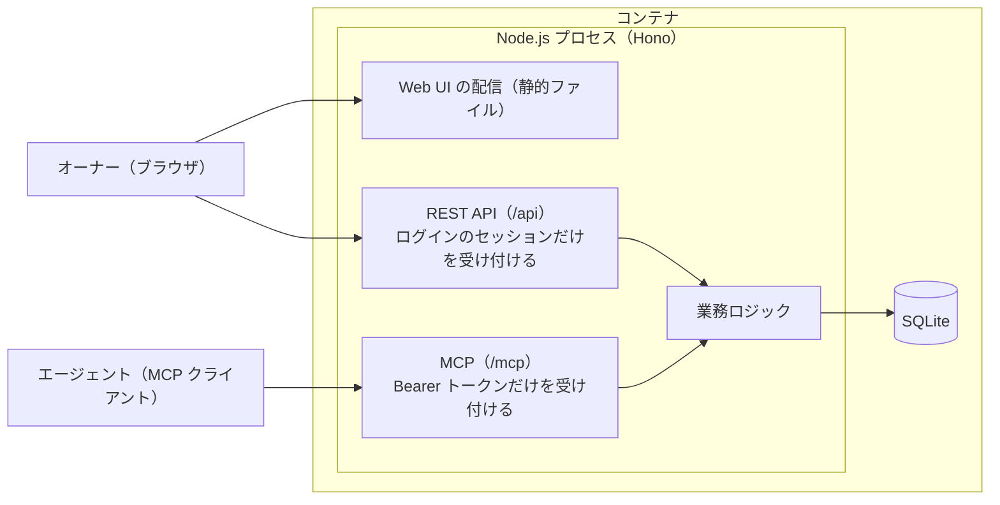

# 設計書

> [要件定義書 v1](Requirements.md) を実現するためのアーキテクチャを書く。要件は要件定義書に書き、この文書には要件をどう実現するかだけを書く。

---

## 1. 全体構成

1つのコンテナの中で、1つの Node.js プロセスが Web UI の配信・REST API・MCP をすべて受け持つ。データは同じプロセスから SQLite のファイルに保存する。

```mermaid
flowchart LR
    Owner["オーナー（ブラウザ）"]
    Agent["エージェント（MCP クライアント）"]

    subgraph Container["コンテナ"]
        subgraph Process["Node.js プロセス（Hono）"]
            Static["Web UI の配信（静的ファイル）"]
            REST["REST API（/api）<br/>ログインのセッションだけを受け付ける"]
            MCP["MCP（/mcp）<br/>Bearer トークンだけを受け付ける"]
            Logic["業務ロジック"]
        end
        DB[("SQLite")]
    end

    Owner --> Static
    Owner --> REST
    Agent --> MCP
    REST --> Logic
    MCP --> Logic
    Logic --> DB
```

- REST API と MCP は、同じ業務ロジックを通る（要件定義書 設計原則5）。MCP から DB を直接触る経路は作らない
- 経路ごとに受け付ける認証を分ける。REST API はログインのセッションだけ、MCP はエージェントのトークンだけを受け付ける。エージェントのトークンは REST API に使えない
- パスは REST API が `/api`、MCP が `/mcp`。それ以外のパスは Web UI を返す（[REST API「パス」](architecture/REST_API.md#section-7-1)）

## 設計書の構成

詳細は以下の文書に分けて記載する。章・節番号は分割前から維持し、過去の判断記録やコード内の参照からも移動先を確認できるようにする。

| 旧章番号 | 文書 | 内容 |
|---|---|---|
| 1章 | [全体構成](Architecture.md#section-1) | プロセス・経路・データストアの全体像（この文書） |
| 2章 | [技術スタック](architecture/Technology.md#section-2) | 技術の選定理由、開発環境、コンテナ、マイグレーション、バックアップ |
| 3章 | [検索](architecture/Search.md#section-3) | キーワード、対象項目、絞り込み、性能、結果の形式と上限 |
| 4章 | [ソフトウェアの構成](architecture/Software.md#section-4) | 層とモジュール、トランザクション、入力検証、権限、Activity、テスト |
| 5章 | [テーブル設計](architecture/Database.md#section-5) | 共通規則、各テーブル、外部キー、インデックス |
| 6章 | [MCP のツール](architecture/MCP.md#section-6) | ツール名、返却量の上限 |
| 7章 | [REST API](architecture/REST_API.md#section-7) | 経路、ページング、楽観ロック、応答の形式 |
| 8章 | [Web UI](architecture/Web_UI.md#section-8) | 画面とルーティング、一覧表示、操作、PC・スマホの配置 |

実装時は全体構成と、変更する箇所に関係する詳細設計を読む。層・モジュールの境界や操作の書き方は、[ソフトウェアの構成](architecture/Software.md#section-4)を参照する。

要件は[要件定義書 v1](Requirements.md)に記載する。本番の起動・更新は[本番環境の起動手順](Operations.md)、バックアップの確認・復元は[バックアップからの復元手順書](Backup_Operations.md)を参照する。
