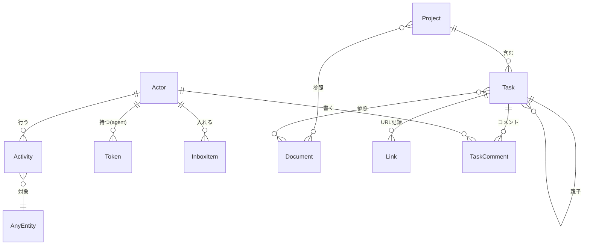
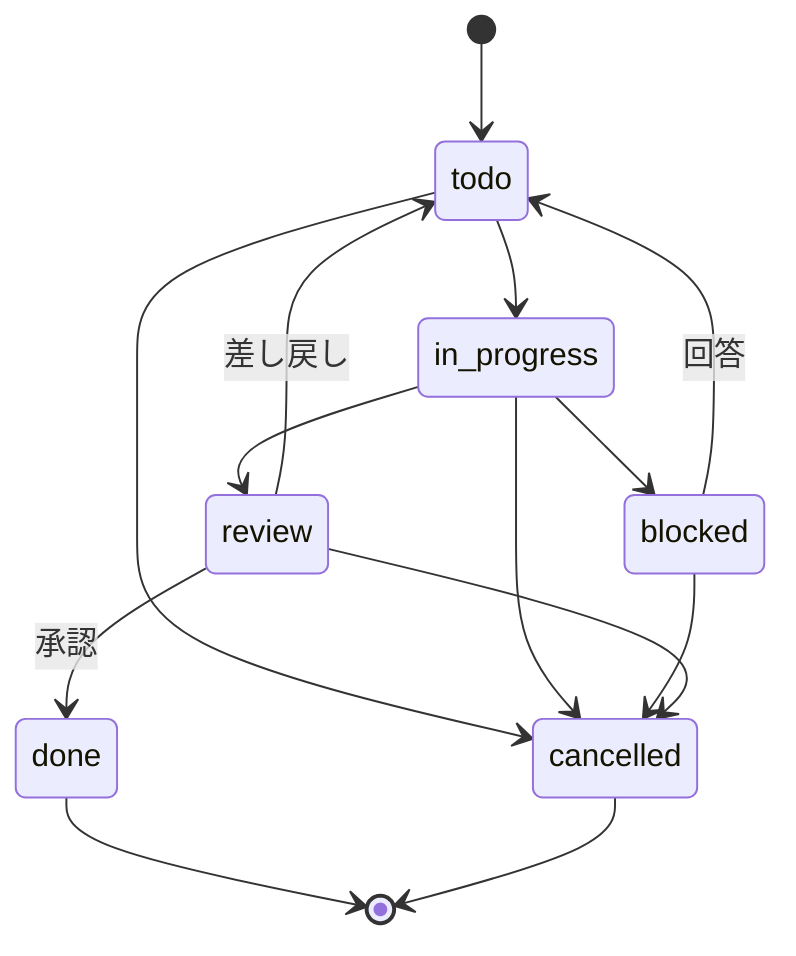

# 要件定義書 v1

> - `S-xx` … 利用シナリオ（4章）。v1 の要件は、いずれかのシナリオに必要なものだけとする
>
> この文書には **v1 でやること** と **やらないこと** だけを書く。「後でやるかもしれないこと」は書かない。変更するときは 5.3 の手順を通す。

---

## 1. 目的・背景

### 1.1 目的

人間とAIエージェントが **Task を通じて、同じデータを見て、同じ文脈で協働する** ための **タスク協働基盤** を作る。

情報全般を置く情報管理基盤（作業と関係のない知識ページの置き場）にはしない。範囲を広げすぎて、何でも置ける場所になり要件が膨らむことを避けるため。

- 人間は Web UI から自然に操作できる
- AIエージェントは MCP から意味のある単位で操作できる
- 「誰が・いつ・何を・なぜ」変えたかが、人間にもAIにも追える

### 1.2 背景

タスク管理の仕組みに AI エージェントを参加させようとすると、次の問題が起きやすい。本プロジェクトは、これらを最初から避けるように要件を定める。

| 問題 | 内容 | 本プロジェクトでの対処 |
|---|---|---|
| 横断概念の欠如 | 誰が変更したか（Actor）、変更履歴（Activity）が後付けになり、AI が何をしたか追えない | 最初から全エンティティに通す |
| 文脈の分断 | データの種類ごとに独立して管理すると、作業に必要な文脈を1か所から集められない | Project を文脈の境界とする |
| 外部サービスへの依存 | 外部サービス（GitHub issue 等）を Task の実体にすると、ID・検索・整合性が複雑になる | passdown を真実の源とする。v1 では外部サービスと同期しない |
| 構造の揺り戻し | 要件が固まらないまま作り始めると、構成の組み替えを繰り返す | 要件 → ドメインモデル → アーキテクチャの順で決める |
| 機能先行 | 機能の候補から出発して目的や使い方を後から付けると、目的のない機能が積み上がる | シナリオから要件を導き、機能追加にも手順を設ける（4章・5.3） |
| 人間の識別がない | トークンだけで認証すると、人間ユーザーを識別できない | ログインを持つ |

---

## 2. 利用者（Actor）

### 2.1 Actor の種類

| actor_type | 説明 | 例 | 認証手段 |
|---|---|---|---|
| human | 人間ユーザー | オーナー（passdown を運用する1人） | ログイン |
| agent | AIエージェント | Claude Code / Codex | APIトークン（有効期限なし、失効で無効化） |

- 人間ユーザーはオーナー1人だけ。ユーザーの新規登録・招待の機能は持たず、アカウントは初回セットアップ時に CLI で作り、パスワードの再設定も CLI で行う。Web UI でのパスワード変更は持たない。人間ユーザー間の権限差（管理者/一般）は持たない
- 内部ネットワークからは前段の認証（10章）を通らずに直接アクセスできるため、passdown 自身のログインが必要
- **Actor ごとの役割は定義しない**。人間・コーディングエージェント・オーケストレーターエージェントは同じ操作ができる。違いは「誰がやったか」として記録されるだけで、制限したい場合は権限（7.1）で絞る（例外は設計原則4）
- agent Actor の作成・権限の設定と、トークンの発行・失効は、ログインした人間だけが Web UI で行う
- 権限は Actor が持つ。トークンは agent Actor の認証手段で、権限を持たない
- v1 には自動処理（system）がないため、system という Actor 種別は持たない

### 2.2 操作経路（source）

| source | 説明 |
|---|---|
| web | Web UI からの操作 |
| mcp | MCP からの操作 |

- スクリプト等から REST API を直接使う経路（api）は持たない

---

## 3. 設計原則

1. **Human-first UI + Agent-first MCP**: 人間向けUIとAI向けMCPを分けて最適化するが、データは同じものを見る。AI専用UIにはしない
2. **Project が文脈の境界**: Project に属する Task と、Project が参照する Document について、AI は Project 単位で文脈を得る。Task の Project への所属は必須ではない
3. **すべての変更は Actor 付きで記録される**: 経路を問わず例外なし。自動で起きる変更（親 Task の連動、親 Task の cancel に伴う子孫の cancel、Project の archive に伴う cancel）は、きっかけになった操作の Actor として記録する。agent Actor の作成・権限の変更、トークンの発行・失効も記録する。ただし CLI での人間のアカウントの作成・パスワードの再設定は、Web UI・MCP を通らない運用作業のため記録しない
4. **Actor の種類で操作能力に差を設けない**: human も agent も同じ操作ができる。制限は Actor 種別ではなく Actor に付与した権限で行う。例外として、Actor・トークンの操作（agent Actor の作成・権限の設定、トークンの発行・失効）と承認（review → done、Task の cancel、Project の done・archive）、Activity の閲覧は、ログインした人間だけが Web UI で行う。この例外は経路で制限し（REST API はログインした人間だけが使い、MCP にはこれらのツールを持たない）、業務ロジックに Actor 種別による分岐を持たない
5. **Web と MCP は同じ業務ロジックを通る**: MCP から DB を直接触る経路は作らない。REST API は Web UI 専用でログインした人間だけが使い、エージェントのトークンは MCP でだけ使える
6. **passdown が真実の源**: 外部サービスのデータを実体にしない
7. **消さない**: 完全削除の機能は持たない。終わったものは状態（archived / cancelled）で表す
8. **シナリオにないものは作らない**: 要件はいずれかの利用シナリオ（4章）に必要なものに限る。目的が明確でないデータは記録できるようにしない。「後で使うかもしれない」は理由にしない

---

## 4. 利用シナリオ

v1 で実現する使い方。S-01〜S-09 は実際の使い方と合っていることを確認済み。

### S-01: 思いつきを Inbox に入れて整理する
1. オーナーが Web UI（外出先からは前段の認証を通って）から、思いついたことを Inbox に入れる。エージェントも会話の中で MCP から Inbox に入れる
2. オーナー、またはエージェントが Inbox の一覧を見て、1件ずつ Project にする / Task にする / Document にする / archive する
3. 変換した Item は整理済み（triaged）にし、Inbox の一覧（既定は未整理のみ）から外す

- エージェントも Inbox に入れる。整理（変換・archive）は人間もエージェントも行う
- Inbox は、Project にするほど固まっていない思いつきや検討したい内容を殴り書きで置く場所。消さないが、整理が済んだものは Inbox の一覧に出さない
- Inbox に入れるのは、整理すれば Project / Task / Document のいずれかになりうるものだけとする。どれにもならないただのメモは入れない。本文は自由記述のためシステムでは判定せず、エージェントには MCP のツール説明でこの基準を示す。基準に合わないものが入った場合は archive する

### S-02: Project を立ち上げて Task を用意する
1. オーナー（またはエージェント）が Project を作り、概要（何の Project か・どうなったら完了か）・instructions（エージェント向けの作業指示）・関連リポジトリを書き、作業の文脈として使う Document を参照に加える
2. オーナー（またはオーケストレーターエージェント）が Task を作り、「何をするか（description）」と「何を満たせば完了か（acceptance_criteria）」を書いて、担当を割り当てる。急ぐものには priority を付ける
3. 大きな Task は子 Task に分ける。子 Task は人間もエージェントも作る。子 Task を追加できるのは、親 Task が todo / in_progress / blocked のときだけ。子 Task は親 Task と同じ Project に属する（親が Project に属さなければ子も属さない）。親の作成し忘れ・付け忘れ・付け間違いに備え、作成済みの Task に後から親を付ける・付け替える・外すことができる
4. 親 Task は、子 Task がすべて終わった（done または cancelled）ときに review に出せる。自動では review / done にせず、ほかの Task と同じく review を経て承認で done にする

- 子 Task を持つ親 Task は、エージェントの着手対象にしない（作業するのは子 Task）
- 子 Task がすべて終わった親 Task は、一覧で分かるようにする
- 担当は「Claude Code」のように個別の Actor を指定する

### S-03: エージェントが担当の Task に自動で着手して review に出す
1. エージェント（passdown の外で定期的に動く仕組み）が MCP で、自分が担当で todo の Task を探す。複数あれば priority の高いものから着手する
2. Task が Project に属していれば、Project の文脈（概要・instructions・Project に属する終わっていない Task・Project が参照する Document）と、Task から参照される Document をまとめて受け取る。属していなければ、Task 本文・コメントと Task から参照される Document を文脈にする。子 Task なら、親 Task の title・description・acceptance_criteria もあわせて受け取る
3. Task を in_progress にして作業する
4. 判断に困ったら blocked にして理由を書き、途中までの作業内容をコメントに残して、セッションを終える
5. オーナーが passdown 上で blocked の Task を見て、**コメントで回答し、Task を todo に戻す**（Web UI では1回の操作で行える）。エージェントは todo に戻った Task を通常どおり着手対象として拾い、コメントを読んで作業を再開する
6. 作業が終わったら、PR 等の URL を記録し、result に成果を書いて review にする

- 人間への質問は「blocked にして理由を書く」で行う
- エージェントは毎回新しいセッションで Task に着手・再開する。エスカレーション後に同じセッションを続けることは前提にしない。再開に必要な経緯は passdown（Task 本文・コメント・result 等）から得る
- エージェントが Task を読むときは、必ずコメントも一緒に受け取り、Task がどんな状況かを把握できるようにする
- エージェントを定期的に動かす仕組み（常駐・スケジュール実行、作業環境の用意等）は passdown の外で作る。本リポジトリの対象外だが、このシナリオの前提になる
- 自動着手で満足のいく成果物になるかは試してみないと分からないため、承認（S-04）で成果を確認する

### S-04: オーナーが review の Task を確認して承認・差し戻す
1. オーナーが review 状態の Task の一覧を見る
2. result・記録された URL・Activity（誰が何をしたか）を確認する
3. 問題なければ承認して done にする。問題があれば**コメントで理由を書いて差し戻す**（todo に戻る）
4. エージェントは todo に戻った Task を拾い、差し戻し理由のコメントを読んで作業を再開する

- review 待ちには一覧で気づければ十分。通知は持たない

### S-05: 作業の文脈になる資料を書いて参照する
1. オーナーやエージェントが、Task の作業に必要な資料を Document として書き、手で更新する。特に、リポジトリを持たない作業（インフラ作業等）では、README や CLAUDE.md に当たる資料の置き場所がないため、Document に置く（例: Kubernetes クラスタの構成）
2. Task や Project から関連する Document を参照し、エージェントは作業時に読む。複数の Project で使う資料（例: Kubernetes クラスタの構成を「Web アプリのデプロイ」「監視システム構築」で使う）は、それぞれの Project から参照する
3. 人間・エージェントがキーワードやタグで Document を検索する。作成・更新した時期でも絞り込む

- Document は **作業の文脈としてだけ** 持つ。作業と関係のない知識ページの置き場にはしない
- インフラ作業などリポジトリを持たない Task も、エージェントに自動着手させる
- スクリプトからの Document の自動更新は持たない
- Document はどの Project にも所属しない。Task・Project から複数の Document を参照でき、1つの Document を複数の Task・Project から参照できる
- タグは、既存のタグを見てから付けられるようにする。エージェントは既存のタグを知らないと、自分で言葉を考えて別の言葉のタグ（例: 既存の「k8s」に対して「kubernetes」）を付け、人間・エージェントがタグで絞り込んだときに漏れるため

### S-06: 過去の Task の経緯を確認する
1. オーナーやエージェントが、done / cancelled / blocked の Task を開く、またはキーワードで Task を検索する。「去年の秋ごろにやった Task」のように、作成・更新した時期でも絞り込む
2. result（どう終わったか・なぜやめたか）、blocked_reason（なぜ止まっているか）、コメント（回答・差し戻し理由などのやり取り）で経緯を把握する。オーナーは Activity（誰がいつ何を変えたか）もあわせて確認する（エージェントは Activity を読まない）

- エージェントは、実行中の Task の中で判断するときに、過去の判断と矛盾しないか・当時どう判断していたかを確認するために使う。そのため、Task のコメントなど判断の経緯を検索できるようにする
- done / cancelled の Task は読み取りだけにする（項目の更新・コメント・Document の参照の追加や削除もできない）。このシナリオでは読むだけで、誤って cancel した場合は新しく起票する

### S-07: エージェントを使える状態にする
1. オーナーが Web UI にログインする
2. エージェント用のトークンを発行する。発行時に、新しい agent Actor の名前（例: 「Codex」）を入力するか、既存の agent Actor を選ぶ。新しく作る場合は Actor の権限（リソースごとの read / readwrite）を絞る
3. エージェントの MCP 設定にトークンを設定する
4. エージェントを使わなくなったとき、またはトークンが漏れたときは、トークンを失効させる
5. トークンが漏れたときは、同じ agent Actor に新しいトークンを発行して設定し直してから、古いトークンを失効させる。Actor は変わらないため、担当の Task・Activity・権限はそのまま引き継がれる

- 1つの agent Actor は有効なトークンを複数持てる（エージェントを止めずにトークンを入れ替えるため）
- 権限の変更は Actor に対して行い、その Actor のすべてのトークンに反映される
- エージェントを使わなくなっても、トークンを失効させるだけで agent Actor は無効にしない（担当の候補に残る）。その Actor が担当する終わっていない Task は、担当を付け替える

### S-08: 起票した Task をやめる
1. オーナーが、起票済みの Task についてコメント等を読み本当に必要かを判断する
2. 不要と判断したら、result にやめた理由を書いて cancelled にする。子孫の Task のうち終わっていないものも、まとめて cancelled にし、result に「親 Task をやめたため」と書く

- Task は「絶対に必要」と決まる前に起票することがあるため、起票後に不要と判断してやめる場面がある
- cancel できるのはオーナー（ログインした人間）だけ（設計原則4の例外）。エージェントが不要だと考えた場合は、blocked にして理由を書き、人間に判断を仰ぐ（cancelled は review を通らないため、人間の確認なしに作業を終わらせる経路を作らない）

### S-09: Project を終える
1. **完了**: 関連する Task がすべて終わり、今後 Task を起票することもない Project を、オーナーが done にする
2. **とりやめ**: 進めるのをやめた Project を、オーナーが archived にする（例: 別の手段で解決することにして開発をやめる）

- 終わっていない（done / cancelled 以外の）Task が残っている Project は done にできない。先に Task をすべて終わらせる
- done にできるのもオーナー（ログインした人間）だけ。done は戻せないため、エージェントが誤って done にすると二度と起票できなくなる（設計原則4の例外）
- done / archived の Project は読み取りだけにする（項目の更新も Document の参照の追加・削除もできない）
- archived にすると、終わっていない Task をまとめて cancelled にし、result に「Project をやめたため」と書く
- done / archived の Project は active に戻せず、Task を起票することも、既存の Task をその Project に入れることもできない。後から作業が必要になったら新しい Project を作る（必要な Document は新しい Project からも参照できる）

---

## 5. スコープ

### 5.1 v1 でやること

| 領域 | 内容 | 根拠シナリオ |
|---|---|---|
| 認証・認可 | 人間のログイン、agent Actor の作成とエージェント用トークン（1 Actor に複数可）、Actor に付与するリソース単位の権限。Actor・トークンの操作、承認（review → done、Task の cancel、Project の done・archive）、Activity の閲覧は、ログインした人間だけが Web UI で行う | S-04, S-06〜S-09 |
| Actor / Activity | すべての変更（agent Actor の作成・権限の変更、トークンの発行・失効を含む）を Actor・経路・変更前後付きで記録し、Project・エンティティ単位で閲覧できる | S-04, S-06, S-07 |
| Project | 概要・instructions・関連リポジトリ、文脈として参照する Document、Project の文脈をまとめてエージェントに渡す、完了（done）・とりやめ（archived） | S-02, S-03, S-09 |
| Task | 状態遷移、description / acceptance_criteria、親子、担当、承認（全 Task で review 必須）、result / blocked_reason、URL 記録、コメント、priority、cancel | S-02〜S-04, S-06, S-08, S-09 |
| Document | 作業の文脈になる資料（Markdown、手で更新）、タグ、Task・Project からの参照（多対多）、archive | S-05 |
| Inbox | 取り込み、Project / Task / Document への変換（変換後は整理済み）、archive | S-01 |
| 検索 | Task（コメントを含む）と Document の全文検索（キーワード＋絞り込み） | S-05, S-06 |

### 5.2 v1 でやらないこと（スコープ外）

ここに挙げたものは「後でやる予定」ではない。必要になったら 5.3 の手順で改めて検討する。

| 項目 | 外した理由 |
|---|---|
| GitHub との同期（issue 作成・状態同期・PR マージで完了） | 承認を担保するには GitHub 側の操作者の識別が必要で重すぎる |
| GitHub 以外の外部連携、webhook 受信 | シナリオにない。外部からの受信経路を作りたくない |
| 判断記録（判断を独立したデータとして残す機能） | 記録する目的が明確でない |
| Document の種別（document_type） | 目的が明確でない。検索の絞り込みはタグで足りる |
| Task の Claim（排他取得）、Task ごとの承認要否の指定 | シナリオにない |
| Agent Session（エージェントの作業単位の記録） | シナリオにない |
| Automation（期限切れ通知等の自動処理） | シナリオにない |
| 細かい権限（Project スコープ、削除禁止フラグ、トークンごとの権限） | v1 はリソース単位の権限で足りる |
| エージェントによる Actor・トークンの操作と承認（review → done、Task の cancel、Project の done・archive） | シナリオにない（S-04, S-07〜S-09 はすべてオーナーが行う）。許すと、自分より強い Actor のトークンを発行して権限を得られないかといった判定が必要になる |
| Document の版履歴・Document 間リンク・共同同時編集 | シナリオにない |
| AI による Inbox の分類提案・自動変換 | シナリオにない |
| Embedding / RAG による検索 | S-05・S-06 の検索は全文検索で足りる |
| Sprint / Gantt / Analytics、SSO、Event Sourcing | シナリオにない |
| ユーザーの新規登録・招待、人間ユーザー間の権限差 | 人間ユーザーはオーナー1人だけ |
| Web UI でのパスワード変更 | 変える場面がシナリオになく、漏えいを疑った場合は CLI で再設定すれば足りる |
| トークンの有効期限 | 定期的に再発行する場面がシナリオになく、不要になった・漏れたときは失効させれば足りる |
| agent Actor の無効化 | エージェントは数体の規模で、トークンの失効と担当の付け替えで足りる |
| MCP の OAuth 認証 | ブラウザでのログイン操作が必要で、無人で定期実行するエージェントに向かない |
| 全体の Activity 表示（Activity Feed） | 見る機会がない。Activity は Project・エンティティ単位で見る |
| Kanban 表示 | 強みのドラッグによる状態変更を使う場面がない。見渡しは状態ごとの件数と絞り込みで足りる |
| passdown 側の二要素認証・パスキー | 外部ネットワークからのアクセスは前段の認証を通り、内部ネットワークからのアクセスは信頼できる範囲に限られる前提のため |
| 外部ネットワークから MCP を使う経路 | エージェントはすべて内部ネットワークで動かす前提のため |
| 情報管理基盤としての機能（作業と関係のない知識ページ、スクリプトからの Document 自動更新、REST API を直接使う経路） | タスク協働基盤に範囲を絞るため |
| 既存ツールからのデータ移行 | 一度きりの作業で、本リポジトリで恒常的に持つ機能ではない |

### 5.3 機能を追加するときの手順

v1 の後に機能を追加する場合も、行き当たりばったりにしないため次の順を必ず通す。

1. **困っている場面をシナリオとして書く**（誰が・いつ・何に困るのか）
2. **要件定義書を更新する**（シナリオと、それに必要な要件を追加し、5.2 から外す）
3. **設計への影響を確認する**（既存の原則・データモデル・承認の担保と矛盾しないか）
4. **実装する**

将来のアイデアは要件定義書に書かず、passdown の Inbox 等に置く。

---

## 6. ドメインモデル（概念レベル）

実装方式（テーブル設計等）はアーキテクチャ設計で決める。ここでは概念と関係のみ。



### 6.1 Actor
- human / agent のいずれか
- human はログインアカウントを持つ。agent はトークンを持つ（有効なトークンを複数持てる）
- 権限は Actor が持ち、トークンは権限を持たない。トークンで操作すると、紐づく agent Actor の権限で動く
- human（オーナー）はすべての操作（すべてのリソースの readwrite、Actor・トークンの操作、承認）を行える。人間ユーザー間の権限差を持たないため
- agent Actor に付与できるのは、リソースごとの read / readwrite だけ
- 同一テーブルで扱うか別テーブルか → アーキテクチャ設計で決定（要件としては「すべての記録で同じ形式で参照できる」こと）

**Token**
| 項目 | 説明 | 根拠シナリオ |
|---|---|---|
| actor | 紐づく agent Actor | S-07 |
| issued_at | 発行日時（入れ替えのとき、どれが古いトークンかを見分けるため） | S-07 |
| revoked_at | 失効日時（失効していなければ空） | S-07 |

- 名前（用途）は持たない。1つの Actor が複数のトークンを持つのは入れ替えの間だけで、新旧は発行日時で見分けられる
- トークンの値は発行時に一度だけ平文で表示し、後から表示できない（ハッシュで保存するため）

### 6.2 Project
| 項目 | 説明 | 根拠シナリオ |
|---|---|---|
| name | 名前 | S-02 |
| description | 概要。何の Project か、どうなったら完了かをあわせて書く | S-02, S-03, S-09 |
| status | active（未完了）/ done（完了）/ archived（やめた） | S-09 |
| instructions | エージェントに自動で渡す作業指示（例: 「破壊的変更は禁止」「変更前に architecture を読む」） | S-02, S-03 |
| repositories | 関連するリポジトリ（URL 等の記録のみ。エージェントが作業対象を知るため。リポジトリを持たない作業では空） | S-02, S-03 |
| documents | 文脈として参照する Document（複数可）。エージェントは Project の文脈を取得するときに受け取る | S-02, S-03, S-05 |
| version | 版数（楽観ロックで同時更新を検知するため。履歴は持たない） | S-02, S-03 |

- done / archived から active には戻せない。done / archived の Project には、Task を作成することも、Task の Project を変えて入れることもできない（Inbox からの変換を含む）
- done / archived の Project は読み取りだけで、項目（name・description・instructions・repositories）の更新も Document の参照の追加・削除もできない
- done にするのも archived にするのも、ログインした人間だけが Web UI で行う（設計原則4の例外）

### 6.3 Task
| 項目 | 説明 | 根拠シナリオ |
|---|---|---|
| title | タイトル | S-02 |
| description | 何をするか | S-02, S-03 |
| acceptance_criteria | 何を満たせば完了か（description と分離する） | S-02〜S-04 |
| status | 下記参照 | S-03, S-04, S-08, S-09 |
| priority | 優先度。担当の todo が複数あるとき、エージェントが着手する順番を決める。値は high / normal / low、既定は normal。同じ priority の中では作成日時の古い順 | S-02, S-03 |
| project | 所属 Project。**任意**（どこにも属さない Task を起票できる）。親を持つ Task の Project は個別に変えられず、最上位の Task の Project を変えると子孫もあわせて変わる | S-02 |
| parent | 親 Task。子は親と同じ Project に属する。作成後に付ける・付け替える・外すことができる | S-02 |
| assignee | 担当 Actor（human / 個別の agent）。**任意**で、担当のない Task はどのエージェントの着手対象にもならない。終わっていない Task ならどの状態でも付け替えられる | S-01〜S-03, S-07 |
| result | どう終わったか。done なら成果の要約、cancelled なら中止した理由 | S-03, S-06, S-08, S-09 |
| blocked_reason | blocked 時の理由。todo に戻したときに消す（経緯はコメントと Activity に残る） | S-03, S-06 |
| links | GitHub issue / PR 等の URL（記録のみ、同期なし） | S-03, S-04 |
| documents | 参照する Document（複数可。Project に属さない Task の文脈にもなる） | S-03, S-05 |
| created_by / created_at | 作成した Actor と日時（同じ priority の中で作成日時の古い順に着手するため。検索で時期を絞り込むため） | S-02, S-03, S-06 |
| updated_at | 最後に変更された日時。コメントの追加でも更新する。検索で時期を絞り込むためと、in_progress のまま放置された Task に一覧で気づくために使う | S-03, S-06 |
| version | 版数（楽観ロックで同時更新を検知するため。履歴は持たない） | S-02〜S-04 |

**状態遷移**



- エージェント専用の状態は増やさない
- 子 Task が in_progress になったら、親 Task が todo なら自動で in_progress にする。孫 Task からも上に向かって順に連動する。連動は todo → in_progress の一方向だけで、子が todo に戻っても親は戻さない。連動による変更は、子を in_progress にした操作と同じ Actor の変更として Activity に記録する
- 親 Task は、子 Task がすべて終わったら in_progress → review で review に出す（親 Task 用の例外の遷移は持たない）。子 Task が1つでも終わっていなければ review に出せない
- 子 Task を追加できるのは、親 Task が todo / in_progress / blocked のときだけ。review / done / cancelled の親には追加できない
- 親 Task を cancel すると、終わっていない子孫の Task（孫以下を含む）もまとめて cancelled にし、result に「親 Task をやめたため」と書く。cancel した操作と同じ Actor の変更として Activity に記録する
- 作成済みの Task C に親 P を付ける・付け替えるときは、次をすべて満たす必要がある
  - C が done / cancelled でない
  - P が todo / in_progress / blocked である
  - P が C 自身でも C の子孫でもない（循環させない）
  - P と C が同じ Project に属する（どちらも Project に属さない場合を含む）。Project が違う場合は、先に C の Project を変える（C が親を持つなら、いったん親を外す）
- 親を外せるのは、C が done / cancelled でないときだけ。外した C は同じ Project に残り、最上位の Task になる
- 親を付ける・付け替えた結果、C が in_progress で P が todo なら、P を自動で in_progress にする（子が in_progress になったときの連動と同じ）。親を付ける・付け替える・外すのは Task の readwrite 権限で行え、自動の連動を含めて操作した Actor の変更として Activity に記録する
- 子をすべて外された（付け替えられた）親 Task が in_progress のまま残っても、自動では状態を変えない。作業させる場合は、blocked を経て todo に戻す（in_progress → blocked → todo）
- エージェントのセッションが異常終了するなどして in_progress のまま放置された Task も、自動では戻さない。Web UI の一覧で最後に変更された日時（updated_at）から気づき、blocked を経て todo に戻す
- in_progress の Task の担当を付け替えた場合も、自動では状態を変えない。新しい担当に着手させるには、blocked を経て todo に戻す
- done / cancelled は終わりの状態で、ほかの状態に戻せない。done / cancelled の Task は読み取りだけで、項目の更新（親・Project・links・Document の参照を含む）もコメントの追加もできない。誤って cancel した場合は新しく起票する
- **すべての Task で review を必須とする**。in_progress から done へ直接は進めない
- review → done（承認）と cancel は、ログインした人間（オーナー）だけが Web UI で行える（設計原則4の例外）。差し戻し（review → todo）と回答（blocked → todo）は readwrite 権限で行える
- blocked への回答・差し戻し理由は Task のコメントに書き、Task を todo に戻す。エージェントは状態（todo）で気づく
- 状態を変えるときに必須の入力は次のとおり。Web UI・MCP で同じルールにする
  - review に出す（in_progress → review）: result
  - blocked にする（in_progress → blocked）: blocked_reason
  - todo に戻す（回答 blocked → todo、差し戻し review → todo）: コメント。あわせて blocked_reason を消す
  - cancel: result
- 回答後・差し戻し後の戻り先を in_progress ではなく todo にする: エージェントは毎回新しいセッションで再開するため、「todo＝誰も作業していない」と区別でき、回答・差し戻し・新規の Task を同じ流れで拾える
- 一覧では、todo に戻った Task に「回答済み」「差し戻し済み」を表示する。最後の状態変更の Activity（blocked → todo なら回答済み、review → todo なら差し戻し済み）から判定する

**TaskComment**
| 項目 | 説明 | 根拠シナリオ |
|---|---|---|
| task | 対象 Task | S-03, S-04 |
| body | 本文（blocked への回答、差し戻し理由、人間・エージェント間のやり取り） | S-03, S-04, S-06 |
| created_by | 書いた Actor | S-03, S-04, S-06 |
| created_at | 日時 | S-06 |

- human / agent のどちらも書ける
- 編集・削除はできない。訂正は新しいコメントで行う


### 6.4 Document
| 項目 | 説明 | 根拠シナリオ |
|---|---|---|
| title / content | Markdown | S-05 |
| status | active / archived（完全削除を持たないため、使わなくなった資料は archived にする） | S-05 |
| tags | タグ。検索での絞り込みに使う | S-05 |
| created_by / updated_by | Actor | S-05, S-06 |
| created_at / updated_at | 作成日時・最後に変更された日時（検索で時期を絞り込むため） | S-05 |
| version | 版数（楽観ロックで同時更新を検知するため。履歴は持たない） | S-05 |

- Project への所属は持たない。Task・Project から参照される（多対多）
- Project を done / archived にしても、参照している Document は変更しない。不要になった Document は個別に archive する
- archived の Document は、Project の文脈にも、MCP で Task を読むときの参照 Document の一覧（`get_task`）にも含めない。Web UI の Task 画面では、archived と分かる表示で参照を残す
- archive の取り消し（active に戻す）は持たない。archived の Document も絞り込みで読めるため、必要になったら内容を写して新しく作る

### 6.5 InboxItem
| 項目 | 説明 | 根拠シナリオ |
|---|---|---|
| content | 本文。untriaged のときだけ変更できる | S-01 |
| created_by | Actor | S-01 |
| status | untriaged（未整理）/ triaged（整理済み）/ archived（不要） | S-01 |
| version | 版数（楽観ロックで同時更新を検知するため。履歴は持たない） | S-01 |

- 本文を変更できるのは untriaged の Item だけで、Inbox の readwrite 権限を持つ Actor なら書いた本人でなくても変更できる。triaged / archived の Item は読み取りだけにする（変換した時点の本文を残し、変換の経緯を追えるようにするため）

- Project / Task / Document へ変換できる。変換した Item は triaged にする。変換先へのリンク項目は持たない
- 変換したこと（どの Item を、どの Project / Task / Document に変換したか）は Activity の inbox.converted に記録し、Item の画面では Activity から変換先を表示する
- 変換せず Project に紐付けるだけの操作は持たない
- archive の取り消し（untriaged に戻す）は持たない。archived の Item も絞り込みで読めるため、必要になったら内容を写して新しく入れる

### 6.6 Activity
すべての変更を1件ずつ残す。Task・Project の画面で経緯を見る用途と、監査ログ（後から追う）を兼ねる。全体を眺める Activity Feed は持たない。読むのはログインした人間だけで、エージェントは読まない（経緯はコメント・result・blocked_reason で把握する）。

| 項目 | 説明 | 根拠シナリオ |
|---|---|---|
| event_type | task.created / task.status_changed / inbox.converted 等（「回答済み」「差し戻し済み」の判定にも使う） | S-03, S-04, S-06 |
| entity_type / entity_id | 対象（agent Actor・トークンを含む） | S-04, S-06, S-07 |
| project | 所属 Project（Project 単位で引くため）。Document は Project に所属しないため、Document 自体の変更は Project に載せない。Project の Document の参照の追加・削除は Project の変更として記録する | S-06 |
| actor / source | 誰が・どの経路で | S-04, S-06 |
| before / after | 変更差分（todo に戻したときの戻り元の状態の判定にも使う） | S-03, S-04, S-06 |
| occurred_at | 日時 | S-06 |

---

## 7. 機能要件

### 7.1 認証・認可
- F-AUTH-01: 人間ユーザー（オーナー1人）はログインして Web UI を使える。アカウントの作成とパスワードの再設定は CLI で行い、新規登録画面と Web UI でのパスワード変更は持たない。ログアウトできる。ログインには有効期限を設け、長さはアーキテクチャ設計で決める（外出先の端末からもログインするため）（S-01, S-07）
- F-AUTH-02: ログインした人間は、Web UI で agent Actor を作成し、その権限を設定し、エージェント用トークンを発行・失効できる。agent はこれらの操作を行えない（設計原則4の例外）。トークンは agent Actor に紐づき、発行時に新しい agent Actor を作るか既存の agent Actor を選ぶ。1つの agent Actor は有効なトークンを複数持てる（S-07）
- F-AUTH-03: agent Actor にはリソース単位の read / readwrite 権限を付与できる（権限はトークンではなく Actor が持つ）。リソースは Project / Task / Document / Inbox の4つで、Task のコメントは Task に含める。付与したリソースにだけアクセスでき、付与していないリソースにはアクセスできない。すべてのリソースに readwrite を付与しても、Actor・トークンの操作と承認はできない（F-AUTH-02, F-AUTH-05）。トークンは権限を持たず、紐づく Actor の権限で動く。Actor の権限を変えると、その Actor のすべてのトークンに反映される（S-07）
- F-AUTH-04: 権限外の操作は、MCP ではツールを表示しない。エージェントのトークンは MCP でだけ使え、REST API（Web UI 専用）には使えない（S-07）
- F-AUTH-05: 承認（review → done）、Task の cancel、Project の done・archive は、ログインした人間だけが Web UI で行える。付与できる権限としては持たない（設計原則4の例外）（S-04, S-08, S-09）
- F-AUTH-06: （欠番）
- F-AUTH-07: 複数のリソースにまたがる結果を返す操作（Project の文脈取得、Task の参照 Document の一覧、検索等）では、read 権限を持たないリソースを結果に含めない（S-03, S-05〜S-07）
- F-AUTH-08: Activity は独立したリソースにしない。Activity（agent Actor の作成・権限の変更とトークンの発行・失効の Activity を含む）は、ログインした人間だけが Web UI で読む。MCP に Activity を読むツールは持たない（S-04, S-06, S-07）
- F-AUTH-09: 複数のリソースにまたがる書き込みには、次の権限を必要とする（S-01, S-02, S-05, S-07）
  - Inbox Item の変換: Inbox の readwrite と、変換先のリソース（Project / Task / Document）の readwrite
  - Task・Project への Document の参照の追加・削除: 参照元（Task / Project）の readwrite と、Document の read

### 7.2 Project
- F-PRJ-01: 作成・参照・更新。status を done（完了）/ archived（やめた）にできる。done は終わっていない（done / cancelled 以外の）Task がないときだけ、archived にすると終わっていない Task をまとめて cancelled にする。done・archive はログインした人間だけが行える。done / archived の Project は active に戻せず、Task を起票・移動できない。done / archived の Project は読み取りだけで、項目の更新も Document の参照の追加・削除もできない（S-02, S-09）
- F-PRJ-02: instructions を設定でき、エージェントは Project の文脈を取得するときに自動で受け取る（S-02, S-03）
- F-PRJ-03: Project 画面で Overview / Tasks / Documents（参照している Document）/ Activity を見られる（S-02, S-06）
- F-PRJ-04: Project から複数の Document を文脈として参照できる。Project を done / archived にしても、参照している Document は変更しない（S-02, S-03, S-05）

### 7.3 Task
- F-TSK-01: 作成・参照・更新・状態変更・cancel。cancel はログインした人間だけが行える。done / cancelled の Task は読み取りだけで、更新・コメントはできない（S-02〜S-04, S-06, S-08）
- F-TSK-02: description と acceptance_criteria を分けて持つ（S-02, S-03）
- F-TSK-03: 親子関係を持てる。子 Task は human / agent が作れる。子 Task は親 Task が todo / in_progress / blocked のときだけ追加でき、親と同じ Project に属する。親 Task は子 Task がすべて done / cancelled になるまで review に出せず、自動でも review / done にならない。子 Task が in_progress になると、todo の親 Task は自動で in_progress になる。親 Task を cancel すると、終わっていない子孫の Task もまとめて cancelled になる。done / cancelled でない Task には、後から親を付ける・付け替える・外すことができる。付けられる親は同じ Project の todo / in_progress / blocked の Task で、循環させない。親を持つ Task の Project は個別に変えられず、最上位の Task の Project を変えると子孫もあわせて変わる（S-02, S-08）
- F-TSK-04: human または個別の agent を担当に割り当てられる。担当は任意で、終わっていない Task ならどの状態でも付け替えられる（S-01〜S-03, S-07）
- F-TSK-05: result（どう終わったか）と blocked_reason（なぜ止まったか）を残せる。review に出す・cancel するときは result、blocked にするときは blocked_reason、todo に戻すときはコメントを必須にする。blocked_reason は todo に戻したときに消す（S-03, S-06, S-08）
- F-TSK-06: GitHub issue / PR 等の URL を記録できる（同期なし）（S-03, S-04）
- F-TSK-07: ログインした人間が review の Task を承認（done）できる。差し戻し（コメントで理由を書いて todo に戻す）は readwrite 権限で行える（S-04）
- F-TSK-08: human / agent が Task にコメントを書ける。コメントの編集・削除はできない（S-03, S-04, S-06）
- F-TSK-09: Web UI では、コメントの投稿と状態の変更（blocked → todo、review → todo）を1回の操作で行える（S-03, S-04）
- F-TSK-10: Task に priority を付けられる。エージェントの着手対象は priority の高い順に返す（S-02, S-03）
- F-TSK-11: エージェントが MCP で Task を読むときは、コメントを必ず一緒に返す。コメントは全件返し、件数・文字数の上限は設けない（S-03, S-06）
- F-TSK-12: エージェントが MCP で Task を読むときは、親 Task の title・description・acceptance_criteria と、子 Task の一覧（title・状態）もあわせて返す。親 Task の参照 Document は含めない（必要なら子 Task にも参照を付ける）（S-02, S-03）

### 7.4 Document
- F-DOC-01: 作業の文脈になる資料を Markdown で作成・参照・更新・archive。archive の取り消しは持たない（S-05）
- F-DOC-02: タグを付けられる。タグは書き方を揃えて保存する（前後の空白を除く、全角・半角を揃える、英字を小文字にする）。タグを付けるときは既存のタグ（archived の Document のタグを含む）を示す（Web UI では入力の候補、MCP では `create_document`・`update_document` の説明）。タグでの絞り込みも、同じように揃えた値で当てる（S-05）
- F-DOC-03: Task・Project から参照できる。Task・Project はそれぞれ複数の Document を参照でき、1つの Document を複数の Task・Project から参照できる。Document は Project に所属しない（S-05）
- F-DOC-04: Document 画面で、参照している Task・Project を見られる（S-05）

### 7.5 Inbox
- F-INB-01: human / agent が取り込める（S-01）
- F-INB-02: human / agent が Project / Task / Document へ変換できる。変換した Item は triaged になり、Inbox の一覧から外れる（S-01）
- F-INB-03: human / agent が archive できる。archive の取り消しは持たない（S-01）
- F-INB-04: human / agent が untriaged の Item の本文を変更できる。triaged / archived の Item は変更できない（S-01）

### 7.6 Activity
- F-ACT-01: 全エンティティの作成・変更・状態変化・変換と、agent Actor の作成・権限の変更、トークンの発行・失効を Actor・経路付きで記録する（S-04, S-06, S-07）
- F-ACT-02: Project / エンティティ単位で閲覧できる。agent Actor もエンティティに含め、Settings の agent Actor の画面で、その Actor の作成・権限の変更と、その Actor のトークンの発行・失効の Activity を見られる。全体の Activity を眺める画面は持たない（S-04, S-06, S-07）
- F-ACT-03: human / 各 agent を視覚的に区別して表示する（S-04, S-06）

### 7.7 検索
- F-SRC-01: Task（title・description・result・blocked_reason・コメント）と Document を全文検索できる。Inbox・Project は検索対象にしない（S-05, S-06）
- F-SRC-02: project / tag / actor / 状態 / 作成日時・更新日時の期間で絞り込める。Document の project での絞り込みは、その Project が参照している Document を対象にする。actor は、担当者か作成者のどちらかがその Actor であるものに当たる。検索は既定で終わったもの（done / cancelled / archived）も含める（S-05, S-06）

---

## 8. MCP 要件

### 8.1 方針
- CRUD をそのまま公開するだけにしない。エージェントの作業の流れ（S-03）に沿った「意味単位のツール」を主にする
- ツール数を絞る（エージェントのコンテキストを圧迫しないため）
- 設計原則4に合わせ、Web UI でできる操作は権限があれば MCP でもできるようにする。ただし Actor・トークンの操作と承認、Activity の閲覧は、設計原則4の例外として MCP にツールを持たない。権限のない Actor のトークンにはツールを表示しない（F-AUTH-04）ため、ツールが増えても権限を持たないエージェントのコンテキストは増えない
- Task・Project の状態は、状態ごとの専用ツールでだけ変える。`update_task` / `update_project` は項目の更新だけを行い、状態は変えない（専用ツールでの確認、例: review に出すときの result 必須（6.3）、を迂回させないため）

### 8.2 ツール構成

ツール名は仮。アーキテクチャ設計で変わりうる。

| 分類 | ツール | 必要な権限 | 根拠シナリオ |
|---|---|---|---|
| 文脈取得 | `get_project_context`（概要・instructions・終わっていない Task（todo / in_progress / blocked / review）・Project が参照する active な Document） | read | S-03 |
| Inbox | `capture_inbox`（入れる基準をツール説明で示す）/ `list_inbox`（状態で絞り込み。既定は未整理の Item）/ `update_inbox_item`（untriaged の Item の本文を変更）/ `convert_inbox_item`（Project / Task / Document へ変換）/ `archive_inbox_item` | read / readwrite | S-01 |
| Project | `list_projects`（状態で絞り込み）/ `create_project` / `update_project`（参照する Document の追加・削除を含む。active の Project だけ） | read / readwrite | S-01, S-02 |
| Task | `list_actionable_tasks`（自分が担当の todo を priority の高い順に。子 Task を持つ親 Task は除く）/ `list_tasks`（状態・Project・担当で絞り込み）/ `get_task`（コメントの全件と参照 Document の一覧（active なものだけ）を必ず含める。親 Task の title・description・acceptance_criteria と子 Task の一覧（title・状態）も含める）/ `create_task` / `update_task`（項目の更新だけ。親の付け替え・Project の変更・参照する Document の追加・削除を含む） | read / readwrite | S-02, S-03, S-06 |
| Actor | `list_actors`（担当に割り当てられる Actor の名前と種別だけを返す。権限・トークンは返さない） | Task の read | S-02 |
| Task 作業 | `start_task` / `block_task` / `request_review`（result・URL を添えて review にする）/ `add_comment` / `return_to_todo`（コメントを添えて blocked / review から todo に戻す） | readwrite | S-03, S-04 |
| Document | `get_document` / `create_document` / `update_document`（`create_document`・`update_document` の説明に既存のタグの一覧を示す）/ `archive_document` | read / readwrite | S-05 |
| 検索 | `search`（Task・コメント・Document。F-SRC-02 の条件で絞り込み） | read | S-05, S-06 |

- 進捗報告専用のツールは持たない。途中経過などのやり取りはコメント（`add_comment`）で行う
- 承認（`approve_task` / `cancel_task` / `complete_project` / `archive_project`）と、Actor・トークンの操作（トークンの発行・失効・一覧、agent Actor の権限の設定）のツールは持たない
- `list_actors` はどのリソースにも当たらないため、担当（Task の項目）を読める Task の read 権限で使えるようにする

### 8.3 Project の文脈のサイズ制御
- `get_project_context` の返却量に上限を設け、詳細は個別ツールで取りに行く
- 上限の基準（件数 / 文字数） → アーキテクチャ設計で決定

---

## 9. Web UI 要件

### 9.1 ナビゲーション
```
Inbox
Projects
Tasks（全 Project 横断。状態で絞り込める）
Documents（全 Project 横断）
Settings（agent Actor の権限、トークンの発行・失効、agent Actor ごとの Activity）
```

### 9.2 方針
- Task は一覧（List）で表示し、Kanban は持たない
- Task 一覧には状態ごとの件数を表示し、状態で絞り込める（S-03 の blocked、S-04 の review、S-09 の Project を done にするかの判断）。件数は既定で表示しない状態の分も表示する
- 作成者・更新者・Activity で human / agent を視覚的に区別する（S-04, S-06）
- 一覧は既定で done / archived / cancelled を表示しない。絞り込みを変えれば表示できる（完全削除を持たないため、終わったものが日常の一覧に紛れないようにする）
- 子 Task がすべて終わった親 Task を一覧で分かるようにする
- todo に戻った Task には「回答済み」「差し戻し済み」を表示する。専用の項目は持たず、最後の状態変更の Activity から判定する（S-03, S-04）
- 終わっていない Task（todo / in_progress / blocked / review）には、最後に変更された日時（Task の updated_at）を表示する（未着手・作業中・回答待ち・確認待ちのまま放置された Task に気づくため。S-02〜S-04）
- コメントの投稿と状態の変更（blocked → todo、review → todo）を1回の操作で行える（F-TSK-09）
- Web UI のすべての画面・操作を、PC の幅だけでなくスマホの幅でも使えるようにする（外出先の端末から、どの操作も行う可能性があるため）

---

## 10. 非機能要件

| 分類 | 要件 |
|---|---|
| 利用規模 | 人間1人（オーナー）＋エージェント数体。高負荷は想定しない |
| デプロイ | セルフホストで、1コンテナで動かす |
| データストア | 軽量運用を優先する。何を使うか（SQLite が第一候補）はアーキテクチャ設計で決める |
| 並行更新 | 楽観ロックで競合を検知する（Web とエージェント、複数のエージェントが同じ Task・Project・Document・Inbox Item を同時に更新しうるため）。対象は Task・Project・Document・Inbox Item |
| 削除 | Web UI・MCP ともに完全削除の機能は持たない。どうしても消す場合は DB を直接操作する運用とする |
| 画面の幅 | Web UI のすべての画面・操作を、PC とスマホの幅で使える |
| 日時 | JST（+09:00）の ISO8601 で統一 |
| 検索 | 日本語のキーワードで、本文の一部に一致すれば検索できる。実現方法はアーキテクチャ設計で決める |
| 外部公開 | 外部ネットワークからのアクセスは、passdown の前段に置いた認証付きのリバースプロキシ（トンネル等）を通す前提とし、認証を通った者だけが到達できる。それ以外の外部からの受信経路（webhook 等）は作らない |
| セキュリティ | トークンはハッシュで保存。passdown のログインはパスワードと総当たり対策だけとし、二要素認証・パスキーは持たない（外部ネットワークからは前段の認証を通る前提のため）。エージェントはすべて内部ネットワークで動かし、MCP は内部ネットワークから直接使う。外部ネットワークから MCP を使うための経路は持たない |
| バックアップ | DB を定期的に自動でバックアップし、復元手順を持つ。方法はアーキテクチャ設計で決める |
| テスト | 業務ロジックは自動テストで担保する。特に状態遷移・権限・親 Task の連動は、壊れると承認の担保が崩れるため必ずテストする |
