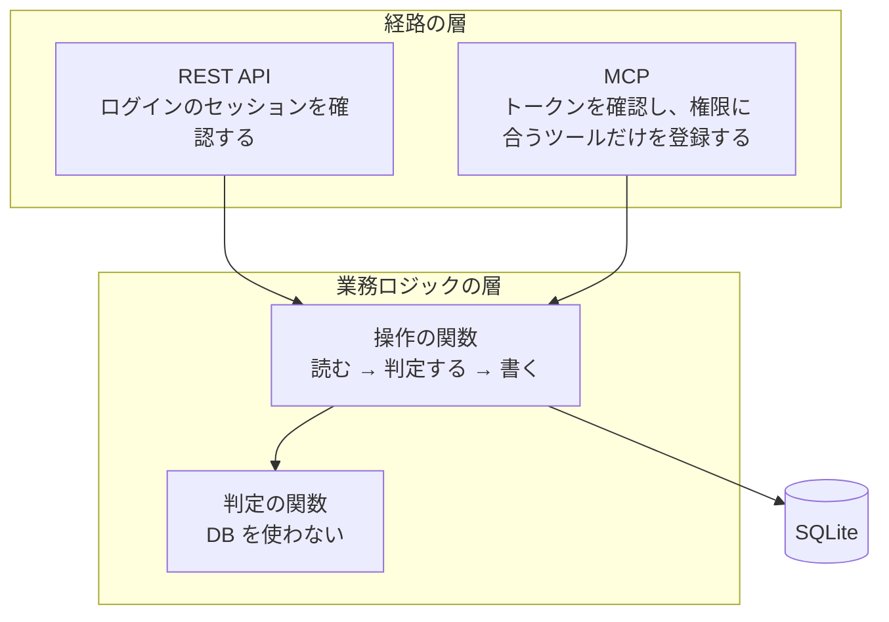

# ソフトウェアの構成

[設計書の入口](../Architecture.md)に戻る。章・節番号は分割前の設計書から維持している。

<a id="section-4"></a>

## 4. ソフトウェアの構成

<a id="section-4-1"></a>

### 4.1 層

経路の層と業務ロジックの層の2つに分ける。DB へのアクセスは層として分けず、業務ロジックの層に書く。



| 層 | 受け持つこと | 持たないもの |
|---|---|---|
| 経路の層（REST API・MCP） | 認証、入力の取り出しと検証（[ソフトウェアの構成「入力の検証」](Software.md#section-4-7)）、業務ロジックの操作の関数の呼び出し、結果とエラーを経路の形式（HTTP のレスポンス・MCP のツールの結果）に変えること。ログインした人間だけの操作（承認・cancel・Actor とトークンの操作・Activity の閲覧）を REST API にだけ出すこと（[ソフトウェアの構成「権限の確認と Activity の記録」](Software.md#section-4-9)） | 業務のルール、DB へのアクセス |
| 業務ロジックの層 | 操作の関数（1つの操作を最初から最後まで行う）と、判定の関数（操作してよいかを決める） | 経路（Web か MCP か）による分岐、Actor の種類による分岐 |

- 経路の層は、同じ操作に対して同じ操作の関数を呼ぶ。Web と MCP でルールを別々に書かない（要件定義書 設計原則5）
- 経路の層から DB を読み書きしない。読むだけの操作（一覧・文脈の取得・検索）も、業務ロジックの層の関数を通す
- 業務ロジックの層は、操作した Actor・経路・現在の日時を `ctx` で受け取る。現在の日時を関数の中で取らない（テストで日時を固定するため）。他のモジュールの関数を呼ぶときも、`ctx` の Actor・経路を差し替えない（[ソフトウェアの構成「権限の確認と Activity の記録」](Software.md#section-4-9)）

<a id="section-4-2"></a>

### 4.2 操作の関数は「読む → 判定する → 書く」で書く

業務ロジックの層の操作の関数は、次の順で書く。

1. **読む**: 判定に必要なデータを、SQL で DB から読む（対象の Task、子孫の Task、所属する Project の状態など）。他のモジュールのデータは、持ち主のモジュールの関数を呼んで読む（[ソフトウェアの構成「モジュールをまたぐ参照」](Software.md#section-4-5)）
2. **判定する**: 読んだデータと入力を判定の関数に渡し、操作してよいか、何を変えるかを決める
3. **書く**: 判定が通ったら、SQL で DB を更新し、Activity を記録する

判定のたびに読む量を最小にするため、1〜2を繰り返してもよい（例: Task を読んで判定し、次に子 Task を読んで判定する）。ただし、自分の関数の中では、書き始めた後に判定しない。

書く段階で、他の操作の関数を呼ぶことは許す（例: Project の archive の中で、task の「Project の Task を cancel する」を呼ぶ）。呼ばれた関数は、その中で読む → 判定する → 書く を行う。そこで弾かれれば、例外で起点の操作の変更がすべて戻る（下の「トランザクション」「例外を catch しない」）。

#### 判定の関数

- DB・操作した Actor の認証情報・現在の日時を取りに行かない。必要なものは引数で受け取る
- 同じ引数なら必ず同じ結果を返す
- 対象になるルールの例
  - 状態遷移（今の状態から移れるか）。操作ごとに常に決まる必須の入力（review に出すときの result 等）は、判定の関数ではなく入力のスキーマに置く（[ソフトウェアの構成「入力の検証」](Software.md#section-4-7)）
  - 親 Task が review に出せるか（子 Task がすべて done / cancelled か）
  - 子 Task を追加できるか、親を付ける・付け替える・外せるか（親の状態、循環、同じ Project か）
  - 子 Task が in_progress になったとき、どの祖先の Task を in_progress にするか
  - 親 Task・Project をやめたとき、どの Task を cancelled にするか
  - Project を done にできるか（終わっていない Task がないか）
  - done / cancelled の Task、done / archived の Project、triaged / archived の Inbox Item を変更しようとしていないか
- 自動で起きる変更（親 Task の連動、子孫・Project の Task をまとめて cancel）は、判定の関数が「どれを・どう変えるか」を返し、操作の関数はそのとおりに書く。操作の関数の中で変更の対象を決めない

#### やってはいけないこと

- **ルールを SQL に書かない**。「子 Task がすべて終わっていれば更新する」を UPDATE の WHERE に書く、「親を付けられる Task」を SELECT の WHERE で絞って件数で判定する、といった書き方をしない。ルールがどこにあるか分からなくなり、判定の関数のテストで守れなくなる
  - 例外1: 楽観ロックの版数の確認（`WHERE id = ? AND version = ?`）は UPDATE に書く。更新した行が0件なら競合として扱う。これは同時更新の検知で、業務のルールではない
  - 例外2: 一覧・検索の絞り込み（状態・Project・担当・キーワード等）と、read 権限を持たないリソースを結果から除く条件は、SQL の WHERE に書く。これらは「何を読むか」で、操作してよいかの判定ではない
- **ルールを操作の関数の if 文に直接書かない**。判定の関数を呼び、その結果に従う。操作できないときは、判定の関数が「操作できない」のエラーを投げる（[ソフトウェアの構成「エラーの扱い」](Software.md#section-4-6)）
- **ルールを経路の層に書かない**。REST API と MCP の片方だけでルールを確認すると、もう片方から迂回できる

#### トランザクション

- 1〜3（読むから書くまで）を1つのトランザクションに収める。読んでから書くまでの間に、ほかの操作で子 Task の状態などが変わると、判定の前提が崩れるため
- **すべての操作の関数は、`ctx.db.transaction((tx) => { ... })` で始める**。起点の操作か、他の操作から呼ばれる関数かで書き分けない（起点の操作は `defineOperation` が張るため、`run` の中で張り直さない。[ソフトウェアの構成「権限の確認と Activity の記録」](Software.md#section-4-9)）
  - 他の操作の関数を呼ぶときは、`tx` を入れた `ctx`（`{ ...ctx, db: tx }`）を渡す
  - 他の操作の関数の中から呼ばれると、Drizzle（better-sqlite3）が自動で SAVEPOINT にする。単独で呼ばれたときは、そのままトランザクションになる
- 操作の関数は、引数の `ctx.db` だけを使う。DB の接続を直接 import しない（lint で検査する）。直接 import した接続を使うと、呼んだ側のトランザクションに乗っているかが分からなくなるため
- トランザクションの中で async・await を使わない（better-sqlite3 のトランザクションは async の関数で動かない）
- 判定が通らなかったときは、判定の関数が例外を投げ、何も書かずにトランザクションが終わる（[ソフトウェアの構成「エラーの扱い」](Software.md#section-4-6)）

#### 例外を catch しない（重要）

- **業務ロジックの層では、例外を catch しない**。例外が一番外側のトランザクションまで届くと、better-sqlite3 がすべてロールバックし、起点の操作でした変更（呼んだ側・呼ばれた側の両方）がすべて戻る
- catch して処理を続けると、SAVEPOINT で呼ばれた側の変更だけが戻り、呼んだ側の変更とその後の変更は書かれる。例: Inbox Item を Task に変換する操作で、「Task を作る」が「操作できない」で弾かれたのを catch して続けると、Task は作られていないのに Item が整理済み（triaged）になる
- 例外を catch するのは、経路の層（REST API・MCP）でエラーを応答に変えるときだけ。これはトランザクションが終わってロールバックした後なので、影響しない
- 例外として、トランザクションの中で SQLite のエラーを catch した場合は、必ず投げ直す（[ソフトウェアの構成「エラーの扱い」](Software.md#section-4-6)）

<a id="section-4-3"></a>

### 4.3 テスト

要件定義書 10章（状態遷移・権限・親 Task の連動を必ずテストする）を、2つの粒度でテストする。

| 対象 | テストの仕方 | 主に確かめること |
|---|---|---|
| 判定の関数 | DB を使わず、引数を変えて直接呼ぶ | 状態遷移の全組み合わせ、親の付け替えの条件、連動・まとめての cancel の対象 |
| 操作の関数 | インメモリの SQLite に対して呼ぶ（DB を差し替えるモックは使わない） | 判定どおりに書かれること、Activity が記録されること、判定が通らないとき何も書かれないこと、楽観ロックの競合 |
| 入力のスキーマ | DB を使わず、入力を変えて検証する | 操作ごとの必須の入力（review に出すときの result、blocked にするときの blocked_reason、todo に戻すときのコメント、cancel するときの result）、列挙値、文字数の上限 |

- 経路の層のテストは、認証と、ログインした人間だけの操作が REST API にだけあり MCP にないことを確かめる。業務のルールは経路の層でテストしない
- 権限・read 権限による絞り込み・経路の制限・Activity の記録漏れは、これに加えて起点の操作の一覧から表駆動でテストする（[ソフトウェアの構成「権限の確認と Activity の記録」](Software.md#section-4-9)）
- 経路の層のテストでは、エラーの種類ごとに、決まった形のレスポンス・ツールの結果に変わることも確かめる（[ソフトウェアの構成「エラーの扱い」](Software.md#section-4-6)）

<a id="section-4-4"></a>

### 4.4 モジュール

業務ロジックの層は、業務の単位でモジュールに分ける。経路の層はモジュールごとには分けず、経路ごと（REST API・MCP）に分ける。

```
src/server/
  main.ts          起動モードの選択 → 通常モードでは設定の読み込み・マイグレーション・サーバーの開始
  app.ts           Web UI の配信・REST API・MCP を1つの Hono のアプリに組み立てる
  config.ts        環境変数の読み込みと検証（docs/architecture/Technology.md 2.9）
  operations.ts    起点の操作の一覧（レジストリ。docs/architecture/Software.md 4.9）
  core/            共通の仕組み: defineOperation・Ctx・エラーのクラス・日時・列の型
  http/            経路の層: REST API
  mcp/             経路の層: MCP
  db/              DB への接続・マイグレーション
  testing/         テストの土台: インメモリの DB・データの用意・表駆動のテストの入力
  modules/         業務ロジックの層
    auth/          Actor・トークン・ログインのセッション・権限
    project/       Project・Project が参照する Document
    task/          Task・コメント・links・親子・Task が参照する Document
    document/      Document・タグ
    inbox/         Inbox Item・変換
    activity/      Activity の記録と閲覧
    search/        Task と Document を横断する検索
```

各モジュールの中は、次のように置く。

```
modules/task/
  index.ts             モジュールの外に公開するもの（operations・inputs から名前を並べて出すだけ。docs/architecture/Software.md 4.5）
  schema.ts            このモジュールが持つテーブルの定義（Drizzle の sqliteTable）
  inputs.ts            操作の入力のスキーマ（zod）
  inputs.test.ts       入力のスキーマのテスト
  operations.ts        操作の関数（起点の操作は defineOperation で宣言する。docs/architecture/Software.md 4.9。Drizzle のクエリもここに書く）
  operations.test.ts   操作の関数のテスト（インメモリの SQLite）
  rules.ts             判定の関数
  rules.test.ts        判定の関数のテスト（DB を使わない）
```

- テーブルの定義は、そのテーブルの持ち主のモジュールの `schema.ts` に置く。drizzle-kit には、全モジュールの `schema.ts` を渡してマイグレーションを生成する
- クエリは、操作の関数の中に直接書く。クエリだけを包む関数やファイル（`queries.ts` 等）は作らない
- ファイルが大きくなったら、モジュールの中で分けてよい（例: `task/rules/status.ts`・`task/rules/parent.ts`）。モジュールの外には出さない
- 判定するルールのない業務（search など）は、`rules.ts` を置かず、操作の関数だけのモジュールでよい
- 複数の操作の関数で使うクエリ（例: Task を id で読む）だけは、そのモジュールの中で関数にまとめる。他のモジュールには公開しない（[ソフトウェアの構成「モジュールをまたぐ参照」](Software.md#section-4-5)）
- コメントは Task の権限に含まれる（要件定義書 F-AUTH-03）ため、task モジュールに置く
- activity は、すべてのモジュールが Activity の記録に使うため、独立したモジュールにする
- search は、Task と Document を横断するため、独立したモジュールにする（[検索「性能」](Search.md#section-3-4)）
- `core/` は、どのモジュールにも属さない共通の仕組みを置く。業務ロジックの層・経路の層・`db/` から使ってよく、`core/` から他の要素は import しない。業務のルールは置かない
- `testing/` は、テストのファイルからだけ使う。インメモリの DB には、drizzle-kit の生成の仕組み（`drizzle-kit/api`）で全モジュールの `schema.ts` から作った CREATE 文を当てる（`drizzle-kit push` と同じ）
- activity の `inputs.ts` は、event_type・entity_type の列挙値と、他の行を指す id の入力の部品（`entityId('task')` 等。[テーブル設計「全テーブル共通の決まり」](Database.md#section-5-1)）を持つ。entity_type は Activity の対象の種類で、`<種類>:<id>` の種類の語と同じもののため

#### lint で検査すること

[ソフトウェアの構成](Software.md#section-4)の決まりのうち、次のものはレビューに頼らず lint で検査する。

- `modules/*/rules.ts`（分けた場合は `modules/*/rules/**`）から、`db/`・SQLite ドライバー・Drizzle・操作の関数（`operations`）を import しない
- 業務ロジックの層（`modules/`）から、経路の層（`http/`・`mcp/`）・Hono・MCP SDK を import しない
- 経路の層（`http/`・`mcp/`）から、`db/`・SQLite ドライバー・Drizzle を import しない
- 経路の層（`http/`・`mcp/`）から import してよい業務ロジックの層のファイルは、`modules/*/index.ts` だけ（[ソフトウェアの構成「モジュールをまたぐ参照」](Software.md#section-4-5)）
- 経路の層（`http/`・`mcp/`）から、起点の操作の `withoutPermissionCheck` を呼ばない（[ソフトウェアの構成「権限の確認と Activity の記録」](Software.md#section-4-9)）
- Web UI（`src/web/`）から `src/server/` は、`import type` でだけ参照する。例外として、`modules/*/inputs.ts` は実行時にも import してよい（[ソフトウェアの構成「入力の検証」](Software.md#section-4-7)・[ソフトウェアの構成「リポジトリの構成」](Software.md#section-4-8)）
- `modules/*/inputs.ts` から import してよいのは、zod と、他のモジュールの `inputs.ts` だけ（Web UI のビルドにサーバーのコードを含めないため。[ソフトウェアの構成「入力の検証」](Software.md#section-4-7)）
- 他のモジュールから import してよいのは、`modules/*/index.ts` だけ（[ソフトウェアの構成「モジュールをまたぐ参照」](Software.md#section-4-5)）。例外として、`schema.ts` は外部キーの参照のために、他のモジュールの `schema.ts` から import してよい
- 操作の関数（`operations`）から、他のモジュールの `schema.ts` を import しない（他のモジュールのテーブルを直接読み書きしないため。[ソフトウェアの構成「モジュールをまたぐ参照」](Software.md#section-4-5)）
- 業務ロジックの層（`modules/`）から、DB の接続（`db/` の接続のインスタンス）を import しない。`ctx.db` を使う（[ソフトウェアの構成「操作の関数は「読む → 判定する → 書く」で書く」](Software.md#section-4-2)）
- 業務ロジックの層（`modules/`）で、try / catch を書かない（SQLite のエラーを投げ直す場合を除く。[ソフトウェアの構成「操作の関数は「読む → 判定する → 書く」で書く」](Software.md#section-4-2)・[ソフトウェアの構成「エラーの扱い」](Software.md#section-4-6)）。例外を設ける箇所は lint の無効化のコメントに理由を書き、レビューで確かめる
- モジュール同士の依存が循環することは検査しない（循環を許す。[ソフトウェアの構成「モジュールをまたぐ参照」](Software.md#section-4-5)）

<a id="section-4-5"></a>

### 4.5 モジュールをまたぐ参照

#### 操作の置き場所

- 操作の関数は、**起点の業務のモジュール**に置く。起点とは、経路の層から呼ばれる操作の主語（オーナー・エージェントが何をしたか）
- 起点の操作の中で他のモジュールのデータを読み書きする処理は、**そのデータの持ち主のモジュール**に置き、起点の操作から呼ぶ

| 起点の操作 | 置き場所 | 中で呼ぶ、持ち主のモジュールの関数 |
|---|---|---|
| Inbox Item を変換する | inbox | project の Project を作る、task の Task を作る、document の Document を作る |
| Project を archive する | project | task の「Project の終わっていない Task を cancelled にする」（どれを対象にするかの判定は task が持つ） |
| Project を done にする | project | task の「Project の終わっていない Task があるか」 |
| Task を作る・Project を変える | task | project の「Project の状態を読む」 |
| Task・Project に Document の参照を足す | task・project | document の「Document を読む」 |
| Document の参照元を見る（要件定義書 F-DOC-04） | document | task の「Document を参照している Task を読む」、project の「Document を参照している Project を読む」 |
| Project の文脈を取得する | project | task の「Project の終わっていない Task を読む」、document の「active な Document を読む」 |
| 検索する | search | task の「Task・コメントを検索する」、document の「Document を検索する」 |
| （すべての変更） | 各モジュール | activity の「Activity を記録する」 |

#### データの読み書き

- 他のモジュールのデータは、**読み取りも書き込みも、持ち主のモジュールの操作の関数を通す**
- **他のモジュールのテーブルを、SQL で直接読み書きしない**（JOIN を含む）。Drizzle のクエリはテーブルの定義を import しないと書けないため、「操作の関数から他のモジュールの `schema.ts` を import しない」を lint で検査して守る。`sql` テンプレートにテーブル名を文字列で書くと lint を迂回できるため、`sql` テンプレートを使った箇所はレビューで確かめる。どのテーブルがどのモジュールの持ち物かは、テーブル設計（[テーブル設計](Database.md#section-5)）で決める
- 書き込みを持ち主の関数に限るのは、書き込みに判定と Activity の記録が付くため。直接書くと、判定と記録を迂回できてしまう
- 読み取りも持ち主の関数に限るのは、次の理由による
  - 読み書きのルールが統一される
  - 読み取りの条件（archived の Document を文脈・参照の一覧に含めない、read 権限のないリソースを結果から除く）が持ち主のモジュールの1か所に集まり、書き忘れによる漏れを防げる
  - テーブルの構成を変えても、持ち主のモジュールの中だけで直せる
- 複数の行をまとめて読む場合は、id の一覧を受け取る関数にし、1件ずつ何度も呼ばない

#### 他のモジュールに公開するもの

- 各モジュールに `index.ts` を置き、モジュールの外（経路の層・他のモジュール）に公開するものの名前を並べる。定義は書かず、`operations`・`inputs` から出すだけにする

  ```ts
  // modules/project/index.ts
  export { createProject, archiveProject, getProjectStatus } from './operations'
  export { createProjectInput, archiveProjectInput } from './inputs'
  ```

- **モジュールの外からは `index.ts` だけを import する**（lint で検査する）。`operations` の中で export していても、`index.ts` に並べなければ外からは使えない
- 公開するのは、操作の関数、他のモジュール向けの読み取りの関数、入力のスキーマ。判定の関数（`rules`）とクエリの部品は並べない。これらを外から直接呼ぶと、判定と Activity の記録を迂回できてしまうため
- 起点の操作（`defineOperation` で宣言したもの、[ソフトウェアの構成「権限の確認と Activity の記録」](Software.md#section-4-9)）は `index.ts` に並べたものが一覧（レジストリ）になり、経路の層への登録と表駆動のテストがここから作られる
- `index.ts` に並べ忘れると、外から使う箇所でコンパイルエラーになるため、そこで気づける
- 例外は2つ。外部キーの参照のための `schema.ts` 同士の import と、Web UI からの `inputs.ts` の import（`index.ts` は操作の関数を通してサーバーのコードを含むため、Web UI からは import しない。[ソフトウェアの構成「入力の検証」](Software.md#section-4-7)）
- モジュール同士の依存が循環することは許す（例: project の archive が task の関数を呼び、task の作成が project の「Project の状態を読む」を呼ぶ）。読み取りも持ち主の関数を通すため、Project と Task、Document と Task・Project、auth と activity のように、互いに呼び合うことが避けられないため
- 循環する import で壊れないよう、**ファイルのトップレベル（読み込んだ時点で実行されるコード）で、他のモジュールから import した値を使わない**。他のモジュールの関数は、関数の中で呼ぶ。外部キーは `references(() => projects.id)` のように関数で書く。破ると起動時やテストの読み込み時にエラーになるため、そこで気づける

<a id="section-4-6"></a>

### 4.6 エラーの扱い

業務のエラーは例外で投げ、経路の層で経路の形式に変える。結果の型（`{ ok: false, error }` 等）で返さない。

#### エラーの種類

エラーのクラスは次の種類に限る。種類を足すときは、この表と経路の層の変換をあわせて直す。

| 種類 | 投げる場面 | 投げる場所 | REST API | MCP |
|---|---|---|---|---|
| 入力が不正 | 必須の項目がない、形式が違う | 入力の検証 | 400 | ツールのエラー（理由付き） |
| 見つからない | 存在しない id | 操作の関数（読んだ結果が無いとき） | 404 | ツールのエラー（理由付き） |
| 権限がない | read / readwrite を持たない | 起点の操作の権限の確認（[ソフトウェアの構成「権限の確認と Activity の記録」](Software.md#section-4-9)） | 403 | ツールのエラー（理由付き） |
| 操作できない | 判定で弾かれた（例: 子 Task が終わっていないので review に出せない） | 判定の関数 | 409 | ツールのエラー。エージェントが次に何をすべきか分かる理由を付ける |
| 競合 | 楽観ロックで更新した行が0件（ほかの誰かが先に更新した） | 操作の関数 | 409（競合と分かる印付き） | ツールのエラー。読み直してやり直すよう伝える |
| 想定外 | 上記以外（バグ、DB の障害） | — | 500。詳細は返さず、ログに残す | ツールのエラー。詳細は返さず、ログに残す |

- 判定の関数は、操作できないときに「操作できない」のエラーを理由付きで投げる。何を変えるかを決める判定（連動・まとめての cancel の対象など）は、値を返す
- エラーの理由は、人間にもエージェントにも、何が原因で次に何をすればよいかが分かる文にする

#### 守ること

- **業務ロジックの層では、例外を catch して処理を続けない**。例外は起点の操作まで届け、トランザクションをロールバックさせる。catch して続けると、判定で弾かれたのに書き込みを続けることになる
- トランザクションの中で SQLite のエラーを catch した場合は、必ず投げ直す（SQLite がトランザクションを自ら終わらせていることがあるため）
- 想定外のエラーの詳細（スタックトレース・SQL）を、REST API・MCP の応答に含めない

<a id="section-4-7"></a>

### 4.7 入力の検証

#### スキーマの置き場所

- 操作の入力のスキーマは zod で書き、1つの操作に1つ作って、その操作のモジュールの `inputs.ts` に置く
- 同じスキーマを、REST API（`@hono/zod-validator` の `zValidator`）と MCP（`registerTool` の `inputSchema`）の両方に渡す。Hono RPC の入力の型と、MCP のツールの入力の説明（JSON Schema）は、どちらもこのスキーマから作られる。REST API と MCP で別々にスキーマを書かない
- MCP のツールの入力の説明はエージェントが読むため、項目には `describe` で意味を書く

#### 検証する場所

- **経路の層と、操作の関数の先頭の両方で検証する**
  - 経路の層: `zValidator` と MCP SDK が、スキーマを渡すと検証する
  - 操作の関数: 先頭で自分の入力のスキーマで検証してから、読む → 判定する → 書く に進む。他のモジュールから呼ばれるとき（例: Inbox の変換が task の「Task を作る」を呼ぶ）は、経路の層の検証を通らないため
- 検証に失敗したら、「入力が不正」のエラー（[ソフトウェアの構成「エラーの扱い」](Software.md#section-4-6)）にする。経路の層の `zValidator` の既定の 400 の応答は使わず、[ソフトウェアの構成「エラーの扱い」](Software.md#section-4-6) の決まった形に揃える

#### スキーマと判定の関数の分け方

| 置き場所 | 置くもの | 例 |
|---|---|---|
| 入力のスキーマ（`inputs.ts`） | 操作ごとに常に決まる入力の形 | 型、必須、空でない、文字数の上限、列挙値（priority は high / normal / low）、review に出すときの result・blocked にするときの blocked_reason・todo に戻すときのコメント・cancel するときの result が必須 |
| 判定の関数（`rules.ts`） | 今の状態や、他のデータによって変わる判定 | 今の状態から移れるか、子 Task がすべて終わっているか、親の付け替えで循環しないか、Project が active か |

- 必須の入力を入力のスキーマに置くことで、MCP のツールの入力の説明にも必須と載り、エージェントが最初から正しく呼べる
- 操作ごとの必須の入力は状態遷移のルールの一部のため、入力のスキーマもテストする（[ソフトウェアの構成「テスト」](Software.md#section-4-3)）
- タグの書き方を揃える処理（前後の空白を除く、NFKC で全角・半角を揃える、英字を小文字にする。要件定義書 F-DOC-02）は、入力のスキーマの変換（zod の transform）に置く。Document の作成・更新と、検索のタグでの絞り込みの入力で、同じ変換を使う

#### Web UI での利用

- Web UI のフォームは、サーバーと同じ入力のスキーマ（`inputs.ts`）で入力を検証する。例: 必須の項目（review に出すときの result 等）が空なら、送信のボタンを押せなくする
- 画面の側でスキーマと別にチェックを手で書かない。サーバーのルールとずれるため
- 画面で検証しても、サーバーは必ず検証する（経路の層と操作の関数の先頭。上の「検証する場所」）
- Web UI からも使うため、`inputs.ts` はブラウザで動くようにする。import してよいのは zod と他のモジュールの `inputs.ts` だけ（例: Inbox の変換の入力は、task の Task を作る入力のスキーマを組み合わせて作る）。列挙値（priority 等）も `inputs.ts` か、そこから import できる場所に置き、Drizzle のテーブルの定義（`schema.ts`）から import しない

<a id="section-4-8"></a>

### 4.8 リポジトリの構成

サーバーと Web UI を、1つのパッケージ（`package.json` が1つ）に置く。

```
package.json
tsconfig.json          project references で下の2つをつなぐ
tsconfig.server.json   サーバー用（Node.js）
tsconfig.web.json      Web UI 用（ブラウザ）
vite.config.ts
drizzle.config.ts      全モジュールの schema.ts を渡す
src/
  server/              docs/architecture/Software.md 4.4 のとおり
  web/                 React の SPA
```

- tsconfig はサーバー用と Web UI 用に分け、どちらも `strict: true` にする（Hono RPC の型を正しく働かせるため）
- Web UI は、サーバーの `AppType`（Hono RPC の型）を `import type` でだけ参照する。例外として、入力のスキーマ（`modules/*/inputs.ts`）は実行時にも import する（[ソフトウェアの構成「入力の検証」](Software.md#section-4-7)）。それ以外のサーバーの実行コードを Web UI のビルドに含めないよう、lint で検査する
- ビルドしたサーバーと Web UI の静的ファイルを、1つのコンテナに入れる
- パッケージマネージャーは npm（[技術スタック「開発環境の道具」](Technology.md#section-2-8)）

<a id="section-4-9"></a>

### 4.9 権限の確認と Activity の記録

要件定義書の設計原則3〜5（すべての変更を Actor 付きで記録する、Actor の種類で操作能力に差を設けない、Web と MCP は同じ業務ロジックを通る）を、設計で守る方法。

#### 起点の操作の宣言

経路の層から呼ばれる操作（起点の操作、[ソフトウェアの構成「モジュールをまたぐ参照」](Software.md#section-4-5)）は、`defineOperation` で宣言する。

```ts
export const approveTask = defineOperation({
  name: 'approve_task',
  routes: ['web'],
  requires: [['task', 'readwrite']],
  returns: [],
  entity: 'task',
  input: approveTaskInput,
  run: (ctx, input) => { /* 読む → 判定する → 書く */ },
})
```

| 項目 | 意味 |
|---|---|
| `name` | 操作の名前。MCP のツール名に使う |
| `routes` | この操作を出す経路。`['web']` か `['web', 'mcp']` |
| `requires` | 必要な権限。リソースと段階（read / readwrite）の組の一覧 |
| `returns` | 結果に含む、自分以外のリソースの種類（下の「read 権限による絞り込み」） |
| `entity` | 結果が表すリソースの種類（`task` 等）。MCP の層が結果の `id` を `<種類>:<id>` に変えるのに使う（[テーブル設計「全テーブル共通の決まり」](Database.md#section-5-1)） |
| `input` | 入力のスキーマ（[ソフトウェアの構成「入力の検証」](Software.md#section-4-7)） |
| `run` | 読む → 判定する → 書く（[ソフトウェアの構成「操作の関数は「読む → 判定する → 書く」で書く」](Software.md#section-4-2)） |

- 項目はすべて必須にする。要らない場合も `[]` を書く（書き忘れと区別がつかなくなるため）
- `defineOperation` が返す関数は、呼ばれると **入力の検証（[ソフトウェアの構成「入力の検証」](Software.md#section-4-7)）→ 権限の確認 → トランザクションを張って `run` を実行（[ソフトウェアの構成「操作の関数は「読む → 判定する → 書く」で書く」](Software.md#section-4-2)）** の順に行う。`run` の中でトランザクションを張り直さない
- 他のモジュールから呼ばれるだけの関数（[ソフトウェアの構成「モジュールをまたぐ参照」](Software.md#section-4-5) の「持ち主のモジュールの読み取り・書き込みの関数」）は `defineOperation` を使わず、普通の関数にして自分でトランザクションを張る
- 起点の操作を `index.ts` に並べる（[ソフトウェアの構成「モジュールをまたぐ参照」](Software.md#section-4-5)）ことで、宣言の一覧（レジストリ）が得られる。`src/server/operations.ts` が、各モジュールの `index.ts` から `defineOperation` で作った値を集める。経路の層への登録と、下のテストはこの一覧から作る
- `routes` は `['web']` か `['web', 'mcp']` の2通りだけを型で許す。MCP の層は `routes` が `['web', 'mcp']` の操作の型（`McpOperation`）しか受け取らない

#### 権限の確認は起点だけが行う

- 権限を確認するのは起点の操作だけ。起点から呼ばれる他のモジュールの関数は確認しない
- 起点の操作が、その操作に必要な権限をすべて `requires` に列挙する。複数のリソースにまたがる書き込み（要件定義書 F-AUTH-09）もここに書く
- 例: Inbox Item を Task に変換する → `[['inbox', 'readwrite'], ['task', 'readwrite']]`
- 変換先を入力で選ぶ `convert_inbox_item` は、`requires` には共通の inbox readwrite を置き、Inbox モジュール内で選ばれた変換先（project / task / document）の readwrite を確認する。静的な `requires` だけでは、変換先ごとの最小権限を表せないため。この確認も起点操作の中で行い、`withoutPermissionCheck` を呼ぶ前に必ず済ませる
- 起点の操作を他のモジュールから呼ぶときは、権限を確認しない呼び口を使う

  ```ts
  createTask(ctx, input)                       // 経路の層から。権限を確認する
  createTask.withoutPermissionCheck(ctx, i)    // 他のモジュールから。確認しない
  ```

  どちらも入力の検証とトランザクションは通る。`http/`・`mcp/` から `withoutPermissionCheck` を呼ばないことを lint で検査する（[ソフトウェアの構成「モジュール」](Software.md#section-4-4)）
- 内部で呼ぶ関数が権限を確認しないのは、要件にない権限を要求しないため。例: Task を作る操作は、中で project の「Project の状態を読む」を呼ぶ（[ソフトウェアの構成「モジュールをまたぐ参照」](Software.md#section-4-5)）。ここで Project の read を求めると、Task の readwrite だけを持つエージェントが Project に属する Task を作れなくなる
- human の Actor は4つのリソースすべてに readwrite を持つ（[テーブル設計「Actor」](Database.md#section-5-2)）ため、Web UI からの操作が `requires` で弾かれることはない。権限の確認で Actor の種類による分岐は持たない（要件定義書 設計原則4）

#### 人間だけの操作は経路で制限する

- 承認（review → done）、Task の cancel、Project の done・archive、agent Actor の作成・名前変更・論理削除・権限の設定、トークンの発行・失効、Activity の閲覧は、`routes: ['web']` にする
- MCP への登録は、`routes` に `'mcp'` を含む操作しか受け付けない（型で落とす）。ツールを足しただけでは人間だけの操作は MCP に出ない
- REST API は Cookie のセッションだけを見て、`Authorization` ヘッダを読まない。MCP はトークンだけを見て、Cookie を読まない。セッションとトークンはテーブルが分かれている（[テーブル設計「Token・ログインのセッション」](Database.md#section-5-3)）ため、これでエージェントのトークンは REST API に使えない（要件定義書 F-AUTH-04）
- 業務ロジックの層では `actor_type` を見て分岐しない。人間だけの操作であることは `routes` の宣言にだけ表れる（要件定義書 設計原則4）
- Activity を読む操作は `routes: ['web']`・`requires: []` にする。Activity は独立したリソースにしない（要件定義書 F-AUTH-08）ため、リソースの権限は問わず、経路の制限がそのまま「ログインした人間だけ」になる

#### read 権限による絞り込み

- 一覧・文脈の取得・検索で、read 権限を持たないリソースを結果に含めない（要件定義書 F-AUTH-07）。条件は SQL の WHERE に書く（[ソフトウェアの構成「操作の関数は「読む → 判定する → 書く」で書く」](Software.md#section-4-2) の例外2）
- 起点の操作は、結果に含む自分以外のリソースを `returns` に宣言する。例: `get_project_context` は `requires: [['project', 'read']]`・`returns: ['task', 'document']`
- `requires` と `returns` の違いは、持っていないときの結果。`requires` の権限がなければ 403 になり、`returns` のリソースの read がなければ、エラーにはならず結果から除かれる
- `returns` の宣言は、絞り込みの書き忘れをテストで捕まえるために使う（下の「テスト」）。書き忘れてもエラーにならず、権限のないリソースが結果に混ざるだけのため、これが唯一の歯止めになる

#### Activity の記録

- 記録は、変更を行った操作の関数が activity の「Activity を記録する」関数を呼ぶ（[ソフトウェアの構成「モジュールをまたぐ参照」](Software.md#section-4-5)）
- Actor・経路は `ctx` の値をそのまま使う。**他のモジュールの関数を呼ぶときに、`ctx` の Actor・経路を差し替えない**。これにより、自動で起きる変更（親 Task の連動、親 Task・Project に伴うまとめての cancel）も、きっかけになった操作の Actor・経路で記録される（要件定義書 設計原則3）
- 自動で起きた変更は、直接の操作とは別の `event_type` で記録する。同じ `event_type` にすると、画面で、その Actor が直接変えたように見えてしまうため。Activity は監査ログを兼ねる（要件定義書 6.6）。値の一覧は [テーブル設計「Activity」](Database.md#section-5-9) の「event_type」
- 記録の呼び忘れは、操作の関数のテストの共通の検査で防ぐ（下の「テスト」）

#### テスト

要件定義書10章の「権限」と、設計原則3〜5を、次のテストで守る。上3つは起点の操作の一覧（レジストリ）から表駆動で回すため、操作を足せばテストも自動で増える。

| 確かめること | 回し方 |
|---|---|
| 権限 | 各操作について、`requires` の権限を1つずつ欠いた Actor で呼び、403 になる |
| read の絞り込み | `returns` を持つ各操作について、そのリソースの read を持たない Actor で呼び、結果にそのリソースが含まれない |
| 経路の制限 | `routes` に `'mcp'` を含まない操作が、MCP が登録するツールの中に現れない |
| REST への登録漏れ | `routes` に `'web'` を含む操作が、REST API が登録した経路の中にすべてある（[REST API「経路の決まり」](REST_API.md#section-7-2)） |
| Activity の記録漏れ | 操作の関数のテストで共通のヘルパ（`expectRecorded`）を通して呼び、`activities` 以外のテーブルが変わったのに `activities` が増えていなければ失敗させる |

- 表駆動のテストには、操作ごとに通る入力とデータの用意が要る。`testing/scenarios.ts` に操作の名前ごとに書き、操作の関数のテスト（[ソフトウェアの構成「テスト」](Software.md#section-4-3)）と共用する。用意が無い操作・`returns` のリソースを確かめる関数が無い操作は、テストが失敗する
- 権限のテストは、`requires` の権限を1段下げた Actor（readwrite なら read、read なら none）で呼び、何も書かれないことも確かめる
- REST への登録漏れは、経路の層が操作を登録するときに名前を記録し（`http/registry.ts` の `expose`）、その記録と一覧を照らし合わせる
- 自動で起きる変更は、どれを・どう変えるかを判定の関数のテストで、対象ごとに1行の Activity が起点の Actor・経路で記録されることを操作の関数のテストで確かめる（[ソフトウェアの構成「テスト」](Software.md#section-4-3)）
- これらは [ソフトウェアの構成「テスト」](Software.md#section-4-3) のテストに加えて行う。[ソフトウェアの構成「テスト」](Software.md#section-4-3) の粒度は変えない

<a id="section-4-10"></a>

### 4.10 一覧の並び順

一覧を返すときの既定の並び順は、**id の昇順（足した順）**を基本にする。id は行を足した順に必ず大きくなり（[テーブル設計「全テーブル共通の決まり」](Database.md#section-5-1)）、`created_at` のようにサーバーの時計の巻き戻りに影響されないため（D-108）。

目的が「足した順」でないものだけ、一覧ごとに並び順を決める。

| 一覧 | 並び順 |
|---|---|
| Inbox Item（`list_inbox_items`・Inbox 画面） | id の昇順（入れた順に上から処理するため） |
| Project（`list_projects`・Projects 画面） | id の昇順（[テーブル設計「Project」](Database.md#section-5-4)） |
| Task（`list_tasks`・Tasks 画面） | id の昇順 |
| Document（Documents 画面） | id の昇順 |
| Task のコメント | id の昇順（[テーブル設計「Task」](Database.md#section-5-5)） |
| Activity | id の昇順（[テーブル設計「Activity」](Database.md#section-5-9)） |
| Task・Project が参照する Document | id の昇順（[テーブル設計「Document の参照」](Database.md#section-5-7)） |
| 着手できる Task（`list_actionable_tasks`）と `get_project_context` の Task | priority の高い順、同じなら id の昇順（着手する順。要件定義書 F-TSK-10・S-02・S-03） |
| 検索の結果 | `updated_at` の降順、同じなら id の降順（[検索「結果の並び順と返す単位」](Search.md#section-3-5)） |

- Task の一覧を更新の新しい順にしない。一覧は状態で絞り込んで使うもので（要件定義書 9.2）、絞り込んだ中では足した順の方が、古いものが残っていることに気づける。放置された Task には、in_progress の Task に最後に変更された日時を表示すること（要件定義書 9.2）で気づく
- 呼び出し側が並び順を指定する仕組みは持たない。要件にないため
